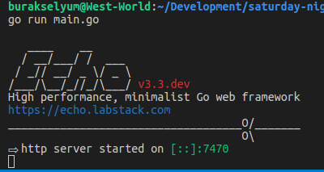
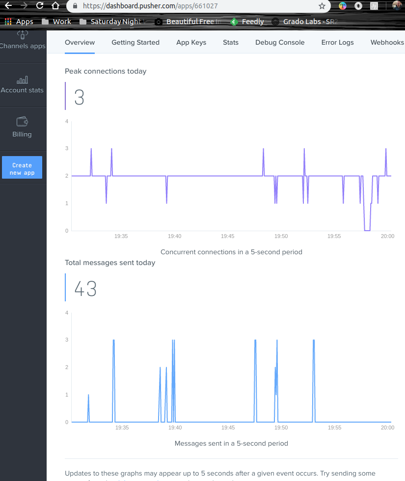

# Haber akışına fotoğraf eklemek

Amaç bir haber akışına fotoğraf ekleyebilmek _(Sosyal ağların web arayüzlerinde anlık güncellemelerle aşağıya doğru akan akış olarak düşünebiliriz)_ Tabii haber akışı herkesin görebildiği bir alandır. Yani "Barbarossa" masaüstünden bir fotoğraf seçip yüklediğinde _(veya haber akışında görünebilecek bir içerik)_ bağlı olan diğer kullanıcılar da eklenen içeriği görebilmelidir. Kılavuza göre örnek Go, Vue.js, SQLite ve Pusher Channels isimli uygulama içi bildirim aracı ile gerçeklenmektedir. Vue tarafında hiç tecrübem olmadığı düşünülecek olursa ona merhaba demek adına benim için faydalı bir çalışma.

> Tabii sistemimizde Go ve SQLite yüklü olmalıdır diyebilirim. Tabii bu şart değil. Nitekim her ikisi içinde Docker imajları mevcut. Sistemi kirletmek istemezseniz ilgili docker imajlarından da örneği deneyebilirsiniz.

## Birinci Hamle

İlk olarak [Pusher Channels](https://pusher.com/) adresine giderek bir uygulama kaydettirmemiz gerekiyor. Bu ürüne github veya google hesaplarımız ile bağlanabiliyoruz. Uygulamayı oluşturduktan sonra App Keys sayfasından geliştirmemiz için gerekli app_id, key, secret gibi bilgileri alabiliriz. Pusher temel olarak içeriklerin hissedilip abone olan taraflara yollanması ile ilgili bir rol üstleniyor.


## İkinci hamle klasör yapısını oluşturmak

```
mkdir lovely-photos
cd lovely-photos
mkdir db
mkdir public
mkdir public/uploads
```

> Visual Studio Code, go uzantılı main dosyasını görür görmez bazı eklentileri kurmanızı önerecektir. Onu dinleyin ;)

## Go tarafı için gerekli paketlerin yüklenmesi

Web framework, SQLite ve Pusher tarafı için gerekli go paketlerini aşağıdaki terminal komutlarıyla yükleyebiliriz.

```
go get github.com/labstack/echo
go get github.com/labstack/echo/middleware
go get github.com/mattn/go-sqlite3
go get github.com/pusher/pusher-http-go
```

Uygulamayı çalıştırmak için, 

```
go run main.go
```

dememiz yeterli. Sorun çıkmazsa aşağıdakine benzer bir ekran görüntüsü ile karşılaşmamız gerekiyor.



Bundan sonra http://localhost:7470 adresine gidebiliriz. 

En az iki sayfa açmanızı öneririm. Bir tanesinden yüklenecek dosya içeriği anında diğer tarayıcıdaki haber akışına da yansıyacaktır. index.html sayfasında Vue.js kullanılmıştır. axios kütüphanesi ise XmlHttpRequest tipinden talepleri gerçekleştirmek için kullanılmaktadır _(Yani go server'ına göndereceğimiz Post, Get, Put, Delete gibi komutlar için kullanılır)_ Pusher tarafındaki kanala abone olmak içinse pusher'ın istemci için yazılmış javascript kütüphanesinden yararlanıyoruz. Çok azcık ucundan da olsa bootstrap ile css desteği sağlayıp erkanı biraz da güzelleştirdik :P


Denemeler sırasında Pusher üzerinde oluşan hareketlilikleri Dashboard üzerinden de gözlemleyebiliriz.



> index.html dosyasında pusher nesnesi için gerekli application key ve cluster bilgisi sizin uygulamanızınkine ait olmalıdır

## Daha iyi olması için

Örneği iyileştirmek sizin elinizde. Şunları deneyebilirsiniz;

- Fotoğraf kalite ve boyutlarının kontrolü sağlanmalı
- Sadece izin verilen formatların yüklenmesi garanti edilmeli
- Zararlı içerik yüklenemeyeceğinden emin olunmalı
- Arayüz tasarımı daha şık hale getirilmeli

## Neler Öğrendim?

- Go ile sqlLite'ı nasıl konuşturabileceğimi,
- Go'yu web sunucusu olarak nasıl ele alabileceğimi _(echo)_,
- Basit bir Vue.js kodlamasının nasıl yapıldığını,
- axios ile XmlHttpRequest'leri nasıl yapabileceğimi,
- pusher'ın ne işe yaradığını,