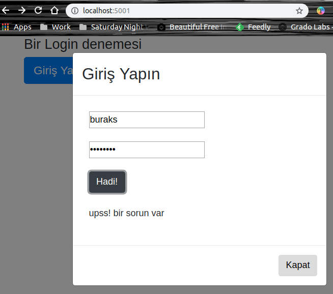

# Login için Bootstrap Modal Popup kullanmak

Bu örnekte bir Login penceresini modal popup olarak açtırmayı hedefledim. Node.js tabanlı bir sunucu kullanmayı tercih ettim. Modal penceresini ise bootstrap ile tasarlamaya çalıştım. Login işlemini üstlenen fonksiyonu bir servis noktası olarak sundum ve önyüz kodlamasında jQuery'den yararlandım.

## Başlangıç için gerekli kurulumlar

```
npm init
npm install --save-dev express morgan body-parser uuid
bower install jquery bootstrap
```
uuid paketini login olan kullanıcı için benzersiz bir guid üretmek maksadıyla kullanmaktayız. express bildiğiniz üzere REST taleplerini karşılamak ve routing işlemleri için yararlanacağımız paket. Server hareketliliklerini log şeklinde takip etmek için morgan'dan, JSON parse işlemine ihtiyaç duyduğumuz noktaları kolaylaştırmak içinse body-parser'dan yararlanmaktayız.

>Offline'da çalışabilelim diye jquery ve bootstrap için gerekli minimum dağıtım paketlerini public klasörü altına atabiliriz.

## Temel çalışma şekli

Kullanıcı / adresine gelirse (yani http://localhost:5001/ 'e) index.html sayfası render edilir. Bu bizim için sembolik bir sayfadır. Genelde varsayılan giriş noktaları bildiğiniz üzere index.html gibi sayfalar oluyor.


Burada 'Giriş Yap' düğmesine basılınca Modal Popup kontrolü açılır. Aslında kendisini index.html içerisine bir div olarak ekledik. 

>Bunu harici bir sayfaya nasıl alabilirsiniz? Malum başka yerlerden de Login'e göndermek isteyebiliriz. Her sayfaya gidip de modal div gömmesek iyi olur değil mi? Bunu biraz düşünün ;)


Eğer hatalı kullanıcı bilgisi girersek şöyle bir şeyler olmalı.



Eğer doğru kullanıcı bilgileri girilirse aşağıdaki güzel fotoğrafla karşılaşmamız lazım.


Querystring'e gelen id parametresi login olan kullanıcı için özel üretilmiş bir Guid değeri. Şayet değiştirip aynı sayfayı yüklersek, Guid'in sunucu tarafındaki aktif kullanıcı listesinde yer alması gerekiyor _(aktif kullanıcı listesi dediğime bakmayın. Havalı ismi o. Örnekte ben basit bir array kullandım. Sunucuyu kapatınca uçup gidecek)_ Aksi durumda 403 hatası alacağız. Bunu Wellcome gibi bir sayfaya login olunmadan gelinmesin diye ekledik.

>Sistemi daha güvenli hale getirmeye çalışmak lazım tabii ama ana amaç Bootstrap Modal bileşenini bir Login işleminde nasıl ele alabileceğimizi görmekti.

## Çalıştırmak için

Uygulamayı aşağıaki terminal komutu ile başlatabiliriz.

```
npm start
```

Sonra localhost:5001/ adresine gidip ve giriş yapmayı deneyebiliriz.

## Neler Öğrendim?

- Bower ile bootstrap'in nasıl yüklendiğini,
- Bootstrap modal pencereleri ile node sunucusunu nasıl haberleştirebileceğimizi,
- Morgan'ın ne işe yaradığını,
- JSON parse işlemlerinde body-parser'ı nasıl kullanabileceğimi,
- Çok basit bir Login kurgusunun nasıl tesis edilebileceğini,