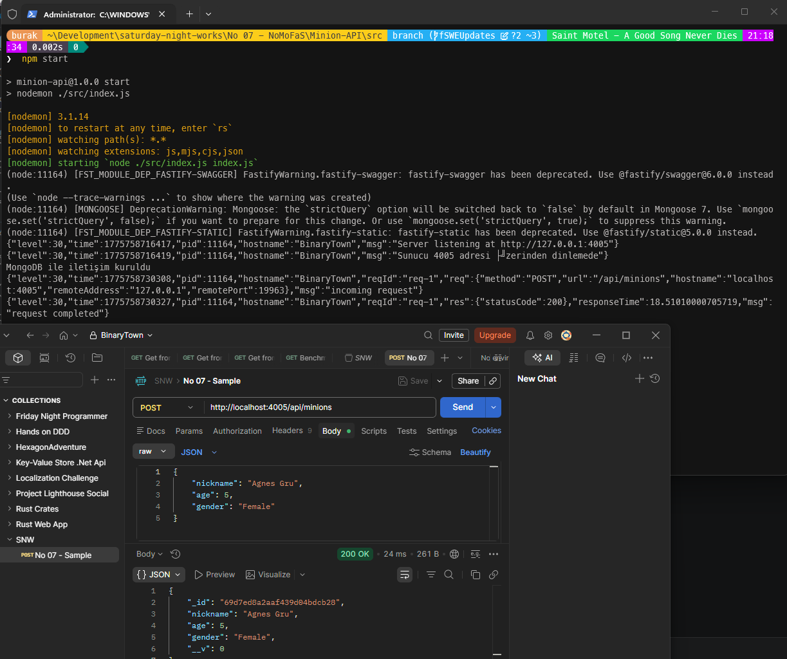

# Güncellemeler

## 9 Nisan 2026

> MongoDb ile daha rahat çalışmak için docker-compose dosyası ekledim. Artık `docker-compose up -d` komutu ile MongoDb'yi ayağa kaldırabilirsiniz.

### Paket Güncellemeleri

| **Paket** | **Eski Sürüm** | **Yeni Sürüm** | **Not** |
| --- | --- | --- | --- |
| **fastify** | ^1.13.2 | ^3.29.5 | |
| **fastify-swagger** | ^0.16.2 | ^5.1.1 | |
| **mongoose** | ^5.4.0 | ^6.13.6 | |
| **nodemon** | ^1.18.9 | ^3.1.14 | |

### Kod Değişiklikleri

- **package.json:** `start` script bildiriminde Windows'ta çalışmayan Unix yolu (`./node_modules/nodemon/bin/nodemon.js`) yerine `nodemon` komutu kullanacak şekilde düzeltildi.
- **index.js:** Fastify 3.x ile uyumsuz olan `fastify.listen(4005)` çağrısı, nesne parametresi alacak şekilde değiştirildi; `fastify.listen({ port: 4005, host: '127.0.0.1' })`
- **routes/swagger-help/minionApi.js:** `getAllMinionSchema` response şeması `type: 'object'` yerine `type: 'array'` olarak düzeltildi zira Fastify' da sonradan değişen serileştirici kuralı nedeniyle dizi yanıtı boş nesne `[]` şeklinde dönüyordu.
- **index.js:** Fastify örneği oluşturulurken `trustProxy: false` seçeneği eklendi. Bu sayede güvenilmeyen istemcilerin `X-Forwarded-Proto` ve `X-Forwarded-Host` başlıklarını göndererek `request.protocol` ve `request.host` değerlerini taklit etmesi engellendi.

### Testler

- [x] Windows 11 testleri
- [ ] Ubuntu testleri

