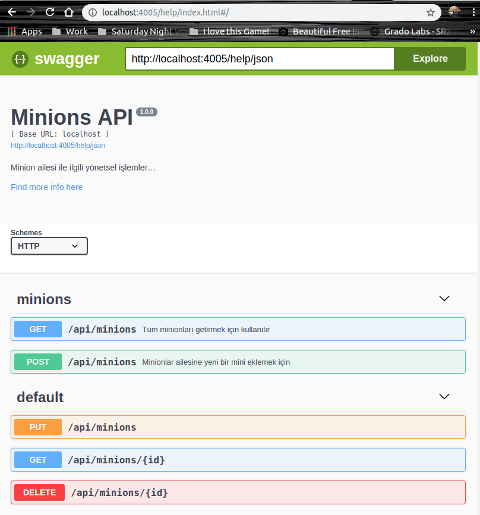
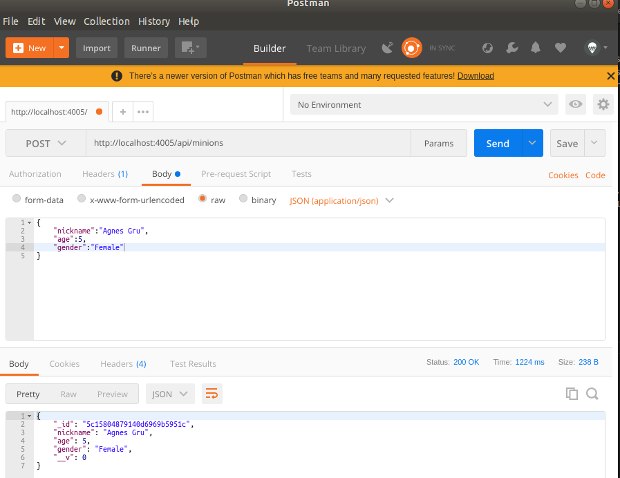

# Node.js, MongoDB, Fastify ve Swagger Kullanılan bir uygulama

Amacım başlıktaki konuları kullanarak komple bir Web API uygulaması geliştirmek. WestWorld'de _(Ubuntu 18.04 64bit)_ Node.js, npm ve MongoDB yüklü durumda. Yazmaya çalışacağımız örnek sayesinde javascript, node.js, mongodb ve REST API bilgilerimi de tazelemiş _(geliştirmiş)_ olacağım.

>MongoDB'yi Ubuntu'ya kurmak için [https://docs.mongodb.com/manual/tutorial/install-mongodb-on-ubuntu/](adresinden) yararlanabiliriz. Ama isterseniz MongoDB'nin konu ile ilgili [docker imajını da kullanabilirsiniz](https://hub.docker.com/_/mongo)

## Klasör Ağacı ve Paketler

Uygulamanın iskelet klasör ve temel dosya yapısı aşağıdaki gibi kurgulanabilir.

```
mkdir Minion-API
cd Minion-API
mkdir src
cd src
mkdir models
mkdir controllers
mkdir routes
mkdir config
touch index.js
npm init
```

Gerekli paketleri kurmak içinse aşağıdaki terminal komutundan yararlanabiliriz.

```
npm i nodemon mongoose fastify fastify-swagger boom
```

nodemon'u herhangibir dosyada değişiklik olduğunda node sunucusunu otomatik olarak yeniden başlatmak için kullanıyoruz. Ancak kullanımı için package.json'daki start komutunu değiştirdik.

mongoose, mongodb ile konuşabilmek için gerekli bir paket. Fastify, Hapi ve Express'ten ilham alınarak yazılmış oldukça hızlı bir web framework. API dokümantasyonu içinse Fastify'a Swagger desteği veren Fastify-swagger modülünü kullanıyoruz. HTTP hata mesajları içinse boom isimli utility paketinden yararlanmaktayız.

## İçerde neler var?

Temel olarak mongodb dokümanlarına ait şemaları models klasöründe tutuyoruz. _(Örnekte sadece mini.js var)_ CRUD Operasyonlarını controllers içerisinde karşılıyoruz. _(ki örnekte sadece minicontroller.js var)_ HTTP taleplerini ele aldığımız yerse routes klasörü. _(ki sadece index.js var)_

Swagger ile ilgili ayarlamalar için config klasöründeki swagger.js dosyası kullanılıyor. Dosyaya göre localhost:4005/help şeklinde geldiğimizde aşağıdaki ekran görüntüsünde yer alan yardım sayfası ile karşılaşıyoruz. minions altındaki GET ve POST bildirimleri routes/swagger-help klasöründeki js dosyası içerisindeki tanımlamalardan oluşuyor. Yani Swagger arayüzüne swagger.js ve miniApi.js dosyalarındaki gibi müdahale edip değiştirebiliriz.



## Testler

Önce mongodb'yi çalıştırmak lazım. Ardından node uygulaması başlatılmalı. Malum uygulamamız mongodb ile çalışıyor. mongodb sunucusunun önceden çalışır durumda olması gerekiyor. İki ayrı terminal penceresi açılarak ilerlenebilir ki ben öyle yaptım.

```
mongod
npm start
```


Sonrasında aşağıdaki testler yapılabilir _(Testler için Postman gibi bir araçtan yararlanılabilir)_

Yeni bir mini eklemek için http://localhost:4005/api/minions adresine json formatında body içeren aşağıdaki içeriği göndermemiz yeterli.

```
{
	"nickname":"Agnes Gru",
	"age":5,
	"gender":"Female"
}
```

>id değerleri tahmin edileceği üzere MongoDB tarafından otomatik olarak üretilmiştir. Silme ve güncelleme işlemleri için kullanabiliriz.



Bir kaç minion daha ekledikten sonra bunların güncel listesini elde etmek için http://localhost:4005/api/minions adresine gidebiliriz.

Belli bir minion'u elde etmek içinse MongoDb'nin verdiği ID değerinden yararlanabiliriz.

http://localhost:4005/api/minions/5c1581e579140d6969b5951f talebi için şöyle bir sonuç döndü mesela.


Benzer şekilde aynı adresi PUT metodu ile kullanıp BODY kısmında mini bilgisini JSON formatında göndererek güncelleme işlemini de gerçekleştirebiliriz.

## Neler Öğrendim?

- express yerine Fastify'ı nasıl kullanabileceğimi,
- mongodb'de temel veri işlemlerini web api üzerinden nasıl karşılayabileceğimi,
- Swagger ile API arayüzünü nasıl kullanıcı dostu okunabilir hale getireceğimi,
- Postman ile basit REST testlerini nasıl yapabileceğimi,