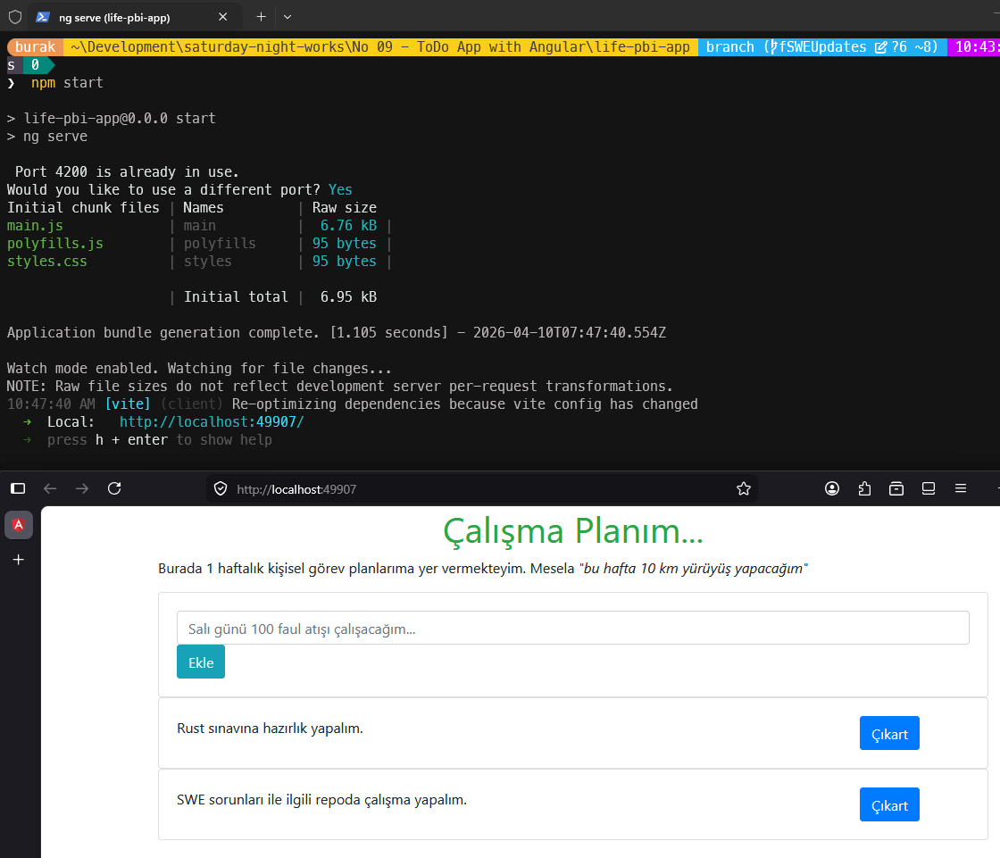

# Güncellemeler

## 10 Nisan 2026

- **Problem:** Angular Stored XSS Vulnerability via SVG Animation, SVG URL and MathML Attributes  
- **Çözüm:** Angular 11 -> 21 sürüm yükseltmesi ve kaynak kod hata düzeltmeleri
- **Yapay Zeka Asistanı:** Claude Sonnet 4.6

---

## Kod Değişiklikleri

### `src/main.ts`

- `platformBrowserDynamic().bootstrapModule(AppModule)` -> `bootstrapApplication(AppComponent)` (NgModule'süz standalone bootstrap)
- enableProdMode() kaldırıldı zira Angular 19 sürümünden itibaren yok
- AppModule ve environment importları kaldırıldı

### `src/app/app.component.ts`

- **XSS güvenlik açığı:** `@angular/core/src/change_detection/change_detection_util` özel (private) iç API importu kaldırıldı; bu import Angular 13'te silinmişti ve SVG/MathML XSS saldırılarına zemin hazırlıyordu
- Bileşen **standalone: true** olarak güncellendi; **FormsModule** doğrudan bileşene import edildi (**ngModel** için artık AppModule gerekmiyormuş)
- jobs dizisi `string[]` olarak tiplendirildi; **addJob** ve **removeJob** metodlarına parametre tipleri eklendi
- **removeJob** off-by-one hatası düzeltildi: `i <= this.jobs.length` -> indexOf ile güvenli silme
- Kullanılmayan `// console.log` satırları temizlendi

### `src/app/app.component.html`

- `*ngFor="let job of jobs"` -> Angular 17+ yeni blok kontrol akışı: `@for (job of jobs; track $index)`
- Ekle butonuna `job.value = ''` eklenerek giriş kutusu otomatik temizlenir hale getirildi

### `src/app/app.component.spec.ts`

- async *(deprecated)* -> `async/await`
- `declarations: [AppComponent]` -> `imports: [AppComponent]` *(standalone)*
- RouterTestingModule ve geçersiz başlık testleri kaldırıldı
- Anlamlı testler eklendi: boş liste kontrolü, görev ekleme, boş görev ekleme engeli, görev silme, başlık render testi

### `src/app/app.module.ts` ve `src/app/app-routing.module.ts`

- NgModule mimarisinden standalone mimarisine geçildiği için bu dosyalar kullanım dışı kaldı

---

### Paket Değişiklikleri

| **Paket** | **Eski** | **Yeni** |
| --- | --- | --- |
| `@angular/*` | ~11.0.5 | ~21.2.0 |
| `typescript` | ~4.0.5 | ~5.9.0 |
| `rxjs` | ~6.6.0 | ~7.8.0 |
| `zone.js` | ~0.11.3 | ~0.16.0 |
| `tslib` | ^2.0.0 | ^2.8.0 |
| `@angular/build` | — | ~21.2.0 (yeni esbuild builder) |
| `@angular-eslint/*` | — | ~21.3.0 (ESLint desteği) |
| `typescript-eslint` | — | ~8.0.0 |
| `@eslint/js` | — | ^9.0.0 |
| `@types/jasmine` | ~2.8.8 | ~6.0.0 |
| `jasmine-core` | ~2.99.1 | ~6.1.0 |
| `karma` | ^6.3.14 | ~6.4.0 |

**Kaldırılan paketler:** `@angular/platform-browser-dynamic`, core-js, `@angular-devkit/build-angular`, codelyzer, tslint, protractor, jasmine-spec-reporter, `karma-coverage-istanbul-reporter`, `@types/jasminewd2`, `@types/node`, `@angular/language-service`

### Yapılandırma Dosyaları

**`angular.json`**

- Builder: `@angular-devkit/build-angular:browser` -> `@angular/build:application`
- polyfills: string yolu -> `["zone.js"]` dizisi
- Kaldırılan opsiyonlar: extractCss, namedChunks, vendorChunk, aot, fileReplacements
- life-pbi-app-e2e projesi kaldırıldı (Protractor Angular 16'da kaldırıldı)
- lint builder -> `@angular-eslint/builder:lint`

**`tsconfig.json`**

- target: ES5 -> ES2022
- module: ES2015 -> ES2022
- moduleResolution: node -> bundler
- lib: `[ES2018, dom]` -> `[ES2022, dom, dom.iterable]`
- strict, noImplicitOverride, noImplicitReturns, skipLibCheck, isolatedModules etkinleştirildi
- angularCompilerOptions eklendi

**`tsconfig.app.json` ve `tsconfig.spec.json`** — `src/` altından proje kök klasörüne taşındı

**`eslint.config.mjs`** —> eski `tslint.json` + codelyzer kurallarının yerine geçti

---

### Çalışma Zamanı Testleri

Windows 11 sisteminde çalışabilmek için `.npmrc` dosyası eklendi. İçeriği şu şekilde;

```text
os=win32
```

```bash
npm start
```



- [x] Windows 11 testleri
- [ ] Ubuntu testleri
