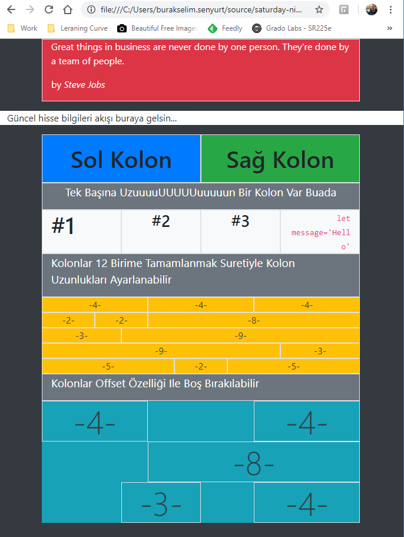

Ön Hazırlıklar

```
bower i bootstrap
```

Bower yoksa npm ile yüklenebilir.

Sonra bower_components\bootstrap\dist\js adresinden bootstrap.min.css ile bootstrap.min.css.map dosyalarını aldım ve kolaylık olsun diye css klasörü içerisine attım.



## sd'ler ne anlama geliyor (Burası Copy-Paste)

- .col-sm for larger mobile phones (devices with resolutions ≥ 576px);
- .col-md for tablets (≥768px);
- .col-lg for laptops (≥992px);
- .col-xl for desktops (≥1200px)