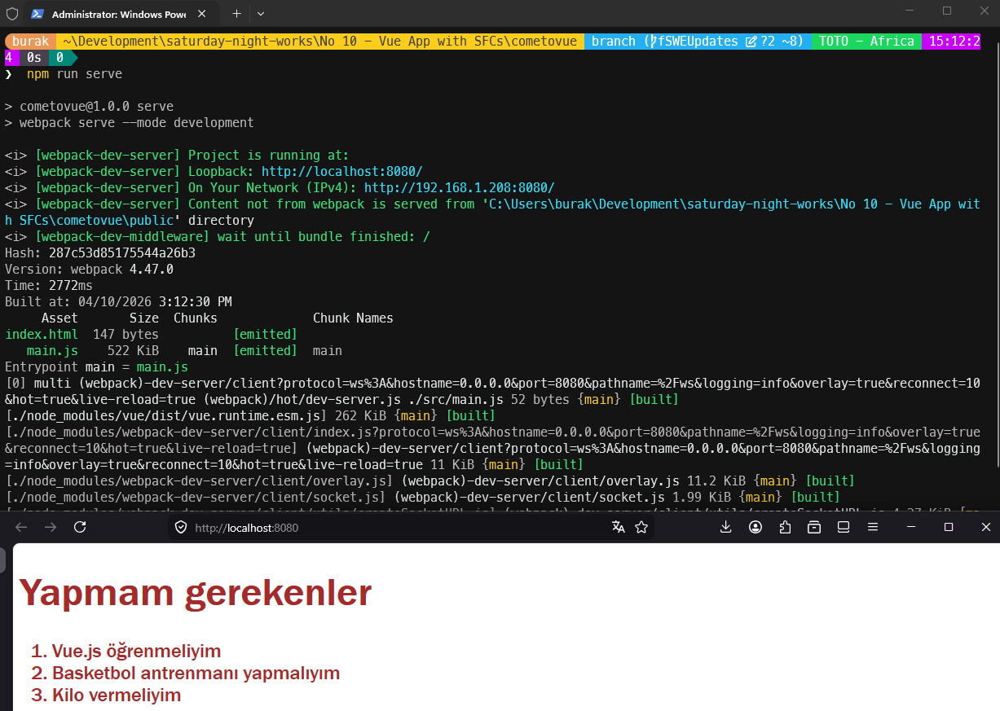

# Güncellemeler

## 10 Nisan 2026

**Problem:** webpack-dev-server users' source code may be stolen when they access a malicious web site  
**Güvenlik Açığı:** CVE-2018-14732 — DNS rebinding saldırısı  
**Çözüm:** **disableHostCheck:true** kaldırıldı, webpack-dev-server v3 -> v4 yükseltmesi ve ilgili paket güncellemeleri uygulandı. Artık webpack-dev-server v4'ün güvenli varsayılanlarıyla çalışıyoruz, yani `localhost` ve `127.0.0.1` adreslerine izin verilirken rastgele host başlıkları engelleniyor.

---

### Paket Güncellemeleri

| **Paket** | **Eski** | **Yeni** | **Açıklama** |
| --- | --- | --- | --- |
| `webpack-dev-server` | `^3.1.13` | `^4.15.2` | **Temel CVE düzeltmesi** — v3 sürümündeki **disableHostCheck** özelliği v4 sürümünde tamamen kaldırılmış. **allowedHosts: 'auto'** güvenli varsayılan olarak ayarlandı |
| `webpack` | `^4.28.2` | `^4.47.0` | webpack-dev-server v4 için gerekli (≥ 4.37.0) |
| `webpack-cli` | `^3.1.2` | `^4.10.0` | **webpack serve** komutunu destekleyen v4 sürümü |
| `html-webpack-plugin` | `^3.2.0` | `^4.5.2` | v3 sürümü kullanımdan kalkmış webpack API'lerini kullanıyordu bu nedenle yükseltildi |
| `vue` | `^2.5.21` | `^2.7.16` | Vue'nun güvenlik yamaları dahil LTS *(Long Term Support)* sürümü |
| `vue-template-compiler` | `^2.5.21` | `^2.7.16` | Her zaman kullanılan **vue** sürümüyle eşleşmeli |
| `vue-loader` | `^15.4.2` | `^15.11.1` | Vue 2 + webpack 4 için kullanılabilecek güncel sürüm |
| `css-loader` | `^2.0.2` | `^5.2.7` | webpack 4 uyumlu son sürüm |
| `@babel/core` | `^7.2.2` | `^7.26.0` | Güvenlik ve hata düzeltmeleri içeren sürüm |
| `babel-loader` | `^8.0.4` | `^8.4.1` | Webpack 4 ile uyumlu olan son 8 sürümü. 9'a geçmek için webpack 5 gerekir. |
| `babel-preset-env` | `^1.7.0` *(kaldırıldı)* | `@babel/preset-env ^7.26.0` | Bakımsız bir eski paketmiş, resmi olan `@babel/` monorepo paketi ile değiştirildi |
| `rimraf` | `^2.6.2` | `^5.0.10` | v2 kullanımdan kalkmış ve bilinen açıkları var |
| `vue-style-loader` | `^4.1.2` | `^4.1.3` | Yama güncellemesi |

### Kod Değişiklikleri

**`webpack.config.js`**

- `disableHostCheck: true` **kaldırıldı** — doğrudan güvenlik açığının kaynağı. webpack-dev-server v4'te bu seçenek zaten yokmuş. `allowedHosts: 'auto'` varsayılan olup `localhost`/`127.0.0.1`'e izin verirken rastgele host başlıklarını *(host header)* engeller
- `const webpack = require('webpack')` gerekli olmadığı için bu importu kaldırıldı
- `new webpack.HotModuleReplacementPlugin()` kaldırıldı. webpack-dev-server v4 HMR'yi *(Hot Module Replacement)* dahili olarak yönetir. *(`hot: true` ile birlikte kullanmak çakışmaya neden oluyordu)*

**`package.json` -> scripts**

- `serve`: `webpack-dev-server --mode development` -> `webpack serve --mode development` — `webpack-dev-server` 4ncü sürümüyle birlikte kullanımdan kalkmış. Doğru komut webpack-cli üzerinden **webpack serve** şeklinde değişti.

**`.babelrc.js`**

- `babel-preset-env` -> `@babel/preset-env` Yeniden adlandırılan dependency tanımı ile eşleştirildi.

**`.npmrc` dosyası eklendi** Burada **legacy-peer-deps** değeri **true** yapıldı. npm 7 ve sonrasın sürümlerde peer dependency çatışmalarını göz ardı etmek için bu şekilde kullanıldı. Tabii bu, webpack 4'ün bazı eski bağımlılıklarıyla uyumluluğu sağlamak için geçici bir çözüm. Sorun çıkartırsa diğer bağımlılıkları da güncelleyebiliriz.

### Çalışma Zamanı Testleri

- [x] Windows 11 testleri
- [ ] Ubuntu testleri
