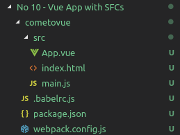

# Webpack ile basit bir vue.js uygulaması geliştirmek

Amacım Single-File Components kavramını anlamak ve Webpack'ten yararlanarak bir Vue.js uygulaması yazıp onu paketlemek. Vue halen daha oldukça yabancı olduğum bir alan. Webpack ortamlara göre dağıtım işini de ele alıp ürünleri daha az parçada ve merkezileştirerek paketlememize yarayan bir araç olarak düşünülebilir.

>Platform olarak WestWorld _(Ubuntu 18.04, 64bit)_ üzerinde çalıştım.

## Ön Gereklilikler

İşe proje iskeletini oluşturarak başlayabiliriz.

```
mkdir cometovue
cd cometovue
npm init
mkdir src

```

Sonrasında aşağıdaki ilaveleri yaparak ilerleyebiliriz.



Projenin diğer bağımlılıklarını yüklemek içinse npm aracından yararlanıyoruz. _(Epey bir bağımlılık yüklemem gerekti)_

```
npm install vue vue-loader vue-template-compiler webpack webpack-cli webpack-dev-server babel-loader @babel/core babel-preset-env css-loader vue-style-loader html-webpack-plugin rimraf -D
```

- rimraf sıkça build edilmiş eski dosyaları silme ihtiyacı için kullanılıyor
- webpack kodları bazı dönüşümlerle tek bir dosya içerisine paketlemek için
- webpack-cli, webpack'in terminalden çalıştırılacak komutlarını ele almak için
- babel-loader, ES6 kodlarını ES5 standartlarına dönüştürmek için
- css-loader, CSS dosyalarının nerede olduğunu anlayıp yüklemeyi kolaylaştırdığı için
- vue-css-loader, css-loader'dan alınan css'i HTML içerisine enjekte etmek için
- html-webpack-plugin, index.html'in başına paketlenmiş Javascript dosyasını enjekte edip dosyayı bu haliyle dist klasörüne attığı için
- vue, elbetteki javascript framework'ümüz olduğu için
- vue-loader, vue dosyalarını javascript'e dönüştürmek için _(vue-template-compiler' da benzer görevi üstleniyor)_

## Çalışma zamanı

package.json'a eklenen serve script'i sayesinde uygulama aşağıdaki gibi çalıştırılabilir.

```
npm run serve
```


webpack.config.js'teki open:true ataması sayesinde tarayıcı otomatik olarak açılır ve localhost:8080 adresine yönlenilir. Vue, progressive uygulama yazmamıza olanak sağladığından herhangibir emulator ile sonuçlara bakabiliriz.

package.json'a eklenen build betiği ile uygulamanın önceki dağıtımlarının silinmesi ve ardından yeni bir dağıtım paketinin oluşturulması sağlanır. Bu dağıtım paketi hazırlanırken build işlemi de gerçekleştirilir. Sonuç olarak _npm run serve_ komutunu çalıştırmadan direkt index.html dosyasını tıklayarak uygulamayı açabiliriz. Tabii öncesinde build etmek lazım :)

```
npm run build
```

build sonrası dist klasörü aşağıdaki ekran görüntüsünde olduğu gibi oluştu.


Sonrasında _npm run serve_ demeden index.html'i fiziki lokasyonundan tarayıcı ile açtığımda çalıştığını gördüm.


>Tabii asıl farkı görebilmek için serve edilen ve fiziki klasörde çalıştırılan index.html dosyalarının source kısımlarına bakıp karşılaştırmak lazım. Sizde böyle yapın ;)

## Neler Öğrendim?

- Bir Vue.js uygulamasının genel anatomisini
- Webpack'in ne işe yaradığını, ona ne yapması gerektiğini nasıl söyleyeceğimi ve nasıl çalıştıracağımı
- package.json'a eklenen betikler ile build ve deploy işlemlerinin nasıl gerçekleştirilebileceğini