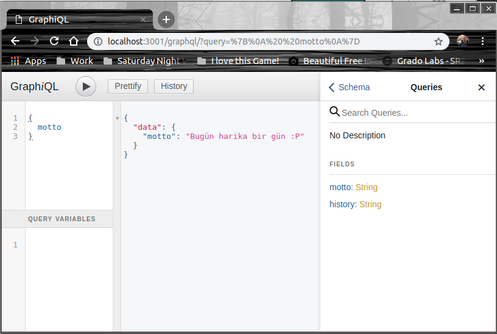
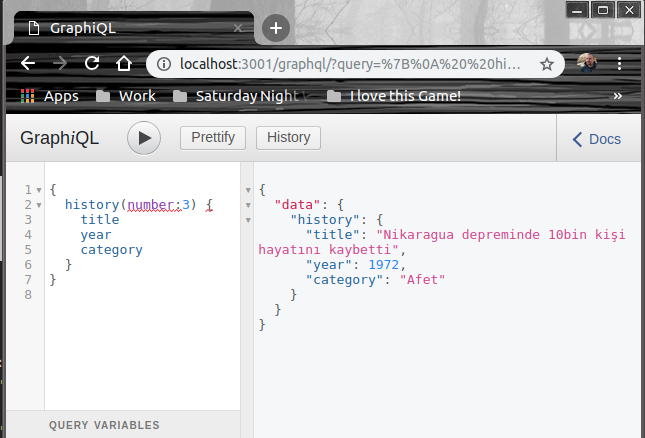
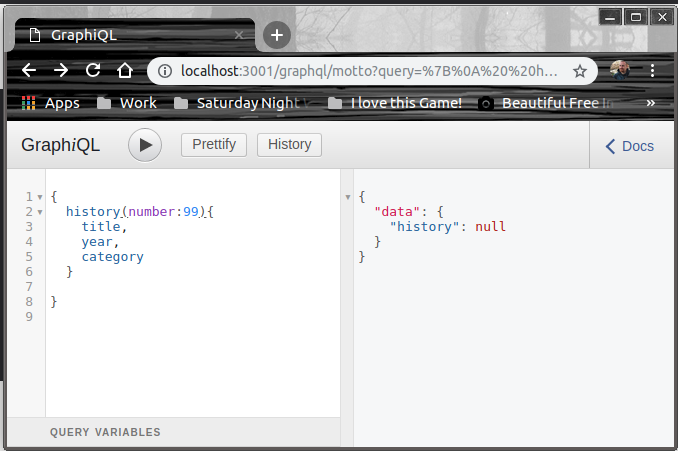

# GraphQL'i Bir NodeJS Uygulamasında Deneyimlemek

GrapQL'in API'ler için bir sorgulama dili olduğunu biliyordum. Özellikle REST API'lerde çok popüler bir konu. Lakin deneyimleyememiştim. Amacım onu NodeJS tabanlı servisler üzerinden nasıl kullanabileceğimi görmekti.

>Platform olarak West-World _(Ubuntu 18.04)_ üzerinde çalıştım.

## Ön Gereklilikler

İşe klasör ve içeriğini oluşturup gerekli npm paketlerini yükleyerek başladım.

```
mkdir hello-graphql
cd hello-graphql
npm init
npm i express express-graphql graphql lodash --save-dev
```

## Çalışma zamanı

Uygulamayı çalıştırmak için 

```
npm start
```

dememiz ve sonrasında http://localhost:3001/graphql adresine gitmemiz yeterli.

Bu durumda GraphiQL ekranı ile karşılaşırız. Sol taraf sorgularımızı girdiğimiz alandır. Örneğin,

```
{
    motto
}
```

yazıp play tuşuna basarsak motto endPoint'i çalışır ve aşağıdaki sonucu elde ederiz.



Benzer şekilde sol tarafa

```
{
  history(number: 3) {
    title
    year
    category
  }
}
```

yazıp play tuşuna basarsak history endPoint'ini karşılayan sorgu çalışır ve aşağıdaki çıktı elde edilir.



ya da şunu

```
{
  history(number:4) {
    year,
    title
  }
}
```

denediğimizde aşağıdaki sonucu alırız. _(4 numaralı bilgi için, sadece year ve title alanlarının değerlerini istedik)_


>play tuşuna bastığımızda URL adresinin nasıl değiştiğine ayrıca sol taraftaki json sorgularında ne yazdığımıza, argümanı nasıl gönderdiğimize dikkat edelim.

Eğer numarasının karşılığı olmayan bir sorgu atarsak null değer alırız.

```
{
  history(number:99){
    title,
    year,
    category
  }  
}
```

için



gibi.

## Neler Öğrendim?

- GraphQL için sorgu endpoint'lerini nasıl oluşturabileceğimi,
- Var olan temel veri türleri dışında örneğin array gibi içinde kullanıcı tanımlı değerler barındıran bir GrappQL tipini nasıl tanımlayabileceğimi,
- Sorgulamaların ne şekilde yapılabileceğini,
- GraphiQL'in ne olduğunu ve nasıl kullanıldığını,

çok temek seviyede öğrendim.