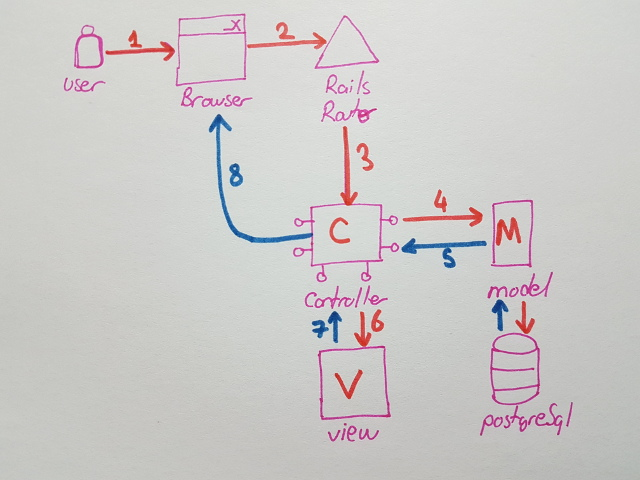

# Ruby on Rails Tabanlı Komple Örnek

Amacım MVC Modelinin işlendiği Ruby on Rails tabanlı bir örnek geliştirmek. Kabaca aşağıdaki gibi bir kurgusu olacak. Back-end tarafında Ruby, Rails ve veritabanı olarak da PostgreSQL kullanacağım. Front-end tarafında HTML, Bootstrap ve jQuery kullanmak istiyorum.

Sayısal sıradan izleyecek olursak;

Kullanıcılar tarayıcıdan talep gönderdiklerinde bunu Ruby tabanlı bir Router mekanizması karşılayıp Controller'a yönlendirecek. Controller, veritabanı ile ilişkili olan model ve View'dan yararlanıyor. View tarafında hazırlanan HTML bazlı içerikte yine Controller üzerinden istemci tarafa render edilmekte.

## Gerekli Kurulumlar

## Çalışma Zamanı

## Neler Öğrendim