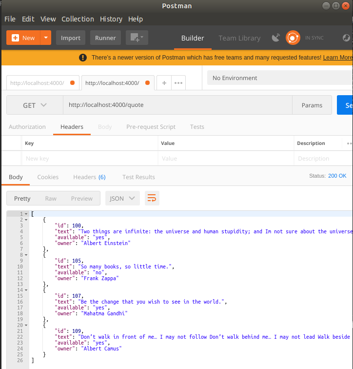

# Typescript Kullanarak Bir Web API Geliştirmek

Amacım FortJs isimli projeyi kullanarak, Typescript ile bir Web API servisi geliştirebilmek. FortJs, MVC tabanlı bir web framework. Nodejs için geliştirilmiş ve Typescript desteği sunmakta. Bende bu tarafını kurcalamak istedim.

## Kurulumlar

İlk olarak https://github.com/ujjwalguptaofficial/fortjs-typescript-starter adresinden bir projeyi klonlamam gerekti. Sonrasında WestWorld için gerekli eksik npm paketlerinin yüklemesini yaptım. Sonra node uygulamasını başlattım ve localhost:4000 adresine gittim. Varsayılan FortJs sayfası ile karşılaştım.

```
git clone https://github.com/ujjwalguptaofficial/fortjs-typescript-starter
cd fortjs-typescript-starter
npm install
npm run start
```


QuoteController isimli ilk controller bileşenini ekledikten sonra http://localhost:4000/quote adresine gittiğimde aşağıdaki çıktıyı elde ettim.


## Yapılan Değişiklikler

- controllers klasörüne quote_controller.ts eklendi
- routes.ts dosyasında eklenen controller bildirimi yapıldı
- models klasörü oluşturulup içersine quote.ts isimli model sınıfı eklendi
- services klasörü oluşturulup içersine quote_service.ts dosyası eklendi

>Detaylar için kodlardaki yorum satırlarını takip etmeye çalışın

## Testler için

quote_service.ts tamamlandıktan sonra aşağıdaki komutlar ile CRUD operasyonları test edilebilir.

```
npm start
```

ile uygulama çalıştırılır ve sunucu aktif hale getirilir.

Yeni özlü sözler eklemek için

```
curl -H "Content-Type: application/json" -X POST -d '{"id":100,"text":"Two things are infinite: the universe and human stupidity; and Im not sure about the universe.","owner":"Albert Einstein","available":"yes"}' http://localhost:4000/quote

curl -H "Content-Type: application/json" -X POST -d '{"id":105,"text":"So many books, so little time.","owner":"Frank Zappa","available":"no"}' http://localhost:4000/quote

curl -H "Content-Type: application/json" -X POST -d '{"id":107,"text":"Be the change that you wish to see in the world.","owner":"Mahatma Gandhi","available":"yes"}' http://localhost:4000/quote

curl -H "Content-Type: application/json" -X POST -d '{"id":109,"text":"Don’t walk in front of me… I may not follow Don’t walk behind me… I may not lead Walk beside me… just be my friend","owner":"Albert Camus","available":"yes"}' http://localhost:4000/quote

curl http://localhost:4000/quote

curl http://localhost:4000/quote/100
```

Yukardaki eklemeler sonrası örneğin Postman ile ilgili adrese gidilirse aşağıdaki sonuçla karşılaşılır.



Güncelleme ve silme için örnek

```
curl -H "Content-Type: application/json" -X PUT -d '{"text":"bla bla bla bla...","owner":"Albert Einstein","available":"no"}' http://localhost:4000/quote/100

curl -X DELETE http://localhost:4000/quote/100
```

## Neler Öğrendim

- Typescriptçe kabaca nasıl bir şeydir?
- Typesrciptçe'ye göre MVC kabaca nasıl uygulanır?
- Routes sistemi Typescript için nasıl çalışır?
- @DefaultWorker ve @Worker ne işe yarar?
- Typescript tarafında controller'ın yardımcısı olacak bir servis sınıfı nasıl inşa edilir?
