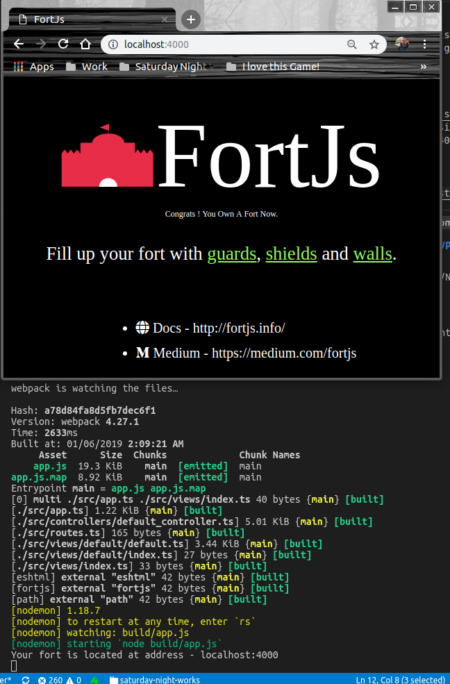
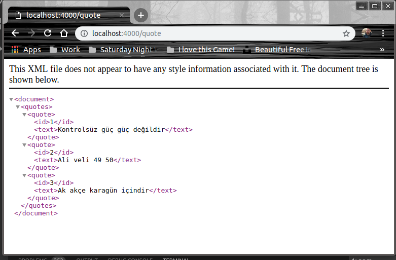

# Typescript Kullanarak Bir Web API Geliştirmek

Amacım FortJs isimli projeyi kullanarak, Typescript ile bir Web API servisi geliştirebilmek. FortJs, MVC tabanlı bir web framework. Nodejs için geliştirilmiş ve Typescript desteği sunmakta. Ben de bu tarafını kurcalamak istedim.

## Kurulumlar

İlk olarak [başlangıç](https://github.com/ujjwalguptaofficial/fortjs-typescript-starter) adresinden bir projeyi klonlamam gerekti. Sonrasında WestWorld için gerekli eksik npm paketlerinin yüklemesini yaptım. Ardından node uygulamasını başlattım ve localhost:4000 adresine gittim. Varsayılan şablona ait FortJs sayfası ile karşılaştım.

```
git clone https://github.com/ujjwalguptaofficial/fortjs-typescript-starter
cd fortjs-typescript-starter
npm install
npm run start
```



QuoteController isimli ilk controller bileşenini ekledikten sonra http://localhost:4000/quote adresine gittiğimde aşağıdaki çıktıyı elde ettim.



## Yapılan Değişiklikler

- controllers klasörüne quote_controller.ts eklendi
- routes.ts dosyasında eklenen controller bildirimi yapıldı
- models klasörü oluşturulup içersine quote.ts isimli model sınıfı eklendi
- services klasörü oluşturulup içersine quote_service.ts dosyası eklendi
- guards klasörü ve içerisine dataValidatorGuards.ts dosyası eklendi

>Detaylar için kodlardaki yorum satırlarını takip etmeye çalışın

## Testler için

quote_service.ts tamamlandıktan sonra aşağıdaki komutlar ile CRUD operasyonları test edilebilir.

```
npm start
```

ile uygulama çalıştırılır ve sunucu aktif hale getirilir.

### Yeni verilerin eklenmesi

Yeni özlü sözler eklemek için terminalden curl aracını aşağıdaki gibi kullanabiliriz. POST taleplerini takiben quote ve quote/100 gibi adreslere gittiğimizde eklediğimiz içerikleri çekebiliriz.

```
curl -H "Content-Type: application/json" -X POST -d '{"id":100,"text":"Two things are infinite: the universe and human stupidity; and Im not sure about the universe.","owner":"Albert Einstein","available":"yes"}' http://localhost:4000/quote

curl -H "Content-Type: application/json" -X POST -d '{"id":105,"text":"So many books, so little time.","owner":"Frank Zappa","available":"no"}' http://localhost:4000/quote

curl -H "Content-Type: application/json" -X POST -d '{"id":107,"text":"Be the change that you wish to see in the world.","owner":"Mahatma Gandhi","available":"yes"}' http://localhost:4000/quote

curl -H "Content-Type: application/json" -X POST -d '{"id":109,"text":"Don’t walk in front of me… I may not follow Don’t walk behind me… I may not lead Walk beside me… just be my friend","owner":"Albert Camus","available":"yes"}' http://localhost:4000/quote

curl http://localhost:4000/quote

curl http://localhost:4000/quote/100
```

Ayrıca yeni eklemeler sonrası Postman ile ilgili adrese gidilirse aşağıdaki sonuçla karşılaşılır.


### Güncelleme ve silme işlemleri

```
curl -H "Content-Type: application/json" -X PUT -d '{"text":"bla bla bla bla...","owner":"Albert Einstein","available":"no"}' http://localhost:4000/quote/100

curl -X DELETE http://localhost:4000/quote/100
```

Post çağrımında gelen verinin çeşitli kurallara göre kontrolü için bir decarator nesne kullanımı söz konusu. Bu FortJS içinden hazır olarak gelen Guard türevli bir tip ile gerçekleniyor _(koddaki izleri takip edin)_ Guard'ın neler yapabileceğini öğrenmek için dataValidatorGuard.ts sınıfındaki check metodundan dönen değerleri değiştirebilirsiniz.

## Neler Öğrendim

- FortJS'in sunduğu imkanlar
- FortJs router sisteminin çalışma şekli
- FortJs ile gelen @DefaultWorker, @Worker, @Route, @Guards gibi dekoratör sınıfların kullanımı
- Genel Typescript kavramları
- MVC yapısının uygulanış biçimi

>Örnek özlü söz listesi için [GoodReads'in şu adresinden](https://www.goodreads.com/quotes) yararlandım.