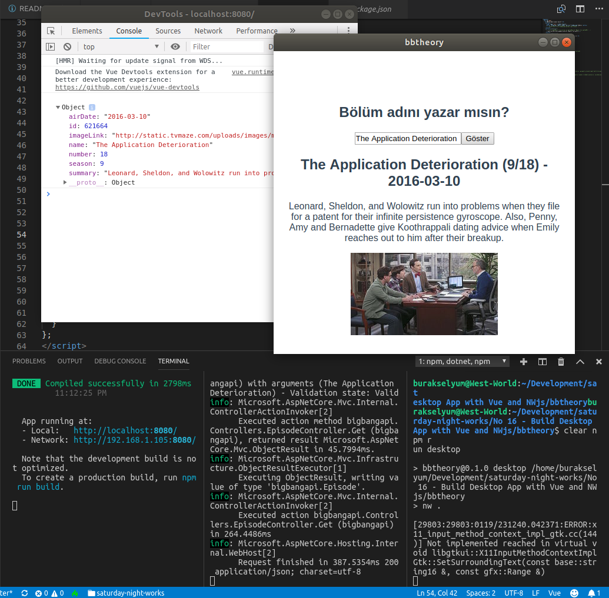
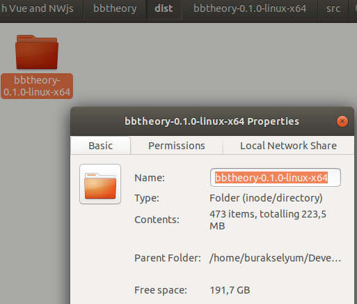

# Vue ve NW.js ile Desktop Uygulaması Geliştirmek

Daha önceden Electron ile cross platform desktop uygulamalarının geliştirilmesi üzerine çalışmıştım. Bu kez eskiden node-webkit olarak bilinen NW.js kullanarak WestWorld üzerinden desktop uygulaması geliştirmek istedim. NW.js cephesinde de aynen Electron'da olduğu gibi Chromium, Node.js, HTML, CSS ve javascript kullanılmakta. Lakin ufak tefek farklılıklar var. Electron'da entry point yeri Javascript script'i iken NW.js tarafında script haricinde bir web sayfası da giriş noktası olabiliyor. Build süreçlerinde de bir takım farklılıklar var.

Uygulama çok basit bir arayüze sahip olacak. Textbox'a bir bölüm adı girilecek ve Big Bang Theory'nin ilgili bölümüne ait bazı bilgiler ekrana bastırılacak. Bölüm bilgisini ise bigbangapi isimli .net core ile yazılmış web api sağlayacak. _(Bölümün konusu web api yazımı olmadığından o konuya değinmedik)_

## Ön Gereklilikler

WestWorld'de _(Ubuntu 18.04 64bit)_ bu örnek için Vue CLI'a ihtiyaç var. Önce versiyonu kontrol edip yoksa yüklemek lazım. Ayrıca projeyi oluşturduktan sonra NW paketini de eklemek gerekiyor. axios'u servis haberleşmesi için kullanacağız.

```
vue --version
sudo npm install -g @vue/cli
vue create bbtheory
cd bbtheory
sudo npm install --save-dev nwjs-builder-phoenix nw@sdk
sudo npm install axios
```

>Vue projesi varsayılan kurulum ayarları ile oluşturulmuştur.

## Bazı Notlar

Uygulamanın giriş noktasını belirtmek için package.json dosyasında main özelliği eklendi ve bir adres yönlendirilmesi yapıldı. Buna göre uygulamadaki her değişiklik anında çalışma zamanına yansıyacak. _(Uygulamayı açtıktan sonra örneğin App.vue da değişiklikler yapın)_

Normalde desktop uygulamasını çalıştırmak için proje klasöründeyken birinci terminalden

```
npm run serve
```

ile sunucuyu etkinleştirmek ve ardından ikinci bir terminal penceresinden 

```
./node_modules/.bin/run .
```

yazmak gerekiyor. Lakin bu durumda NW.js'in ilgili SDK'sı indirilip development ortamı ayağa kalkıyor. Bunu otomatikleştirmek için nw@sdk isimli paketi yükledik ve package.json'a _desktop_ betiğini dahil ettik. 

Desktop uygulaması çalıştıktan sonra tarayıcının Development Tools'unu kullanarak debug yapılabiliyor. API çağrısı yapabilmek içinse axios paketinden yararlanıyoruz.

## Değişiklikler

- App.vue dosyası değiştirildi. Bu, desktop uygulamasının arayüzü.
- main.js tarafında değişiklik yapıldı.
- _Bu konu kapsamı dışında ama birde Asp.Net Core Web API yazıldı_

## Çalışma Zamanı

Öncelikle web api servisi çalıştırılır. Ardından Node.js server ve desktop uygulaması. Bunları 3 ayrı terminal penceresinden yürütebiliriz.

```
dotnet run
npm run serve
npm run desktop
```

Big Bang Theory'den örnek bir bölüm girip aratabiliriz.



## Paketleme

Uygulamayı paketlemek için packages.json içerisine build kısmı eklenir. Burada nw'nin versiyonu belirtlilir. bbtheory isimli uygulamanın root klasöründe aşağıdaki komut ile 64bit linux platformu için gerekli paketin üretilmesi sağlanır.

```
./node_modules/.bin/build --tasks linux-x64 .
```


>Paket boyutu oldukça yüksek! Ancak küçültmek için çeşitli yollar varmış. _(Araştırmak lazım)_



## Neler Öğrendim?

- Vue tarafında nasıl ön yüz geliştirilir
- axios ile nasıl servis talebi gönderilir
- newtonsoft.json ile bir json dizisinde nasıl linq sorgusu çalıştırılır
- CORS ne işe yarar