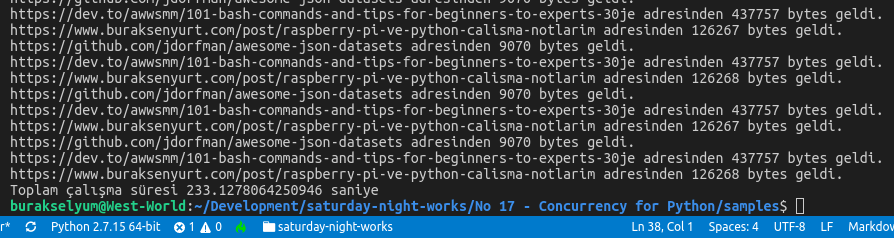
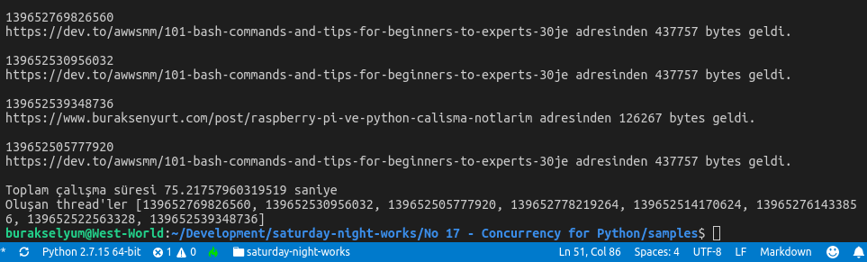
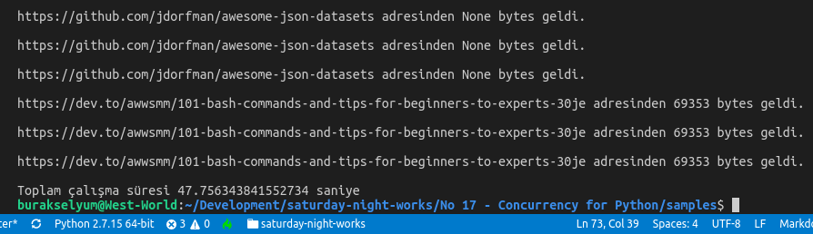
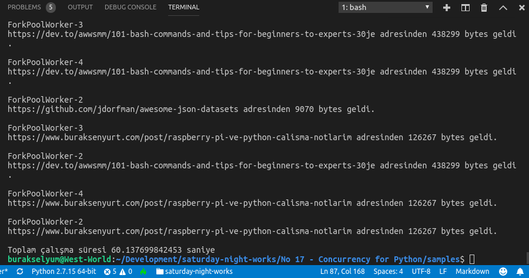
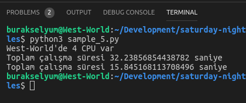

# Python tarafında Concurrency Konusunu Anlamak

Amacım Python dilinde özellikle I/O bound ve CPU bound türünden işlemlerde Concurrency, paralel çalışma gibi konuları anlamak. Nitekim çok yukardan bakıldığında aynı anlamda kullanılan Thread, task ve process gibi terimler biraz daha detaylı incelendiğinde tamamen farklılar. Bu detayları görebilmek için bilgisayarları en çok yoran dosya giriş çıkış ve CPU yoğun işlemlere ait örnekleri kod parçaları aracılığıyla incelemek istiyorum.

>I/O Bound işlemler: programın sıklıkla harici kaynaklara gitip geldiği durumlardır. Dosya sistemi ve network hareketlilikleri örnek gösterilebilir. Bu hareketliliklerin program içinde ve dışına doğru fazla olması uygulamanın yavaşlamasına neden olur.

>CPU Bound işlemler: Genellikle CPU'yu yoracak kadar yoğun işlemler için kullanılan terimdir. Bu tip işlemler de uygulamanın hızını doğrudan etkiler. 

Concurrency tipleri aşağıdaki gibi özetlenebilir.

| Concurrency tipi                     | Processor Sayısı               | Açıklaması                                                                                       |
|--------------------------------------|--------------------------------|--------------------------------------------------------------------------------------------------|
| pre-emtive multitasking  (threading) | 1 işlemci                      | Görevlerin Python tarafına ne zaman gönderileceğine işletim sistemi karar verir.                 |
| Cooperative multitasking  (asyncio)  | 1 işlemci                      | Üzerinde çalıştığı işi ne zaman bırakacağına task'lar karar verir.                               |
| Multiprocessing  (multiprocessing)   | N sayıda işlemci veya çekirdek | Tüm işlemler aynı anda ve farklı processlerce icra edilir (Tam anlamıyla Paralellik diyebiliriz) |

## Ön Gereklilikler

Pek tabii ortamda python'un uygun sürümünün yüklü olması gerekiyor. Kodları çalıştırmak için 

```
python3 sample_1.py
```

şeklinde ilerlenebilir.

>Örneklerin testleri çoğunlukla West-World üzerinde _(Ubuntu 18.04 64bit)_ gerçekleştirilmiştir. Farklı Python sürümleri yüklü olduğundan python3 ve pip3 çalıştırıcıları ile ilerlenilmiştir.

## Örnekler

### sample_1.py _(Senkron versiyon)_

I/O Bound operasyonlara bakılan ve senkron çalıştırılan örnektir. Örnek bir kaç web adresi için 300er elemanlık bir array'da dolaşılır ve her biri için HTTP Get talebi yapılarak dönen cevabın boytu yazdırılır. Toplam çalışma süresi hesaplanır. Bu örnekte HTTP talepleri ve session açmak için requests modülüne ihtiyaç vardır. pip ile yükleyebiliriz.

>Bu örneğin kodlaması kolaydır ama senkron çalışma mantığında olduğu için performansı kötüdür.

```
pip3 install requests
```

West-World'de bu çalışma yaklaşık olarak 233 saniye sürmüştür.



### sample_2.py _(threading kullanılan versiyon)_

Bu örnekte geliştiricinin işini biraz daha kolaylaştıran üst seviye threading yardımcılarından olan ThreadPoolExecutor nesnesi kullanılır. Thread'lerin başlatılması, havuza atılması veya birisinin bekletilip diğerine geçiş yapılması gibi yönetsel işlemleri üstlenir. Örnekte kullanılan requests.Session thread safe olmayan bir nesnedir. Bu nedenle threading.local() mekanizmasına başvurulmuş ve her bir thread'in yaşamı boyunca kendisi için oluşturulan Session ile çalışması garanti edilmiştir. Burada sıkıntı thread'lar arası veri paylaşımıdır. Örneğin 8 eş zamanlı işçi çalıştığında ve n sayıda Session açılıp HTTP talebi gönderildiğinde işçilerin kendileri ile alakalı Session nesneleri ile çalışabilmesini garanti etmek gerekir.

```
python3 sample_2.py
```

West-World'bu çalışma yaklaşık olarak 76 saniye sürmüş ve 8 iş parçacığı çalışmıştır.



16 iş parçacığı için toplam süre 31 saniyeye kadar inmiştir.


### sample_3.py _(asyncio kullanımı)_

Bu örnekte task bazlı çalışma söz konusudur. HTTP talepleri için n adet task kullanılır. Tüm task'lar aynı Session'ı paylaşabilir nitekim aynı thread içerisinde çalışmaktadır. Örnekte aiohttp paketine ihtiyaç vardır.

```
pip3 install aiohttp
```

>Bu kullanım şeklindeki en büyük sorun tutarsızlık. Requests tam anlamıyla bloklandığında açılan olay döngüsünü uyarabilecek kabiliyette değil ve bu nedenle bazı hallerde işlem süresi beklenenden de fazla olabilir.

```
python3 sample_3.py
```

West-World çalışma zamanında işlemler 48 saniye civarında sürmüştür. Dikkat çekici sıra senkronize bir sıranın olmamasıdır. Task'lar arasındaki geçişler farklı sıralarda gerçekleşir.



### sample_4.py _(multiprocessing kullanarak tüm çekirdekleri işe katmak)_

Bu örnekte bir öncekilerde olduğu gibi tek python process tarafından ele alınan farklı veya tekil thread'lerin aksine, gerçek anlamda farklı process'lerin işin içerisine katıldığı çoklu çalışma zamanı söz konusudur. multiprocessing temel olarak çoklu işlemci ve çekirdek gücünü kullanabilmeyi sağlar. Bunun için CPU başına ayrı birer python yorumlayıcısı eş zamanlı olarak çalıştırılır. 

Açılan process'ler arasındaki koordinasyon ve haberleşme yine bir havuzda yönetilir. Havuz genel olarak CPU sayısına göre şekillenir. Buradaki process miktarı değiştirilebilir ama CPU sayısından çok olması işlemleri daha da yavaşlatabilir.

>Bu senaryoda diğer python interpreter'ların ayrı process olarak açılmasının bir maliyeti vardır ve aslında süreye olumsuz etki edecektir. O yüzden gerçekten uygun senaryolarda uygulanması gerekir.

```
python3 sample_4.py
```

West-World'de bu çalışmanın sonuçları aşağıdaki gibi oldu. İfade ediliği üzere öyle yüksek bir performans artışı olmadı. Nitekim uygun bir senaryoyu bulmak gerekiyor. 



West-World 4 çekirdekli bir işlemciye sahip. Buna göre Fork edilen Worker sayısı 4.

## CPU Bound işlemler

Bu sefer network, dosya yazma okuma gibi işlemer gibi dış etkenlerin durumuna göre değil de, tamamen CPU'nun becerisine göre zaman alan baraj işlemleri düşünelim. Matematik yoğun işlemler bu anlamda ele alınabilir. threading ve asyncio gibi kullanımlar senkron kullanıma göre daha uzun sürelerde tamamlanabilirler. Çünkü, hem thread hem task kullanımında tüm işlemler aynı CPU'nun aynı process'inde icra edilir. Yani concurrent'luğu işin içerisine katarsak ekstradan yük getirmiş oluruz.

### sample_5.py

Bu örnekte sembolik olarak büyük bir rastsal sayı dizisinin elemanlarını faktöryel hesabına tabi tutuyoruz. Aynı sayı kümesi için senkron ve çoklu process tekniği ile süreleri karşılaştırıyoruz.



mGörüldüğü üzere Multiprocessing modelinin kullanımı oldukça basit. Ayrıca tüm CPU gücünü almamıza olanak sağlıyor. Lakin yapılacak işlemleri process'lere göre ayırmak daha zor. Process'ler arası haberleşme gerektiren durumların kurgulanması da pek kolay değil.

## Neler Öğrendim?

- multiprocessing kanalıyla yapılan concurrency modelinin diğerlerine göre farklarını
- I/O Bound ve CPU Bound operasyonların ne anlama geldiğini
- Thread pool çalışma mekanizmasını
- Task bazlı çalışma modelini
- Makinedeki CPU sayısını bulmayı
- CPU Bound problemlerde performans için multiprocessing modelinin kullanılması gerektiğini
- I/O Bound problemlerde en azından threading kullanılması gerekiğini _(eğer yapabiliyorsak onun yerine asyncio ile ilerlenmesi öneriliyor)_
- Hangisi olursa olsun öncelikle iyi şekilde anlaşılmaları gerektiğini 

öğrendim.