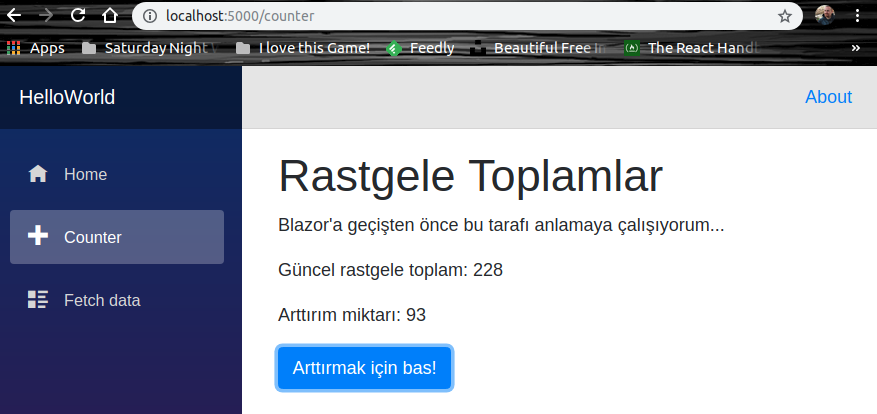

# Blazor ile Hello World Uygulaması Geliştirmek

Amacım Microsoft'un deneysel olarak geliştirdiği Blazor çatısı ile Razor,HTML ve WebAssembly tabanlı web uygulamalarının nasıl geliştirilebileceğini Hello World diyerek deneyimlemek. Blazor, WebAssembly odaklı çalıştığı için yüksek performanslı yeni nesil web uygulamalarına C# rahatlığı ile geçmemiz mümkün gibi görünüyor.

## Gereksinimler

Pek çok kaynak konuyu Visual Studio üzerinde incelemekte. Orada bir Web projesi açarken şablon kısmında Blazor'u seçmek yeterli. Ancak ben yabancı topraklardayım ve West-World'de Linux ile en yakın arkadaşı Visual Studio Code var. Bu nedenle işe aşağıdaki gibi başlamak gerekiyor.

```
dotnet new --install "Microsoft.AspNetCore.Blazor.Templates"
dotnet new blazor -o HelloWorld
```

Öncelikle blazor için gerekli proje şablonunu indiriyoruz. Ardından blazor tipinden hazır bir proje iskeletini oluşturuyoruz.

>Hemen ilgili klasöre girip _dotnet run_ ile uygulamayı çalıştırıp deneyebiliriz. Uyguluma localhost:5000 numaralı porttan hizmet verecektir. 

## Notlar

Sayfaları incelemekte yarar var. Index, Counter ve FetchData yönlendirmeleri sonrası çalışan aynı isimli cshtml içeriklerine odaklanmak gerekiyor. Söz gelimi Counter sayfasında düğmeye bastıkça sayaç değeri artmakta. Ancak bu gerçekleşirken sayfa yeniden yüklenmiyor ki bunun için normalde Client-Side Javascript koduna yazılması gerekiyor. Blazor açısından baktığımızda olaya, kodlamanın Javascript değil de C# ile yapıldığını fark etmiş olmamız lazım. 

İlgili sayfada oynayarak farklı sonuçlar elde etmeye çalışabiliriz_(Ben hemen bir kaç değişiklik yapıp konuyu anlamaya çalıştım)_



>CSS tarafında bootstrap hazır olarak geliyor. Sol taraftaki navigation menu'yü kurcalamak istersek, Shared klasöründeki NavMenu.cshtml ile oynamak yeterli. Her şeyin giriş noktası olan index.html içerisinde blazor.webassembly.js javascript dosyası için bir referans var _(Bu niye var öğrenmek lazım)_

## Yapılanlar

- Pages klasörüne Book.cshtml isimli bir dosya eklendi.
- NavMenu.cshtml içeriği ile birazcık oynandı.
- Kitapları temsil eden book sınıfı eklendi.

## Neler Öğrendim