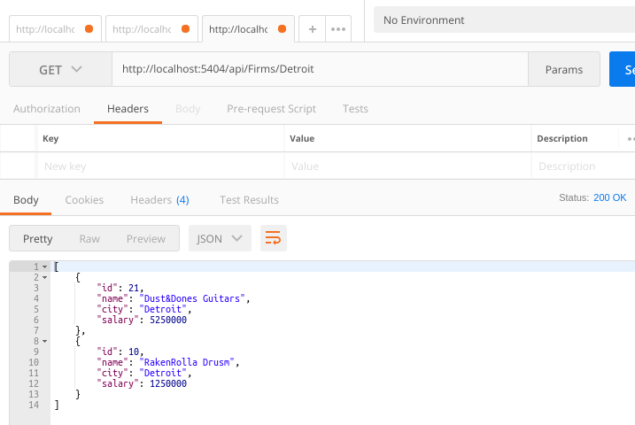
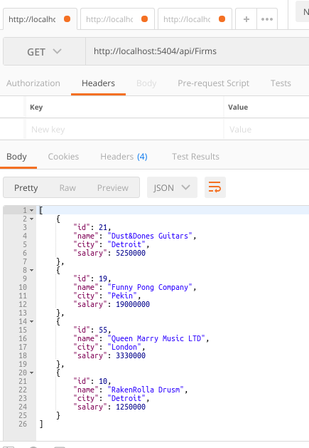
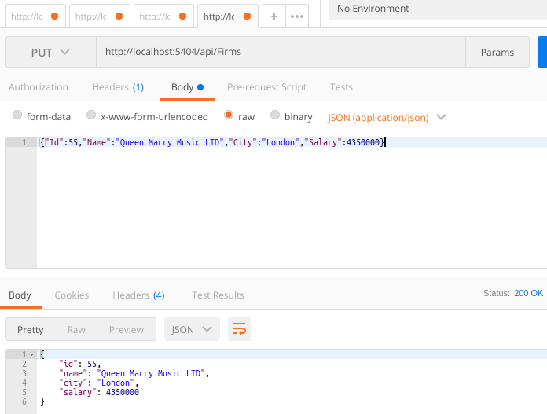
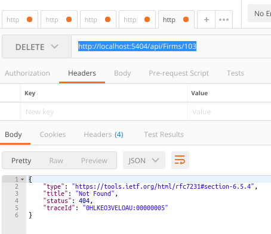

# AspNet Core Web API Tarafında Dapper Kullanımı

Veri kaynakları ile kod tarafındaki modeller arasında devreye giren bir çok ORM aracı mevcut. Stackoverflow tarafından geliştirilen ve Micro ORM olarak nitelendirilen Dapper bunlardan birisi. SQLite, MySQL, SQLCE, SQL Server, Firebird ve daha bir çok veritabanı platformu ile çalışabilen Dapper'ın performans olarak da iyi sonuçlar verdiği ifade edilmekte. Amacım Dapper'ı bir Web API uygulamasında SQLite ile birlikte kullanabilmek.

## Hazırlıklar

sqlite3 komutu yardımıyla örnek bir veritabanı ve tablo oluşturulur. _(İstenirse örnek satırlar girilebilir ya da yeni kayıtlar eklenmesi için Web API kullanılabilir)_

```
sqlite3 Westwind.db
.databases
CREATE TABLE FIRM(
    ID INT PRIMARY KEY NOT NULL,
    NAME TEXT NOT NULL,
    CITY CHAR(50) NOT NULL,
    SALARY REAL
);

INSERT INTO FIRM (ID,NAME,CITY,SALARY) VALUES (1,'Pedal Inc','Los Angles',10000);

INSERT INTO FIRM (ID,NAME,CITY,SALARY) VALUES (2,'Cycling Do','London',9000000);

SELECT * FROM FIRM;
```


Ardından .Net Core Web API projesi oluşturulur ve gerekli Nuget paketleri sisteme ilave edilir.

```
dotnet new webapi -o WestwindAPI
cd WestwindAPI
dotnet add package System.Data.SQLite.Core
dotnet add package Dapper
```

## Yapılan Değişiklikler

- appsettings.json dosyasına SQLite connection string bilgisi eklendi
- Models klasörü oluşturuldu ve Firm entity sınıf eklendi
- Varsayılan olarak gelen ValuesController sınıfı FirmsController olarak değiştirildi ve Dapper kullanılacak hale getirildi.

## Çalışma Zamanı

Uygulamayı terminalden

```
dotnet run
```

komutu ile çalıştırdıktan sonra Postman veya muadili bir aracı kullanarak API fonksiyonelliklerini deneyebiliriz.

Örnek veri girişi için,

```
http://localhost:5404/api/Firms 
POST
{"Id":21,"Name":"Dust&Dones Guitars","City":"Detroit","Salary":5250000}
```


Aynı ID ile tekrar giriş yapmak istersek, SQLite tarafındaki Primary Key alanı nedeniyle exception fırlatılacaktır.


Belli bir şehirdeki şirketleri elde etmek için,

```
http://localhost:5404/api/Firms/Detroit
GET
```



Tüm firmaların listesi için,

```
http://localhost:5404/api/Firms
GET
```



ID bazlı güncelleme için,

```
http://localhost:5404/api/Firms
PUT
{"Id":55,"Name":"Queen Marry Music LTD","City":"London","Salary":4350000}
```



ID bazlı bir firma bilgisini silmek için,

```
http://localhost:5404/api/Firms/103
DELETE
```
Tabii o ID için bir kayıt yoksa HTTP 404 NotFound döndürüyoruz.



## Neler Öğrendim

- Dapper Micro ORM aracının .net core tarafından nasıl kullanıldığını
- CRUD operasyonlarını SQLite ile çalıştırmayı
- IActionResult ile Web API metodlarından nasıl sonuçlar dönebileceğimizi