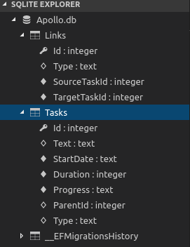

# dhtmlxGantt Kütüphanesi ile AspNet Projesinde Gantt Chart Kullanımı

Henry Gantt tarafından icat edilen Gantt tabloları, proje takvimlerinin şekilsel gösteriminde kullanılmaktadır. Temel olarak yatay çubuklardan oluşan bu tablolarda proje planlarını, task'ları, süreleri ve ilerleyişi görmek mümkündür. Excel üzerinde bile kullanılabilen Gantt Chart'lar sanıyorum proje yöneticilerinin de vazgeçilmez araçlarındandır. Benim amacım ise dhtmlxGantt isimli Javascript kütüphanesinden yararlanarak bir Asp.Net Core projesinde Gantt Chart kullanmak. 

## Hazırlıklar

Uygulamayı her zaman olduğu gibi WestWorld'de _(Ubuntu 18.04 64bit)_ deniyorum. İlk olarak boş bir web uygulaması oluşturarak işe başlayabiliriz. Ardından wwwroot klasörünü ekleyip içerisine index.html dosyasını ekliyoruz.

```
dotnet new web -o ProjectManagerOZ
```

>Örnekte kullanılan ve gantt chart çizimi için kullanılan CSS dosyasına [şu adresten](https://cdn.dhtmlx.com/gantt/edge/dhtmlxgantt.css), Javascript dosyasına da [buradaki](https://cdn.dhtmlx.com/gantt/edge/dhtmlxgantt.js) adresten ulaşabilirsiniz. Bu kaynakları offline çalışabilmek için bilgisayara indirim wwwroot altında konuşlandırdım.

## Yapılanlar

- wwwroot klasörüne index.html eklendi _(dhtmlxGantt'ın öngördüğü varsayılan index.html kullanıldı)_
- Program.cs ve Startup.cs içeriklerinde değişiklik yapıldı.
- SQLite veritabanını tutmak için db klasörü oluşturuldu.
- Models klasörü açıldı ve içerisine ilgili sınıflar eklendi.

## SQLite Kullanabilmek için

SQLite kullanımı için EntityFramework Core'un ilgili NuGet paketini projeye eklemek lazım.

```
dotnet add package Microsoft.EntityFrameworkCore.SQLite
```

Ardından appsettings.json dosyasına bir Connection String bildirimi dahil edip, Startup sınıfındaki ConfigureServices metodunda minik bir ayarlama gerekiyor. Bunlar başlangıç aşamasında yeterli değil. Nitekim SQLite veritabanının oluşturulması da gerekiyor.

```
dotnet ef migrations add InitialCreate
dotnet ef database update
```

sayesinde DataContext türevli sınıf baz alınarak migration planları çıkartılır. Planlar hazırlandıktan sonra ikinci komut ile update planı yürütülür ve ilgili tablolar SQLite veritabanı içerisine ilave edilir.



## Çalışma Zamanı

## Neler Öğrendim?