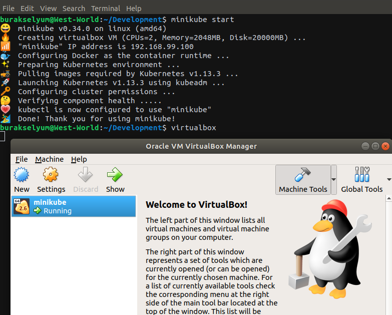
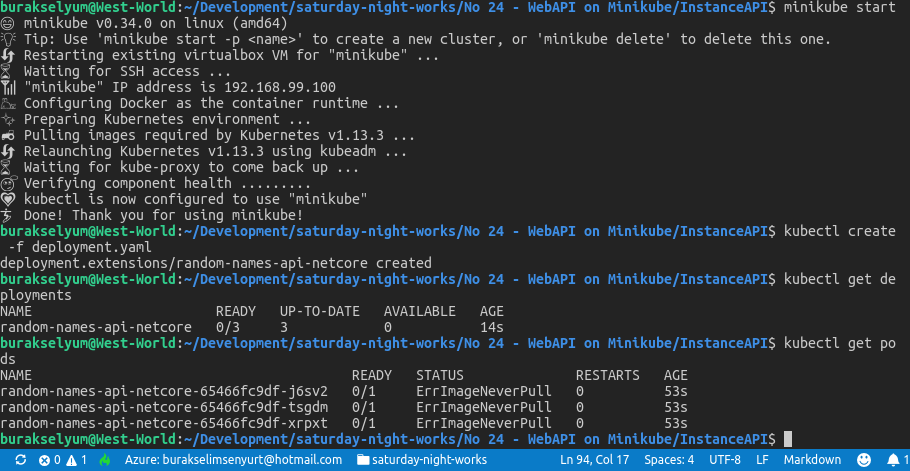
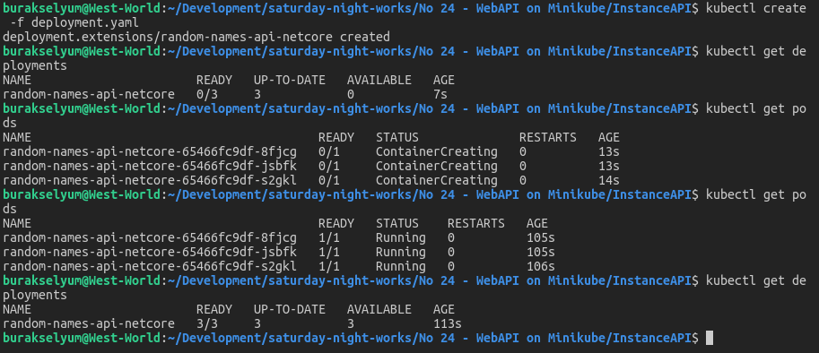

# .Net Core Web API Servisini Minikube Üzerinde Çalıştırmak

Birden fazla konteyner'ın bir araya geldiği, yönetilmeleri, kolayca dağıtılmaları, küçülerek veya büyüyerek ölçeklenebilmeleri gerektiği durumlarda orkestrasyon işi çoğunlukla Kubernetes _(k8s)_ tarafından sağlanır. Kubernetes bir konteyner kümeleme aracı olarak Google tarafından Go dili ile yazılmıştır. 

Amacım Kubertenes'i WestWorld _(Ubuntu 18.04, 64bit)_ üzerine kurmak yerine onu development ortamları için deneyimlememizi sağlayan Minikube'ü tanımak _(Kubernetes'in tüm küme yapısının kurulumu çok da kolay değil. Üstelik sadece geliştirme noktasında onu denemek istersek bu maliyete girmeye gerek yok)_ Bunu yaparken de, .Net Core tarafında geliştirilen bir Web API servisini içeren Docker konteyner'ini Minikube üzerinde koşturmak.

>Minikube ile Kubernetes'i local bir makinede deneme şansımız oluyor. Minikube, VirtualBox veya muadili bir sanal makine içinde tek node olarak çalışan bir Kubernetes kümesi sunar.

## Ön Gereklilikler

Linux ortamında Virtual Box isimli sanal makineye, Docker'a, Minikube ve onu komut satırından kontrol eden kubectl araçlarına ihtiyacımız var. WestWorld'de docker yüklü olduğu için diğerlerini kurarak ilerlemeye çalıştım.

Virtual Box kurulumu için aşağıdaki terminal komutlarını kullanabiliriz.

```
sudo add-apt-repository multiverse
sudo apt-get update
sudo apt install virtualbox
```

Minukube kurulumunu şu şekilde geliştirebiliriz.

```
curl -Lo minikube https://storage.googleapis.com/minikube/releases/v0.34.0/minikube-linux-amd64 && chmod +x minikube && sudo cp minikube /usr/local/bin/ && rm minikube
```

Kubectl komut satırı aracı içinse aşağıdaki adımlarla ilerlenebilir.

```
sudo apt-get update && sudo apt-get install -y apt-transport-https
curl -s https://packages.cloud.google.com/apt/doc/apt-key.gpg | sudo apt-key add -
echo "deb https://apt.kubernetes.io/ kubernetes-xenial main" | sudo tee -a /etc/apt/sources.list.d/kubernetes.list
sudo apt-get update
sudo apt-get install -y kubectl
```

## Kurulum Sonrası Kontroller

Docker, Virtual Box, Minikube ve kubectl araçları başarılı bir şekilde kurulduktan sonra aşağıdaki komut ile Minikube başlatılabilir.

```
minikube start
```

Minikube başarılı bir şekilde başladıktan sonra Virtual Box ile durumunu inceleyebiliriz de. 



Minikube'u durdurmak için

```
minikube stop
```

Silmek için

```
minikube delete
```

komutlarından yararlanabiliriz.

## .Net Core Web API Tarafı

Docker üzerinde koşturacağımız basit bir Asp.Net Web API uygulamamız var. Oluşturmak için aşağıdaki terminal komutu ile ilerleyebiliriz.

```
dotnet new webapi -o InstaceAPI
```

Servis sadece rastgele isim dönen bir metod sunmakta ki servisin ne iş yaptığı bu örnek özelinde çok mühim değil.

## Yapılanlar

- ValuesController, NamesController olarak değiştirildi
- Web API uygulamasını Dockerize etmek için Dockerfile eklendi
- Minikube içerisine neyin deploy edileceğini belirtmek için deployment.yaml eklendi

## Docker Hazırlıkları

Dockerfile içeriği tamamlandıktan sonra aşağıdaki komut ile docker imajı hazırlanabilir.

```
docker build -t random-names-api-netcore .
```

## Minikube Deployment Hazırlıkları

deployment.yaml dosyası tamamlandıktan sonra aşağıdaki terminal komutu ile deployment işlemi gerçekleştirilir ve yapılan işlem sonuçları kontrol edilir. Tabii bu işlemlere başlamadan önce minikube'ün başlatılması gerekir.

```
kubectl create -f deployment.yaml
kubectl get deployments
kubectl get pods
```

Deployment ve Pod içeriklerine bakıldığında aslında bir sorun olduğu görülür. Pod'lardaki image durumları ErrImageNeverPull şeklindedir.



Sorun, minikube ile docker'ın birbirlerinden haberdar olmamalarından kaynaklanıyormuş. Çözmek için aşağıdaki komutla ilerlemek ve sonrasında docker imajını yeniden oluşturup minikube dağıtımını tekrardan yapmak gerekiyor. Tabii önceki komutlar nedeniyle büyük ihtimalle sistemde duran dağıtımlar var. Önce onları silmemiz lazım.

```
kubectl get all
kubectl delete deployment.apps/random-names-api-netcore service/kubernetes
```

İlk komutla sileceğimiz pod adını buluyoruz. İkinci komutla siliyoruz.

Sonrasında,

```
eval $(minikube docker-env)
docker build -t random-names-api-netcore .
kubectl create -f deployment.yaml
kubectl get deployments
kubectl get pods
```



## Çalışma Zamanı