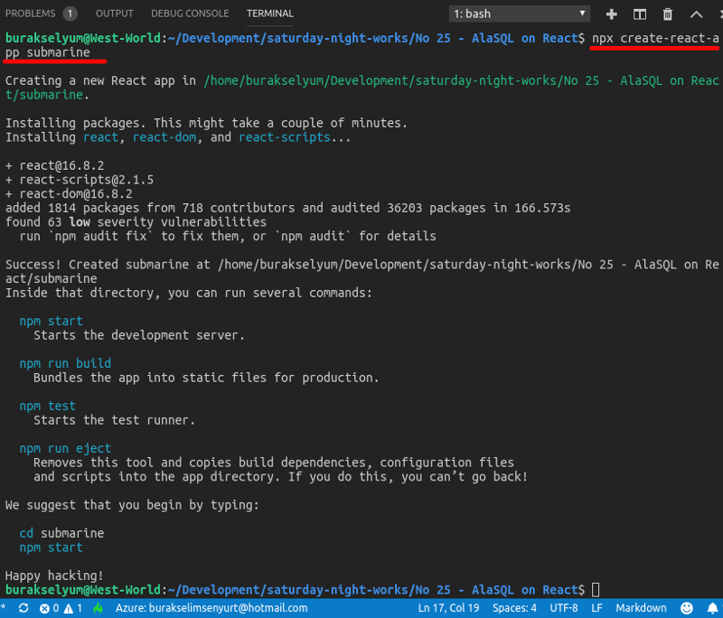
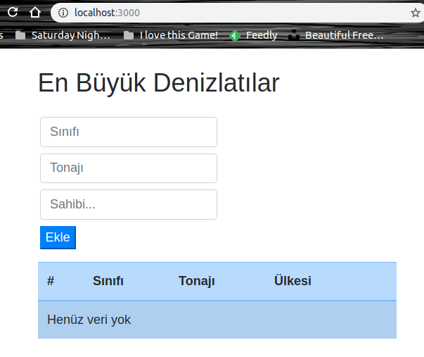
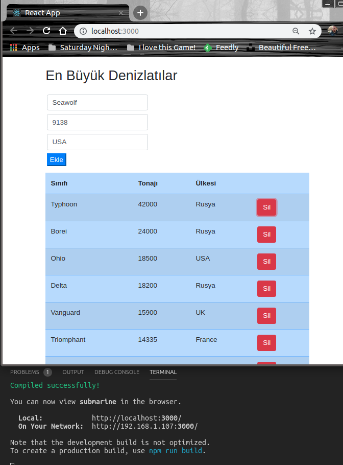
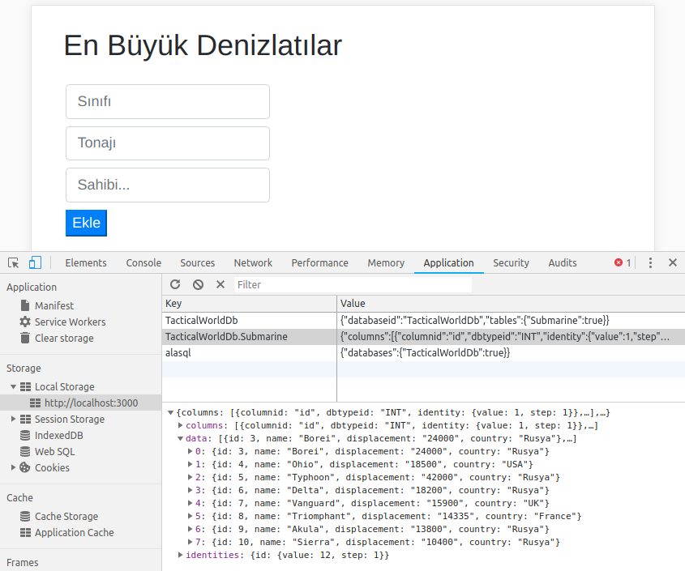
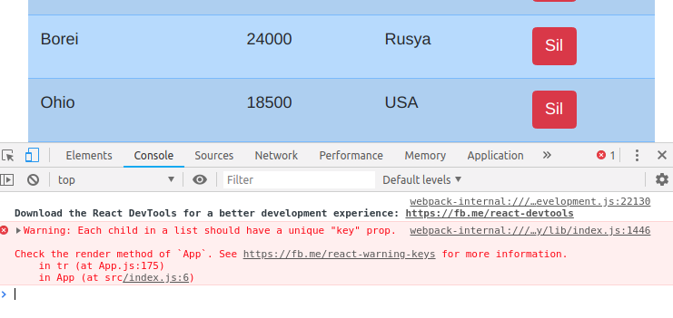

# Bir React Uygulamasında AlaSQL Kullanmak

Öğrenecek bir şeyler araştırırken AlaSQL isimli bir çalışma ile karşılaştım. Tarayıcı üzerinde çalışabilen istemci taraflı bir In-Memory veritabanı olarak geçiyor. Tamamen saf Javascript ile yazılmış. Geleneksel ilişkisel veritabanı özelliklerinin çoğunu barındırıyor. Group, join, union gibi fonksiyonellikleri karşılıyor. In-Memory tutulan veriyi kalıcı olarak saklamakta mümkün. Hatta bu noktada localStorage olarak ifade edilen yerel depolama'dan veri okunup tekrar yazılabiliyor. IndexedDB veya Excel'ide fiziki repository olarak kullanabiliyor. Ayrıca JSON nesnelerle çalışabiliyoruz ki bu da NoSQL desteği anlamına gelmekte. Benim amacım onu yalın bir React uygulamasında deneyimlemeye çalışmak.

>[AlSQL](https://github.com/agershun/alasql) açık kaynak kodlu, dokümantasyonu oldukça zengin bir proje. Yine de endüstriyel anlamda olgunlaştığına dair emareler görülmeden canlı ortamlarda kullanmak riskli olabilir. Öncelikle deneysel çalışmalarda ele almakta yarar var.

## Kurulum ve Hazırlıklar

Örneği her zaman olduğu gibi WestWorld _(Ubuntu 18.04, 64bit)_ üzerinde deniyorum. Sistem node yüklü durumda. React uygulamasını kolayca oluşturabilmek için aşağıdaki terminal komutunu kullanabiliriz.

```
npx create-react-app submarine
```



AlaSQL'i kullanabilmek içinse uygulama klasöründe gerekli npm paketinin yüklenmesi yeterli olacaktır.

```
cd submarine
npm install --save-dev alasql
```

Ayrıca görselliği zenginleştirmek için ben Bootstrap'i kullanmayı tercih ettim.

```
npm install --save-dev bootstrap
```

## Yapılanlar

- Gereksiz dosyalar silindi ve manifest.json azcık değiştirildi
- En köklü değişiklik App.js tarafında yapıldı _(Kodda yorum satırları mevcut)_

## Çalışma Zamanı

Uygulamayı çalıştırmak için 

```
npm run start
```

terminal komutunu vermek yeterlidir. Zaten npm run ile çalıştırılabilecek tüm komutlar package.json içerisinde proje iskeleti oluşturken eklenmektedir. İşte çalışma zamanına ait bir kaç görüntü.

Her şey yeni başlarken hiç veri yok elbette ki...



Bir kaç satır ekledikten sonraki durum ise şöyle olacaktır.



## Local Storage Nerede

Örnekte veritabanını tarayıcının local storage bölümünde konuşlandırmış bulunuyoruz. Uygulamayı çalıştırdıktan sonra Application sekmesine giderek içeriğini görebiliriz.



Dikkat edileceği üzere IndexedDB lokasyonu da var. Kullanmak içinse

```
ATTACH INDEXEDDB DATABASE TacticalWorldDB
```

gibi bir SQL ifadesinden yararlanmak lazım. Bizim örneğimizde bunun yerine LOCALSTORAGE'ı u ele aldık.

## Neler Öğrendim?

- Hazır bir react uygulama iskeletinin nasıl oluşturulduğunu
- React sayfası içerisindeki yaşam döngüsüne dahil olan componentWillMount, componentDidMount ve render metodlarının hangi aşamalarda devreye girdiğini
- Alasql paketinin react uygulamasına nasıl dahil edildiğini ve temel SQL ifadelerini _(veritabanı ve tablo oluşturmak, insert ve delete sorgularını çalıştırmak vb)_
- state özelliğini ne amaçla kullanabileceğimi
- Veritabanından çekilen JSON dizisinin map fonksiyonu ile nasıl etkileştiğini
- refs özelliği ile kontrollerin metotlarda nasıl ele alınabildiğini

## Problemler

- Aşağıdaki problem ile karşılaştım. Bunu çözmem gerekiyor.

