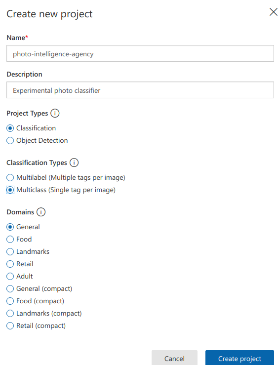
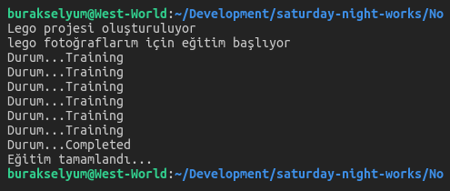
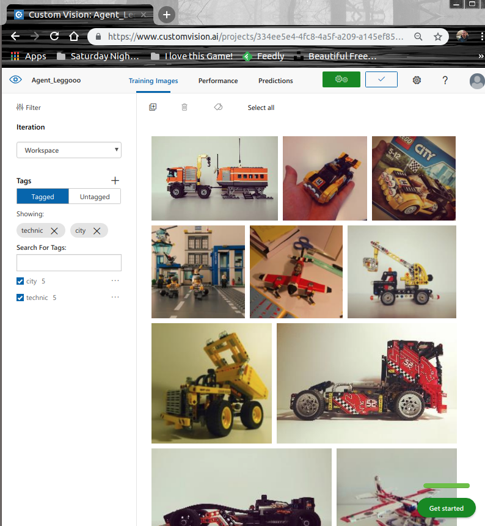
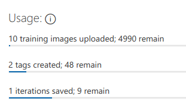
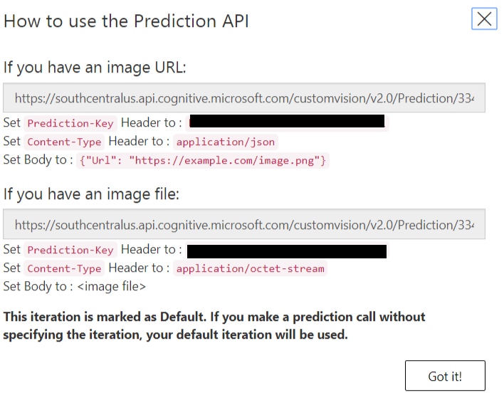
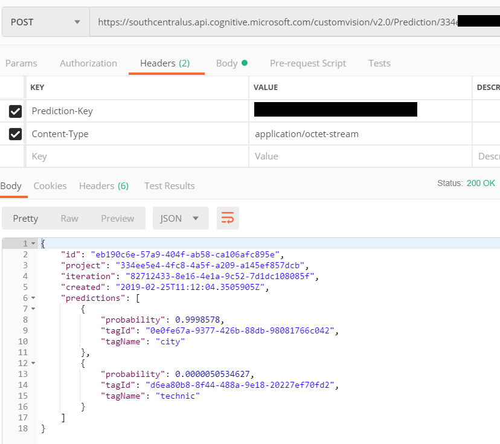
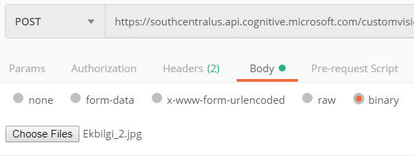
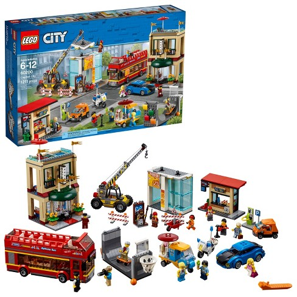

# Microsoft Custom Vision Servisini Python ile Kullanmak

Amacım, Microsoft Azure platformunda yer alan ve fotoğraf/nesne sınıflandırmaları için kullanılabilen Custom Vision servisini basit bir Python uygulaması ile deneyimlemek. Custom Vision API'si geliştircilere kendi fotoğraf/nesne sınıflandırma servislerini yazma imkanı tanımakta. Onu, imajları belli karakteristik özelliklerine göre çeşitli takılar _(tag)_ altında sınıflandırıp sıralayan bir AI _(Artificial Intelligence)_ servisi olarak düşünebiliriz.

Örnek çalışmada belli takılar için belli sayıda imajı sisteme öğreteceğiz. _(Custom vision api için bu oran en az iki tag ve her bir tag için en az beş fotoğraf/nesne şeklinde)_ Sonrasında sisteme bir fotoğraf gösterip ne olduğunu tahmin etmesini isteyeceğiz. Sistem bizim öğrettiklerimize göre bir tahminlemede bulunacak ve yüzdesel değerler verecek.

## Ön Hazırlıklar

Uygulamayı Python SDK'sini kullanarak WestWorld _(Ubuntu 18.04, 64bit)_ üzerinde geliştiriyorum. Platform bağımsız olarak Python ve pip aracının sistemde yüklü olması gerekiyor. Aşağıdaki terminal komutu ile gerekli Python SDK'sını sisteme yükleyebiliriz.

```
pip install azure-cognitiveservices-vision-customvision
```

### Custom Vision API için Credential Bilgilerinin Alınması

Diğer pek çok 3ncü parti serviste olduğu gibi istemci tarafının belli credential bilgilerini sağlaması gerekiyor. Bu servis kullanabilmek için abone olmamız ve uygulama anahtarını almamız lazım. İlk olarak [şu adrese](https://www.customvision.ai/) gidip login olmalıyız. Ardından _Create new project_ sekmesini kullanarak yeni bir proje oluşturmalıyız. Ben buradaki ayarları varsayılan değerlerinde bırakıp aşağıdaki gibi bir proje oluşturdum.



Proje oluşturulduktan sonra özelliklerine ulaşıp bizim için üretilen _Training Key_ ve _Prediction Key_ değerlerini almamız gerekiyor. Bu bilgiler istemci tarafı için gerekli.

>Kodun çalışma dinamiklerini anlamadan önce Custom Vision API için ilk başta oluşturduğumuz projeyi tarayıcıdan denemenizi öneririm. Belirtildiği gibi elinizdeki imajları en az 2 farklı tag'e gelecek şekilde ayrıştırıp sisteme yükleyin. Sonra eğitim programını _(training kısmı)_ başlatın _(ki bu işi Azure tarafı halledecek)_ Sonrasında bir kaç imaj yükleyip hangi takılardan yüzde kaç oranında karşılandığına bakın.

## Çalışma Zamanı

İki python dosyamız var. pgadget.py isimli olan fotoğraf eğitimi için kullandığımız, client.py isimli olansa servisi tüketip sonuçları aldığımız. İlk örnekte belli karakteristikliklerine göre lego imajlarını sınıflandırmaya çalışıyorum. Koddaki tag yapısı buna göre kurgulandı. Birinci örneği çalıştırmak için aşağıdaki terminal komutunu kullanabiliriz.

```
python pgadget.py
```





Görüldüğü üzere fiziki depolama alanından seçilen fotoğraflar ilgili Azure projesine yüklendiler ve hatta iki kategori ile de tag bazında ilişkilendirildiler. Bu haliyle proje özetine baktığımızda aşağıdaki sonuçları elde ederiz.



Artık servisimize bir fotoğraf gönderip ne olduğunu tahmin etmesini isteyebiliriz. Bu çok basit anlamda Postman gibi bir araçla da olabilir, tercih ettiğimiz programlama diliylede.

### Postman ile Test

Oluşturduğumuz eğitmeni test etmek için, bize açılan prediction API servisini kullanabiliriz. Postman ile basit bir POST talebi göndermek yeterlidir. Gerekli adres bilgilerini site ayarlarından bulabiliriz.



Postman ayarlarında Header kısmında ki bilgileri de aşağıdaki gibi doldurmalıyız.



Ben WestWorld'de bulunan bir imajı deneme amaçlı olarak göndermek istediğimden Body kısmında Binary seçeneğini kullandım.



Deneme olarak kullandığım fotoğraf ise şu.



Tahminleme servisim bu fotoğraf için aşağıdaki sonuçları verdi. %99 ihtimalle Lego City olduğunu ifade edeiyor. Oldukça başarılı ;)

```
{
    "id": "eb190c6e-57a9-404f-ab58-ca106afc895e",
    "project": "334ee5e4-4fc8-4a5f-a209-a145ef857dcb",
    "iteration": "82712433-8e16-4e1a-9c52-7d1dc108085f",
    "created": "2019-02-25T11:12:04.3505905Z",
    "predictions": [
        {
            "probability": 0.9998578,
            "tagId": "0e0fe67a-9377-426b-88db-98081766c042",
            "tagName": "city"
        },
        {
            "probability": 0.0000050534627,
            "tagId": "d6ea80b8-8f44-488a-9e18-20227ef70fd2",
            "tagName": "technic"
        }
    ]
}
```

>Alakalı alakasız fotoğraflar ile örneği denemelisiniz. Pek tabii eğitmene ne kadar çok örnek anlatır ve tag kullanırsak tahminleme sonuçları da o oradan başarılı olacaktır.

### Python Kodları ile Test Etmek

İkinci uygulamayı çalıştıraraktan da denemeler yapabiliriz. Bu uygulama test klasörü altındaki imajları tarar ve her biri için POST talebi göndererek tahminleme sonuçlarını ekrana basar.

```
python client.py
```

Test klasöründeki imajlar için aşağıdaki sonuçlar elde edildi.


Einstein ve havadaki uçak için çok başarılı tahminlemeler yapılmadığını görebiliriz. Bunun sebebi eğitmeni sadece 10 imajla yetiştirmiş olmamızdır. Örnek kümeyi ve tag yapısını ne kadar geniş tutarsak tahminleme oranlarında o kadar isabetli sonuçlar elde ederiz.

>Bu uygulamada filetype modülü kullanımıştır. Yüklemek için terminalden _pip install filetype_ yazmak yeterli.

## Neler Öğrendim?

- Vision API'ye bir fotoğrafı nasıl öğretebileceğimi
- Python ile bunu nasıl yapabileceğimi
- Temel olarak Azure Custom Vision Service'in AI çalışma mantığını _(bir takı için en az beş örnekten oluşan fotoğraf kümeleri oluştur. Ne kadar çok olursa o kadar iyi olur. Bu nedenle koddaki gibi imgeleri tek tek öğretmek yerine, bir klasör altına n tane imge koyup onları bir tag ile ilişkilendirmek daha mantıklıdır)_
- Oluşturulan servisin python tarafında nasıl tüketilebileceğini
- Python tarafında request modülünü kullanarak HTTP Post talebinin nasıl yapılabileceği
- request modülü kullanılırken Header ve Data bilgilerinin nasıl eklendiğini
- Bir klasördeki dosyaları nasıl dolaşabileceğimi
