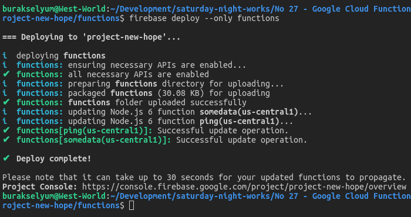
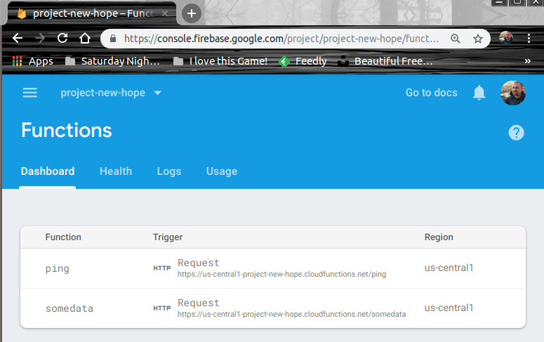
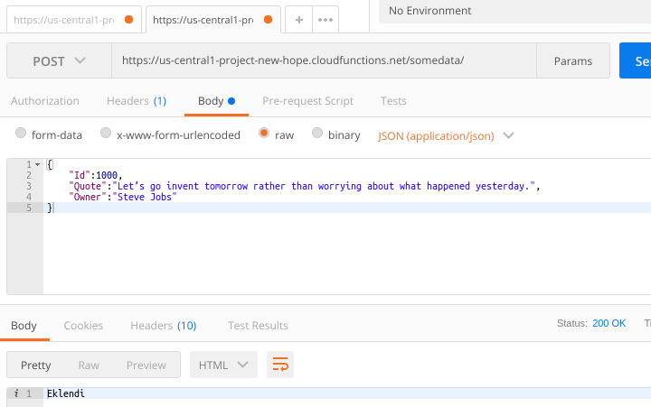
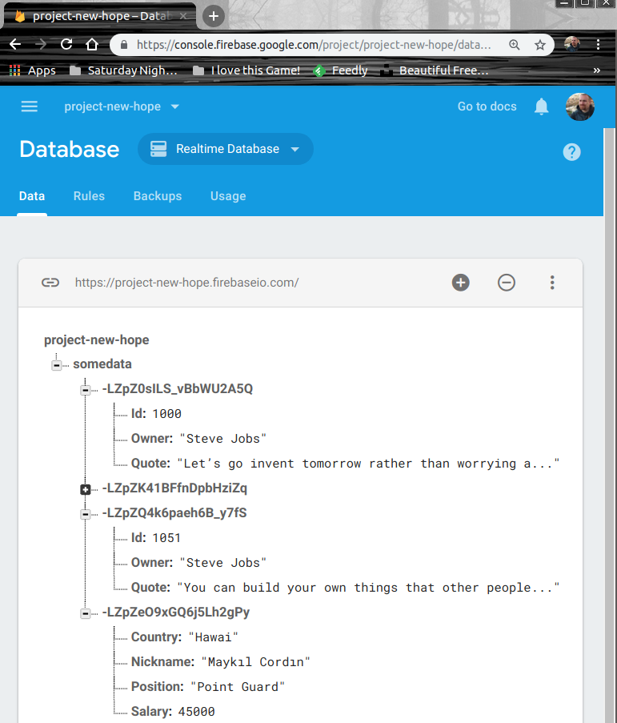
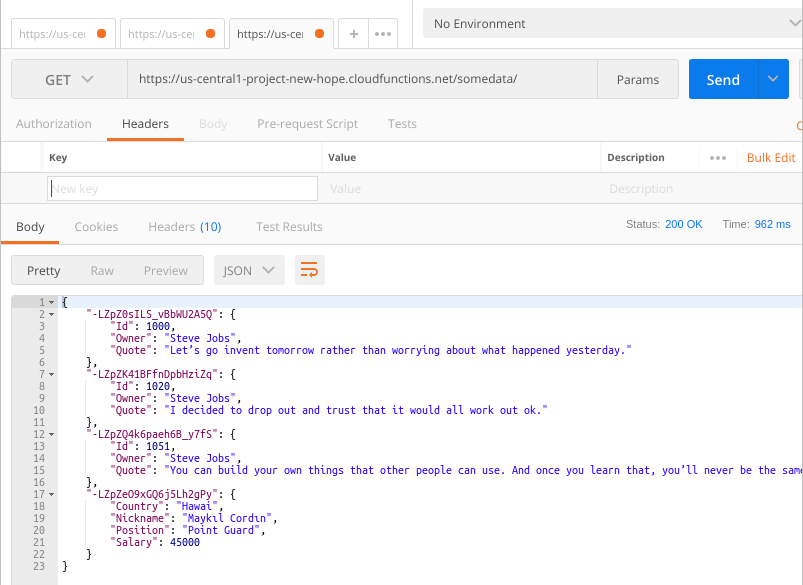

# Google Cloud Function'ları Firebase ile Birlikte Kullanmak

Bulut çözümlerin sunduğu imkanlardan birisi de sunucu oluşturma, barındırma, yönetme gibi etkenleri düşünmemize gerek kalmayacak şekilde uygulama geliştirme ortamları sağlamalarıdır. Bazen bulut platform üzerinde sunulan bir veritabanı ile konuşan servis kodlarını yine o platformun sunucularında barındırmak suretiyle hizmet sağlarız. Söz gelimi Google'ın Firebase veritabanı ve onu kullanan servis tabanlı fonksiyonları Google Cloud Platform üzerinde konuşlandırabiliriz. Bu örnekteki amacım da Firebase ile ilişkili bir uygulama servisini Google Cloud Platform üzerinde fonksiyonlaştırabilmek. Her zaman olduğu gibi örneği WestWorld _(Ubuntu 18.04, 64bit)_ üzerinde geliştiriyorum.

Örnekte Firebase'in Realtime Database seçeneği kullanılmaktadır. Veriyi JSON tipinde tutan bir NoSQL sistem olarak düşünülebilir. Veri, bağlı olan tüm istemciler için gerçek zamanlı _(realtime)_ olarak eşlenir. Dahası istemci uygulama kapansa bile veriyi hatırlar. Cloud-Hosted bir veritabanıdır _(Yani sunucu Google tarafında durur)_ Özellikle Cross-Platform tipinde uygulamalar söz konusuysa _(iOS, Android, Javascript veya Typescript fark etmez)_ tüm bağlı istemcilerle aynı verinin senkronize olarak paylaşılmasını sağlar.

Birde Cloud Firestore vardır. Firebase'in orjinal veritabanı olan Realtime modelinin daha geliştirilmiş bir versiyonudur. 

- Realtime modelinde veri JSON ağaç yapısı şeklinde saklanırken Firestore'da koleksiyonlar şeklinde organize edilmiş dokümanlar söz konusudur _(Firestore, Mongo'yu hatırlattı burada bana)_
- Firestore özellikle karmaşık ve hiyerarşik veri kümelerini ölçeklerken Realtime modele göre daha başarılıdır.
- Realtime veritabanı iOS ve Android platformları için offline çalışma desteği sunar. Firestore buna ek olarak Web tabanlı istemciler için de offline desteğ verir.
- Sıralama ve filtreleme imkanları Cloud Firestore'da Realtime modeline göre çok daha geniştir.
- Firestore'da Transaction'lar tamamlanıncaya kadar otomatik olarak tekrar ve tekrar denenir. 
- Realtime veritabanı modelinde ölçekleme için Sharding uygulanması gerekirken Firestore'da bu iş otomatiktir.

Ben Realtime Database modelini tercih ettim. Uygulanması daha basit geldi :)

## İlk Hazırlıklar

Her şeyden önce Google Cloud Platform üzerinde bir hesabımızın olması gerekiyor. Ardından [Firebase Console](https://console.firebase.google.com/) adresine gidip bir proje oluşturmalıyız. Ben project-new-hope isimli bir proje oluşturdum.


Projeyi komut satırından yönetebilmemiz gerekiyor. Yazdığımız kodları kolayca deploy edebilmeliyiz. Bu nedenle Firebase CLI aracına ihtiyacımız var. Kendisini npm ile aşağıdaki gibi yükleyebiliriz _(Dolayısıyla sistemimizde node ve npm yüklü olmalıdır)_

```
npm install -g firebase-tools
```

Yükleme işlemi başarılı olduktan sonra proje ile aynı isimde bir klasör oluşturup, içerisinde sırasıyla login ve functions komutlarını kullanarak ilerleyebiliriz. Öncelikle Firebase tarafı için login olacak ve ardından projenin başlangıç iskeletini oluşturacağız.

```
mkdir project-new-hope
cd project-new-hope
firebase login
firebase init functions
```

Login işlemi sonrası arabirim bizi tarayıcıya yönlendirecektir. Başarılı login sonrası tekrar console ekranına dönüş yapmış oluruz.


init functions çağrısı ile yeni bir GCF oluşturma işlemine başlanır. Dört soru sorulacaktır. Projeyi zaten Firebase Console'unda oluşturmuştuk. Klasör adını aynı verdiğimiz için varsayılan olarak onu kullanacağını belirtebiliriz. Dil olarak Typescript ve Javascript desteği sorulmakta ki ben ikincisi tercih ettim. 3ncü seçenekte ESLint kullanıp kullanmayacağımız soruluyor. Şimdilik 'No' seçeneğini işaretleyerek geçebiliriz. Projenin bağımlılık duyduğu npm paketleri varsa bunların install edilmesini de istediğimizden son soruda 'Yes' seçminini yapabiliriz.


Komut çalışmasını tamamladıktan sonra aşağıdaki klasör yapısının oluştuğunu görebiliriz.


Bundan sonra index.js dosyası ile oynayıp deploy işlemini gerçekleştirebiliriz. Index sayfasında yorum satırı içerisine alınmış bir kod parçası bulunur. Bunu açarak hemen _Hello World_ dememiz mümkün. Ama bunun için yapılan değişiklikleri platforma deploy etmeliyiz. Aşağıdaki terminal komutu ile bunu sağlayabiliriz.

```
firebase deploy --only functions
```

### Sorun Yaşayabiliriz

Yukarıdaki terminal komutunu denediğimde aktif bir proje olmadığına dair bir hata mesajı aldım ve deployment işlemi başarısız oldu. Bunun üzerine önce aktif proje listesine baktım ve sonrasında _use --add_ ile tekrardan proje seçimi yaptım. Bir alias tanımladıktan sonra _(ki her nedense proje adının aynısını vermişim :S)_ tekrardan deploy işlemini denedim. Bu seferde sadece fonksiyon olarak dağıtım yapmak istediğimi belirtmediğim için başka bir hata aldım. Nihayetinde çalıştırdığım terminal komutu işe yaradı ve proje GCP'a deploy edildi.

```
firebase list
firebase use --add
firebase deploy --only functions
```


Firebase Dashboard'una gittiğimizde helloworld isimli API fonksiyonunun _(ki index.js dosyasından export edilen metodumuzdur)_ eklenmiş olduğunu görebiliriz.


## Çalışma Zamanı

Örneğin ilk yalın versiyonunda Google'ın index.js içerisine koyduğu yorum satırlarını kaldırarak bir deneme yapılabilir. Bu durumda Firebase tarafında üretilen fonksiyona ait API adresini 

```
curl -get https://us-central1-project-new-hope.cloudfunctions.net/helloWorld
```

ile çağırdığımızda 'Hello from Firebase!' yazısını görürüz.


## İkinci Örnek

Asıl işi yapan örneğimiz ise basit bir API hizmeti. POST ve GET mesajlarını destekleyen metotlar içeriyor ve temel olarak veri ekleme ve listeleme fonksiyonelliklerini sağlıyor. Arka planda Firebase veritabanının Realtime çalışan modelini kullanıyor. Arka plandan kastımız GCP üzerindeki Firebase veritabanı. Yani kendi makinemizde geliştirdiğimiz bir API servisini, firebase veritabanını kullanacak şekilde GCP üzerinde konuşlandırmış oluyoruz. İkinci örnek için gerekli bir kaç npm paketi var. REST modelini node tarafında kolayca kullanabilmek için express ve CORS etkisini rahatça yönetebilmek için cors :D Aşağıdaki terminal komutları ile onları projemize ekleyebiliriz.

```
npm install --save express cors
```

>İlgili paketleri functions klasöründe yüklememiz gerekiyor. Nitekim deploy sırasında bu json dosyasının içerisinde paket bilgileri, GCP tarafında da yüklenmeye çalışacak. Dolayısıyla GCP'nin kullanacağı paketlerin neler olduğunu bilmesi lazım.

Kod nihai halini aldıktan sonra tekrardan dağıtım işlemi yapılır.

```
firebase deploy --only functions
```





Görüldüğü üzere ping ve somedata isimli iki fonksiyonda yayında. Şimdi somedata fonksiyonunun Post metodunu kullanarak bir kaç örnek veri girişi yapalım. Postman ile bunu gerçekleştirebiliriz.

>Hızlıca bir test yapmak için ping fonksiyonunu çağırabilirsiniz. https://us-central1-project-new-hope.cloudfunctions.net/ping adresine talep göndermek yeterli.

```
Adres       : https://us-central1-project-new-hope.cloudfunctions.net/somedata/
Metod       : HTTP Post
Body        : JSON
Örnek Veri  : {
                "Id":1000,
                "Quote":"Let’s go invent tomorrow rather than worrying about what happened yesterday.",
                "Owner":"Steve Jobs"
              }
```



Bir kaç deneme girişi yapabiliriz. JSON formatlı olmak suretiyle istediğimiz şema yapısında veriler yollayabiliriz. Firebase sayfasındaki Database kısmına baktığımıza aşağıdakine benzer sonuçları görürürüz.



Pek tabii HTTP Get çağrılarımız sonuncunda da aktardığımız tüm verileri çekebiliriz.

```
Adres       : https://us-central1-project-new-hope.cloudfunctions.net/somedata/
Metod       : HTTP Get
```



## Neler Yapılabilir?

Bence Put, Delete ve Filtre bazlı Get metodlarını da örneğe katmak lazım. Realtime Database yerine Cloud Firestore modelini kullanmayı deneyebiliriz.

## Neler Öğrendim?

- Firebase üzerinde bir projenin nasıl oluşturulabileceğini
- firebase-tools ile proje başlatma, fonksiyon dağıtma gibi temel işlemleri nasıl yapabileceğimi
- Kendi development ortamında geliştirilen node.js tabanlı bir API hizmetini Function olarak Firebase'e nasıl deploy edebileceğimi
- Realtime veritabanı modelinin ne olduğunu