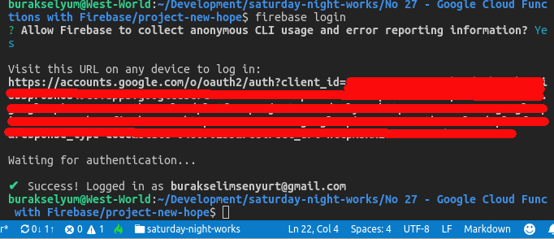
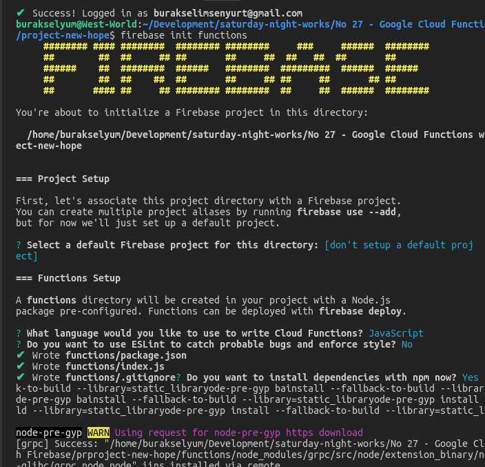
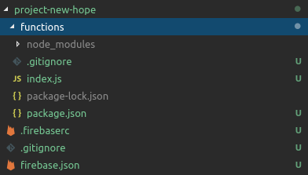
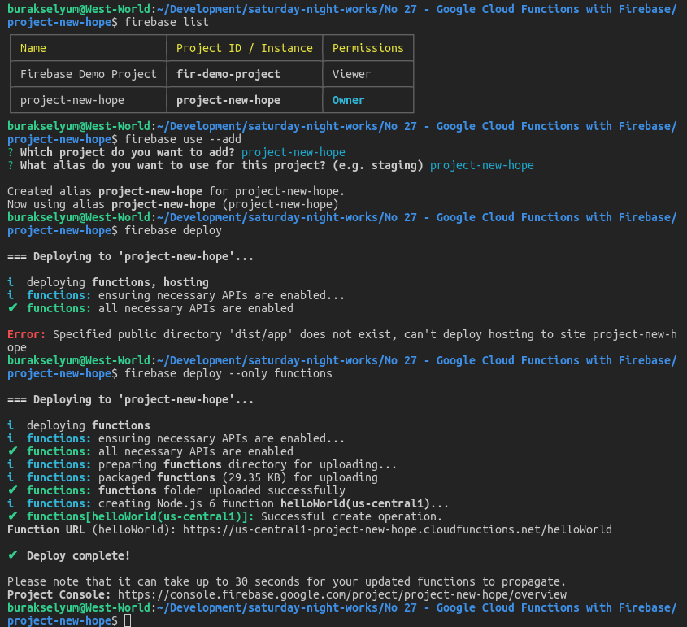
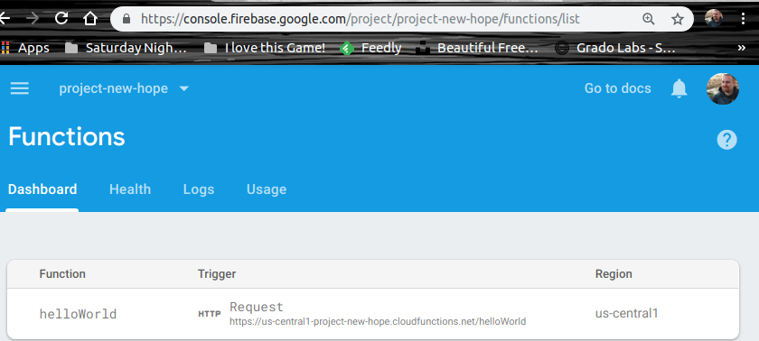
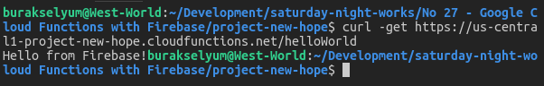

# Google Cloud Function'ları Firebase ile Birlikte Kullanmak

Bulut çözümlerin sunduğu imkanlardan birisi de sunucu oluşturma, barındırma, yönetme gibi etkenleri düşünmeden _(serverless)_ uygulama geliştirme ortamları sağlamalarıdır. Bazen bulut platform üzerinde sunulan bir veritabanını kullanan servis kodlarını yine o platformun sunucularında barındırarark hizmet sağlarız. Söz gelimi Google'ın Firebase veritabanı ve onu kullanan servis tabanlı fonksiyonları Google Cloud Platform üzerinde konuşlandırabiliriz. Bu örnekteki amacım da Firebase ile ilişkili bir uygulama servisini Google Cloud Platform üzerinde fonksiyonlaştırabilmek. Her zaman ki gibi örneği WestWorld _(Ubuntu 18.04, 64bit)_ üzerinde geliştiriyorum.

## İlk Hazırlıklar

Her şeyden önce Google Cloud Platform üzerinden bir hesabımızın olması gerekiyor. Ardından [Firebase Console](https://console.firebase.google.com/) adresine gidip bir proje oluşturmalıyız. Ben project-new-hope isimli bir proje oluşturdum.


Projeyi komut satırından yönetebilmemiz gerekiyor. Yazdığımız kodları kolayca deploy edebilmeliyiz. Bu nedenle Firebase CLI aracına ihtiyacımız var. Kendisini npm ile aşağıdaki gibi yükleyebiliyiz _(Dolayısıyla sistemimizde node ve npm yüklü olmalı)_

```
npm install -g firebase-tools
```

Yükle işlemi başarılı olduktan sonra proje ile aynı isimde bir klasör oluşturup, içerisinde sırasıyla login ve functions komutlarını kullanarak ilerleyebiliriz. Öncelikle Firebase tarafı için login olacak ardından iskelet projeyi oluşturacağız.

```
mkdir project-new-hope
cd project-new-hope
firebase login
firebase init functions
```

Login işlemi sonrası arabirim bizi tarayıcıya yönlendirecektir. Başarılı login sonrası tekrar console ekranına dönüş yapmış oluruz.



init functions çağrısı ile yeni bir GCF oluşturma işlemine başlanır. 4 soru sorulacaktır. Projeyi zaten Firebase Console'unda oluşturmuştuk. Klasör adını aynı verdiğimiz için varsayılan olarak onu kullanmasını belirtebiliriz. Dil olarak Typescript ve Javascript desteği sorulmakta ki ben ikincisi tercih ettim. 3ncü soruda ESLint kullanıp kullanmayacağımız yer alıyor. Şimdilik No diyebiliriz. Projenin bağımlılık duyduğu npm paketleri varsa bunların install edilmesini de istediğimizden son soruyu da Yes olarak geçebiliriz.



Komut çalışmasını tamamladıktan sonra aşağıdaki klasör yapısının oluştuğunu görebiliriz.



Bundan sonra index.js dosyası ile oynayıp deploy işlemini gerçekleştirebiliriz. Index.json içerisinde yorum satırı içerisine alınmış bir kod parçası bulunur. Bunu açarak hemen _Hello World_ dememiz mümkün. Ama bunun için yapılan değişiklikleri GCP'ye deploy etmeliyiz. Aşağıdaki terminal komutu ile bunu sağlayabiliriz.

```
firebase deploy --only functions
```

### Sorun Yaşayabiliriz

Yukarıdaki terminal komutunu denediğimde aktif bir proje olmadığına dair hata mesajı aldım ve deployment işlemi başarısız oldu. Bunun üzerine önce aktif proje listesine baktım ve sonrasında _use --add_ ile tekrardan proje seçimi yaptım. Bir alias tanımladıktan sonra _(ki her nedense proje adının aynısını vermişim :S)_ tekrardan deploy işlemini denedim. Ancak sadece fonksiyon olarak dağıtım yapmak istediğimi belirtmediğim için başka bir hata aldım. Sonrasında çalıştırdığım terminal komutu işe yaradı ve proje GCP'ye deploy edildi.

```
firebase list
firebase use --add
firebase deploy --only functions
```



Firebase Dashboard'una gittiğimizde helloworld isimli API fonksiyonunun eklenmiş olduğunu görebiliriz.



## Çalışma Zamanı

Örneğin ilk yalın versiyonunda Google'ın index.js içerisine koyduğu yorum satırlarını kaldırarak bir deneme yaptık. Bu durumda Firebase tarafında üretilen fonksiyona ait API adresini 

```
curl -get https://us-central1-project-new-hope.cloudfunctions.net/helloWorld
```

ile çağırdığımızda 'Hello from Firebase!' yazısını görürüz.



## İkinci Örnek

Asıl işe yapan örneğimiz basit bir API hizmeti. POST ve GET mesajlarını destekleyen metotlar içeriyor ve temel olarak veri ekleme ve listeleme fonksiyonelliklerini sunuyor. Arka planda Firebase veritabanını kullanıyor. Arka plandan kastımız GCP üzerindeki Firebase veritabanı. Yani kendi makinemde geliştirdiğimiz bir API servisini, firebase veritabanını kullanacak şekilde GCP üzerinden konuşlandırmış oluyoruz. İkinci örnek için gerekli bir kaç npm paketi var. REST modelini node tarafında kolayca kullanabilmek için express ve CORS etkisini rahatça yönetebilmek için cors :D Aşağıdaki terminal komutları ile onları projemize ekleyebiliriz.

```
npm install --save express cors
```

## Neler Öğrendim?

- Firebase üzerinden bir projenin nasıl oluşturulabileceğiniz
- firebase-tools ile proje başlatma, fonksiyon dağıtma gibi temel işlemleri nasıl yapabileceğimi
- Kendi development ortamında geliştirdiğim bir API hizmetini Function olarak Firebase'e nasıl deploy edebileceğimi