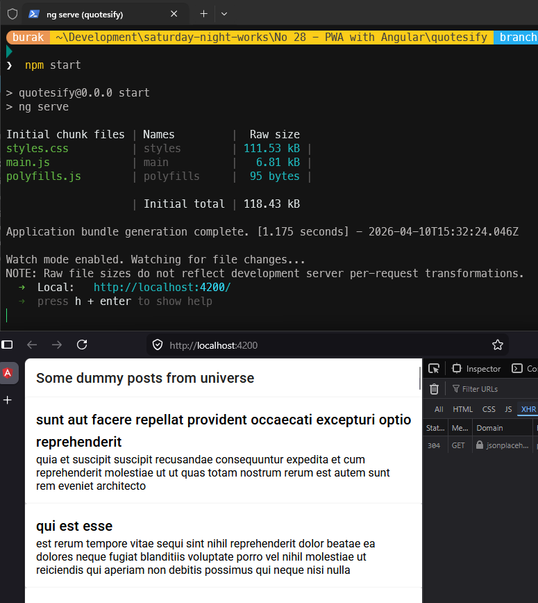

# Güncellemeler

## 10 Nisan 2026 (Önyüzde Görüntüleme Sorunu)

**Problem:** Angular 11 → 21 yükseltmesi sonrası uygulama derleniyor, API'den post verileri geliyor ancak post içerikleri sayfada görünmüyor. Bazı çalıştırma senaryolarında boş beyaz sayfa da oluşabiliyor. Konsolda belirgin bir hata yok.
**Çözüm:** Bileşen veri akışı Angular 21 ile uyumlu hale getirildi. Elle `subscribe` ile dizi doldurmak yerine observable doğrudan şablona taşındı; template tarafı güncel `@if` ve `@for` kontrol akışına geçirildi. Böylece gelen post verileri güvenli biçimde DOM'a işlenmeye başladı.
**Yapay Zeka Asistanı:** GPT 5.4

**Kod Düzeltmeleri:**

- `src/app/app.component.ts` içinde `OnInit` ve manuel `posts` dizisi kaldırıldı; yerine `readonly posts$ = this.dummyService.get()` kullanıldı
- `src/app/app.component.ts` içinde `NgFor` yerine `AsyncPipe` import edildi
- `src/app/app.component.html` içinde eski `*ngFor` yapısı kaldırıldı; `@if (posts$ | async)` ve `@for (post of posts; track post.id)` ile render akışı güncellendi
- `quotesify/src/app/dummy.service.ts` içinde eski tip cast kaldırıldı; `this.httpClient.get<Post[]>(url)` kullanıldı
- `src/app/app.component.spec.ts` içinde observable ve DOM render doğrulamaları güncellendi

## 10 Nisan 2026

- **Problemler:**
  - Angular Stored XSS Vulnerability via SVG Animation, SVG URL and MathML Attributes
  - Angular has XSS Vulnerability via Unsanitized SVG Script Attributes
  - Angular is Vulnerable to XSRF Token Leakage via Protocol-Relative URLs in Angular HTTP Client
  - Angular i18n vulnerable to Cross-Site Scripting

- **Çözüm:** Angular 11 → Angular 21 tam yükseltmesi. Bağımlılık zincirindeki tüm güvenlik açıkları kapandı. `npm audit` 0 zafiyet döndürüyor. NgModule tabanlı mimari Standalone Component mimarisine geçirildi.
- **Yapay Zeka Asistanı:** Claude Sonnet 4.6

---

### Paket Güncellemeleri

| **Paket** | **Eski** | **Yeni** | **Açıklama** |
| --- | --- | --- | --- |
| `@angular/*` | `~11.0.5` | `~21.2.0` | XSS, XSRF ve diğer Angular güvenlik açıklarını kapattı |
| `@angular/cdk` | `~11.0.0` | `~21.2.0` | Angular 21 uyumlu sürüm |
| `@angular/material` | `~11.0.0` | `~21.2.0` | Angular 21 uyumlu sürüm |
| `@angular/service-worker` | `~11.0.5` | `~21.2.0` | PWA service worker güncellendi |
| `@angular/pwa` | `^0.1100.7` | **kaldırıldı** | Sadece schematics paketi; runtime bağımlılık değil |
| `@angular-devkit/build-angular` | `~0.1100.7` | **kaldırıldı** | `@angular/build` ile değiştirildi |
| `@angular/build` | — | `~21.2.0` | esbuild tabanlı yeni build sistemi |
| `rxjs` | `~6.6.0` | `~7.8.0` | Güncel kararlı sürüm |
| `zone.js` | `~0.11.3` | `~0.16.0` | Angular 21 uyumlu sürüm |
| `tslib` | `^2.0.0` | `^2.8.0` | Güncel yama sürümü |
| `typescript` | `~4.0.5` | `~5.9.0` | TypeScript 5 strict mod desteği |
| `protractor` | `~5.4.0` | **kaldırıldı** | Kullanımdan kalktı |
| `tslint` | `~5.11.0` | **kaldırıldı** | ESLint flat config ile değiştirildi |
| `codelyzer` | `~4.5.0` | **kaldırıldı** | tslint ile birlikte kaldırıldı |
| `core-js` | `^2.5.4` | **kaldırıldı** | Angular 21 + ES2022 hedefi ile artık gerekli değil |
| `@angular-eslint/*` | — | `~21.3.0` | tslint yerine Angular resmi ESLint entegrasyonu |
| `typescript-eslint` | — | `~8.0.0` | ESLint TypeScript desteği |
| `@types/jasmine` | `~2.8.8` | `~6.0.0` | Güncel Jasmine tip tanımları |
| `jasmine-core` | `~2.99.1` | `~6.1.0` | Güncel Jasmine çekirdeği |
| `karma` | `^6.3.14` | `~6.4.0` | Güncel Karma test runner |
| `karma-coverage` | `~2.0.1` | `~2.2.0` | karma-coverage-istanbul-reporter'ın yerini aldı |

### Kod Değişiklikleri

**`src/main.ts`**

- NgModule tabanlı `platformBrowserDynamic().bootstrapModule(AppModule)` → `bootstrapApplication(AppComponent)` standalone mimariye geçildi
- `provideNoopAnimations()`, `provideHttpClient()`, `provideServiceWorker(...)` provider'ları eklendi

**`src/app/app.component.ts`**

- `standalone: true` eklendi; Angular Material modülleri (`MatToolbarModule`, `MatCardModule`, `MatButtonModule`) ve `NgFor` doğrudan `imports` dizisine alındı
- `posts` dizisi başlangıç değeri ile tanımlandı: `posts: Array<Post> = []`
- `app.module.ts` bağımlılığı kaldırıldı

**`src/app/app.component.spec.ts`**

- Standalone test mimarisine geçildi; `declarations` → `imports: [AppComponent]`
- `DummyService` mock olarak enjekte edildi
- Eski `async()` wrapper → `async/await` + `TestBed.configureTestingModule`

**`src/app/dummy.service.spec.ts`**

- `TestBed.get()` → `TestBed.inject()` (React to deprecation)
- `provideHttpClient()` provider olarak eklendi

**Yeni dosyalar:** `tsconfig.app.json`, `tsconfig.spec.json` (proje kök dizininde), `.npmrc` (`os=win32`), `eslint.config.mjs` (ESLint 9 flat config)

**Kaldırılan dosyalar:** `app.module.ts`, `e2e/`, `tslint.json`, `src/karma.conf.js`, `src/polyfills.ts`, `src/test.ts`, `src/browserslist`, eski `src/tsconfig.*.json` dosyaları

### Çalışma Zamanı

> **Not:** Derleme çıktısı (`dist/`) klasördeki `index.html` doğrudan tarayıcıda açılmaz. Service Worker'lar `file://` protokolüyle çalışmaz. Uygulamayı her zaman bir HTTP sunucusu üzerinden çalıştırın.

#### Geliştirme modu (önerilen)

```bash
cd "No 28 - PWA with Angular/quotesify"
npm install
npm start
# Tarayıcıda http://localhost:4200 adresini aç
```

> **"Port 4200 is already in use"** hatası alınırsa, portu kullanan süreci sonlandır ve tekrar dene:

```bash
# Portu kullanan süreci bul ve sonlandır
npx kill-port 4200
npm start

# Ya da farklı bir port kullan
npm start -- --port 4201
# Tarayıcıda http://localhost:4201 adresini aç
```



#### PWA testleri için production build + yerel sunucu

```bash
cd "No 28 - PWA with Angular/quotesify"
npm run build
# dist/quotesify/browser klasörünü bir HTTP sunucusuyla serve et
npx serve dist/quotesify/browser
# Tarayıcıda http://localhost:3000 adresini aç
# Lighthouse ile PWA uyumluluğunu test edebilirsin (F12 → Lighthouse → PWA)
```

- [x] Windows 11 testleri
- [ ] Ubuntu testleri
