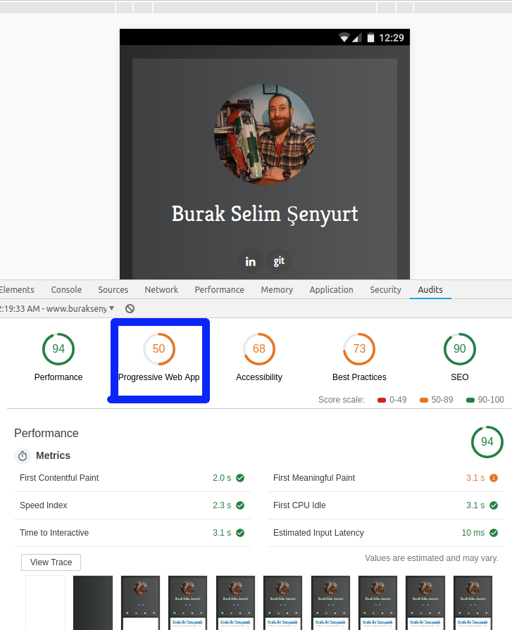

# Angular ile Bir Web Uygulamasını PWA Uyumlu Hale Getirmek

PWA tipindeki web uygulamaları özellikle mobil cihazlarda kullanılırken sanki AppStore veya PlayStore'dan indirilmiş native uygulamalarmış gibi görünürler. Ancak native uygulamalar gibi dükkandan indirilmezler ve bir web sunucusundan talep edilirler. Https desteği sunduklarından hat güvenlidir. Bağlı olan istemcilere push notification ile bildirimde bulunabilirler. Cihaz bağımsız olarak her tür form-factor'ü desteklerler. Service Worker'lar bu uygulama modelinde iş başındadır ve sürekli taze kalınmasını sağlarlar. Düşük internet bağlantılarında veya internet olmayan ortamlarda offline da çalışabilirler. URL üzerinden erişilen uygulamalar olduklarından kurulum ihtiyaçları yoktur. Benim amacım çok yabancısı olduğum Angular ile basit bir web uygulaması yazmak ve bunu PWA uyumlu hale getirmek. 

Peki bir web sayfasından gelen içeriğin PWA uyumluluğunu nasıl test edebiliriz? Bunun için Google'ın geliştirdiği ve Chrome üzerinde bulunan Lighthouse isimli uygulama kullanılır. F12 ile açılan Developer Tools'tan kolayca erişilebilen Lighthouse ile o anki sayfa için uyumluluk testleri yapabiliriz. Örneğin kendi bloğum için bunu yaptığımda mobile cihazlardaki PWA uyumluluğunun %50 olarak çıktığını gördüm.

Bakalım boş bir uygulama için bu durumu değiştirebilecek miyiz?

## Ön Hazırlıklar

## Yapılan Değişiklikler

## Çalışma Zamanı

## Neler Öğrendim?