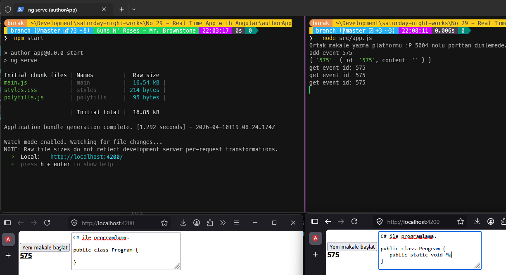

# Güncellemeler

## 10 Nisan 2026 (Gerçek Zamanlı Senkronizasyon Sorunları)

**Problem:** Geliştirilmiş Socket.io istemcisi v4 (Angular 21) ve sunucunun eski v2 sürümünde kalması sebebiyle tarayıcılar arası karşılıklı iletişim kopuyordu. Ayrıca mesajların yazana kendisini tekrar yankılatması, tıklanan bir odanın içeriğinin eksik yansıtılması *(change detection kayması)* sorunları mevcuttu.
**Kullanım Açıklaması:** "Yeni makale başlat" butonu arka planda yeni bir makale odası oluşturur. Karşı tarafın (diğer istemcinin) yazılanları eşzamanlı görebilmesi için listeden aynı makale ID'sine tıklayarak odaya katılması gerekir. İki taraf da aynı makaleyi açtığında klavye darbeleri anında (gönder butonuna gerek kalmadan) birbirine senkronize olur.
**Yapay Zeka Asistanı:** Google Gemini 3.1 Pro

**Çözüm ve Kod Düzeltmeleri:**

- `docserver` tarafındaki `socket.io` paketi v4'e yükseltildi (`~4.8.0`) ve Angular dev server'a (4200) `cors` izni açıldı.
- `docserver`'da sadece odadaki *diğer* istemcilere güncelleme göndermesi için `io.to(id).emit` yerine `socket.to(id).emit` kullanıldı. Bu sayede yazan kişinin ekranına kendisinin yazdığı eski/yeni harfler dönmüyor, yankı oluşmuyor.
- İstemcideki `ArticleService`, veriyi güvence altına almak için `BehaviorSubject` kullanacak şekilde modellendi. Böylelikle odaya tıklandığında sunucudan gelen son (`ready`) değer anında `ArticleComponent`'a ulaşıyor.
- Olay fırlatımları (Socket eventleri) Angular `NgZone.run()` içerisine alınarak Angular 21 Change Detection mekanizmasıyla doğru senkronize olması sağlandı. Testler ve derlemeler başarılı.
**Yapay Zeka Asistanı:** GPT 5.4

## 10 Nisan 2026

- **Problemler:**
  - Angular Stored XSS Vulnerability via SVG Animation, SVG URL and MathML Attributes
  - Angular has XSS Vulnerability via Unsanitized SVG Script Attributes
  - Angular is Vulnerable to XSRF Token Leakage via Protocol-Relative URLs in Angular HTTP Client
  - Angular i18n vulnerable to Cross-Site Scripting

- **Çözüm:** Angular 11 → Angular 21 tam yükseltmesi. `ngx-socket-io@4.10.0` sürümü Angular 21 ile uyumlu (`@angular/core ^21.0.0`). Bağımlılık zincirindeki tüm güvenlik açıkları kapandı. `npm audit` 0 zafiyet döndürüyor. NgModule tabanlı mimari Standalone Component mimarisine geçirildi.
- **Yapay Zeka Asistanı:** Claude Sonnet 4.6

---

### Paket Güncellemeleri

| **Paket** | **Eski** | **Yeni** | **Açıklama** |
| --- | --- | --- | --- |
| `@angular/*` | `~11.0.5` | `~21.2.0` | XSS, XSRF ve diğer Angular güvenlik açıklarını kapattı |
| `@angular/cdk` | `~11.0.0` | `~21.2.0` | Angular 21 uyumlu sürüm |
| `@angular/material` | `~11.0.0` | `~21.2.0` | Angular 21 uyumlu sürüm |
| `ngx-socket-io` | `^2.1.1` (devDep) | `~4.10.0` (dep) | Angular 21 uyumlu; devDependencies'den dependencies'e taşındı |
| `@angular-devkit/build-angular` | `~0.1100.7` | **kaldırıldı** | `@angular/build` ile değiştirildi |
| `@angular/build` | — | `~21.2.0` | esbuild tabanlı yeni build sistemi |
| `rxjs` | `~6.6.0` | `~7.8.0` | Güncel kararlı sürüm |
| `zone.js` | `~0.11.3` | `~0.16.0` | Angular 21 uyumlu sürüm |
| `tslib` | `^2.0.0` | `^2.8.0` | Güncel yama sürümü |
| `typescript` | `~4.0.5` | `~5.9.0` | TypeScript 5 strict mod desteği |
| `protractor` | `~5.4.0` | **kaldırıldı** | Kullanımdan kalktı |
| `tslint` | `~5.11.0` | **kaldırıldı** | ESLint flat config ile değiştirildi |
| `codelyzer` | `~4.5.0` | **kaldırıldı** | tslint ile birlikte kaldırıldı |
| `core-js` | `^2.5.4` | **kaldırıldı** | Angular 21 + ES2022 hedefi ile artık gerekli değil |
| `@angular-eslint/*` | — | `~21.3.0` | tslint yerine Angular resmi ESLint entegrasyonu |
| `typescript-eslint` | — | `~8.0.0` | ESLint TypeScript desteği |
| `@types/jasmine` | `~2.8.8` | `~6.0.0` | Güncel Jasmine tip tanımları |
| `jasmine-core` | `~2.99.1` | `~6.1.0` | Güncel Jasmine çekirdeği |
| `karma` | `^6.3.14` | `~6.4.0` | Güncel Karma test runner |
| `karma-coverage` | `~2.0.1` | `~2.2.0` | karma-coverage-istanbul-reporter'ın yerini aldı |

### Kod Değişiklikleri

**`src/main.ts`**

- NgModule tabanlı `platformBrowserDynamic().bootstrapModule(AppModule)` → `bootstrapApplication(AppComponent)` standalone mimariye geçildi
- `importProvidersFrom(SocketIoModule.forRoot(socketConfig))` ile Socket.IO bağlantısı provider olarak tanımlandı

**`src/app/app.component.ts`**

- `standalone: true` eklendi; `ArticleListComponent` ve `ArticleComponent` doğrudan `imports` dizisine alındı
- `app.module.ts` bağımlılığı kaldırıldı

**`src/app/article-list/article-list.component.ts`**

- `standalone: true` eklendi; `AsyncPipe`, `NgFor`, `NgIf` doğrudan `imports` dizisine alındı
- Import yolu düzeltildi: `'src/app/article.service'` → `'../article.service'`
- `articles` ve `_subscription` tipleri opsiyonel yapıldı (`| undefined`): strict TypeScript uyumu

**`src/app/article/article.component.ts`**

- `standalone: true` eklendi; `FormsModule` `imports` dizisine alındı
- Import yolları düzeltildi: `'src/app/...'` → `'../'`
- `startWith` import'u `'rxjs/operators'` → `'rxjs'` olarak güncellendi
- `article` ve `_subscription` başlangıç değerleri atandı: strict TypeScript uyumu

**`src/app/article.ts`**

- `id` ve `content` özellikleri başlangıç değerleriyle tanımlandı: `id: string = ''` — strict mod uyumu

**`src/app/app.component.spec.ts`** ve **`src/app/article.service.spec.ts`**

- Standalone test mimarisine geçildi
- `Socket` mock olarak enjekte edildi: `{ fromEvent: () => of(null), emit: () => {} }`
- `TestBed.get()` → `TestBed.inject()` güncellendi

**Yeni dosyalar:** `tsconfig.app.json`, `tsconfig.spec.json` (proje kök dizininde), `.npmrc` (`os=win32`), `eslint.config.mjs` (ESLint 9 flat config)

**Kaldırılan dosyalar:** `app.module.ts`, `e2e/`, `tslint.json`, `src/karma.conf.js`, `src/polyfills.ts`, `src/test.ts`, `src/browserslist`, eski `src/tsconfig.*.json` dosyaları

### Çalışma Zamanı



```bash
# Önce docserver'ı başlat (ayrı terminal)
cd "No 29 - Real Time App with Angular/docserver"
npm install
node src/app.js

# Ardından Angular uygulamasını başlat
cd "No 29 - Real Time App with Angular/authorApp"
npm install
npm start
```

- [x] Windows 11 testleri
- [ ] Ubuntu testleri
