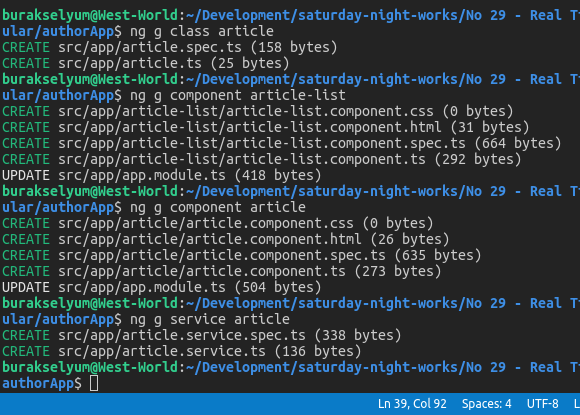
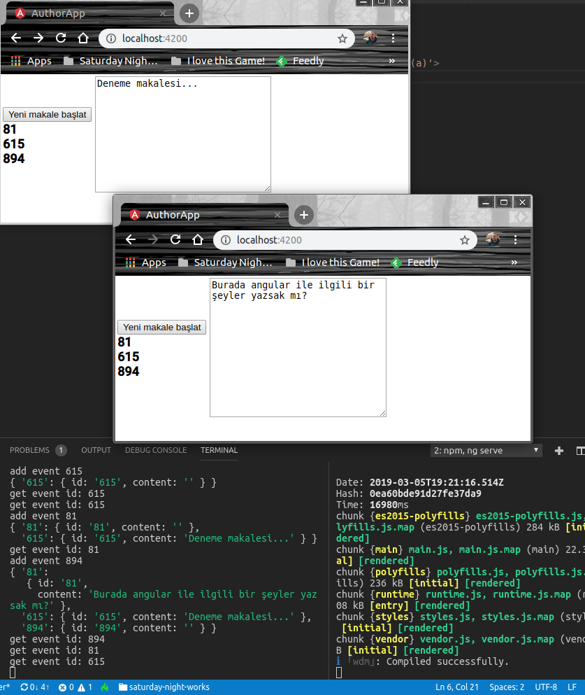

# Socket-IO Yardımıyla RealTime Çalışan Bir Angular Uygulaması Geliştirmek

Bilindiği üzere istemci-sunucu geliştirme modelinde gerçek zamanlı ve çift yönlü iletişim için WebSocket yaygın olarak kullanılan protokollerden birisi. Klasik HTTP request/response modelinden farklı olarak WebSocket protokolünde sunucu, istemcinin talep göndermesine gerek kalmadan mesaj gönderebiliyor. Chat uygulamaları, eş zamanlı oyunlar, finansal bildirim yapan ticari programlar, online doküman yönetim sistemleri ve benzerleri WebSocket protokolünün kullanıldığı ideal ortamlar. 

Benim amacım Socket.IO kütüphanesinden yararlanan bir Node sunucusu ile Angular'da yazılmış web uygulamasını WebSocket protokolü tabanında deneyimlemek. 

Bulduğum örnek, ortak dokümanlar üzerinden istemcilerin eş zamanlı olarak çalışabilmeleriniz sağlıyor. İstemciler yeni dokümanlar başlatabiliyor. Her kullanıcı açılan yeni dokümanı sayfasında görebiliyor ve isterse bir tanesine dahil olup bir şeyler yazmaya başlayabiliyor. Yazılanlar o doküman üzerinde çalışan her istemcinin penceresine de yansıyor _(Bazen sinir bozucu bir durum da olabilir)_ Örneği her zaman olduğu gibi WestWorld _(Ubuntu 18.04, 64bit)_ üzerinden denemeye karar verdim.

>Makinenizde node, npm, angular CLI'ın yüklü olduğu varsayılmıştır.

## Uygulamanın İnşası

Uygulama iki önemli parçadan oluşuyor. Soket mesajlaşmasını yönetecek olan sunucu _(node.js tarafı) ve istemci _(Angular tarafı)_

>Mekanizmaların işleyişi ile ilgili olarak kod dosyalarındaki yorum satırlarına bakmanızı öneririm.

### Sunucun(node.js) İnşası

```
mkdir docserver
cd docserver
mkdir src
npm init
npm install --save-dev express socket.io @types/socket.io
cd src
touch app.js
```

### İstemcinin(Angular tarafı) İnşası

Soket yöneticisi ile konuşacak olan istemciyi bir Angular uygulaması olarak geliştireceğiz. İşe aşağıdaki terminal komutları ile başlayabiliriz.

İlk komutla authorApp isimli Angular uygulaması oluşturulur. Socket.IO ile Angular tarafında konuşmamızı sağlayacak ngx-socket-io paketi proje klasörü içinde yüklenir. Yine aynı klasörde article isimli sınıf, article-list ve article isimli bileşenler ve soket sunucusu ile iletişimde kullanacağımız article isimli servis oluşturulur.

>g sonrasında gelen 'component' ve 'service' için 'c' ve 's' kısaltmaları da kullanılabilir 

```
ng new authorApp --routing=false --style=css
cd authorApp
sudo npm install --save-dev ngx-socket-io
ng g class article
ng g component article-list
ng g component article
ng g service article
```



### İstemcide Yapılan Değişiklikler

- app.module.ts dosyasında SocketIoModule bildirimleri yapıldı ve konfigurasyon bazlı url değeri ile ilişkilendirildi. _(Hangi sunucu ile web socket haberleşmesi yapılacağı tüm modüller için ayarlanmış oldu)_
- article.ts sınıfı yazıldı. Odalardaki makaleleri temsil eden basit bir entity tipi gibi düşünebiliriz.
- article.service.ts sınıfı değiştirildi. Bu servis, Socket sunucusu ile haberleşen proxy servisimiz olarak düşünülebilir. Bu servisi arayüz tarafında ele alacağız.
- app.component.html, article-list.component.ts, article-list.component.html, article-component.html ve article-component.ts dosyalarının içerikleri değiştirildi. article-component ve article-list component iki ayrı angular bileşeni. Typescript arka planları ve HTML ön yüzleri ile app.component isimli ana bileşen içerisinde kullanılıyorlar.

## Çalışma Zamanı

Sunucuyu çalıştırmak için

```
npm run start
```

komutu verilebilir. İstemci tarafını çalıştırmak içinse,

```
ng serve
```

terminal komutundan yararlanılabilir. 

Servis localhost:4200 nolu port'tan ayağa kalkar. Bu zorunlu değildir isterseniz geliştirme ortamı için angular.json dosyasındaki serve kısmına yeni bir options elementi olarak port bilgisi ekleyebilirsiniz veya ng komutu ile --port anahtarını kullanabilirsiniz.

```
ng serve --port 4003
```

gibi.

Örneği daha iyi anlamak için iki veya daha fazla istemci çalıştırmakta yarar var. Bir istemcide yeni bir yazı açıp üzerinde yazarken diğer istemcide de aynı dosya numarası görünür ve değişiklikler karşılıklı olarak istemcilere yansır. Yani Cenifır'ın 399 nolu dokümanda yaptığı değişikliği aynı dokümana bakan Brendon görebilir ve üstüne kendi değişikliklerini yazıp bunları Jenifer'ın görmesini sağlayabilir. Chat uygulaması gibi de değil gibi :)



>Tasarım gerçekten çok kötü ancak amaç Socket.IO'nun Angular tarafında nasıl kullanılabileceğini anlamak.

## Neler Öğrendim?

- WebSocket protokolünün Node.js tarafında Socket.IO paketi yardımıyla nasıl uygulanabileceğini
- emit ile bağlı istemciye ya da tüm istemcilere broadcasting'in nasıl yapılabileceğini
- on, event listener'ların ne olduğunu
- ng komutları ile proje oluşturulmasını, class, component ve service öğelerinin eklenmesini
- Angular component'lerinin bir üst component içerisinde nasıl kullanılabileceğini
- Bileşenlerin HTML tabanlı ön yüzünden, Typescript tarafındaki enstrümanlara _(metod, property vb)_ nasıl ulaşılabileceğini