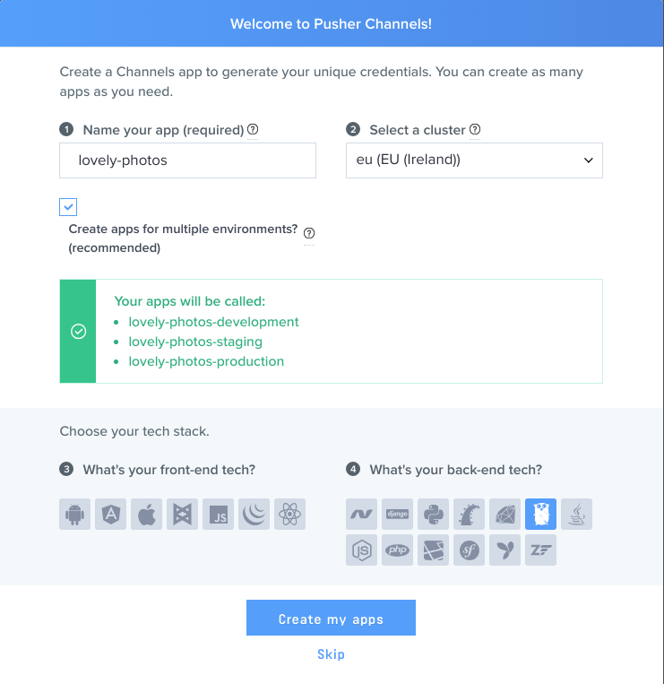
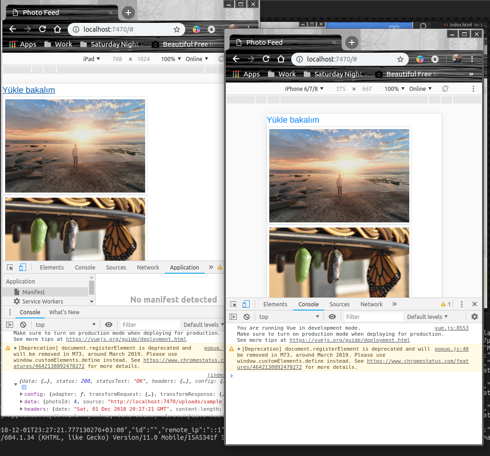

# Haber akışına fotoğraf eklemek

Amaç bir haber akışına fotoğraf ekleyebilmek _(Sosyal ağların web arayüzlerinde anlık güncellemelerle aşağıya doğru akan akış olarak düşünebiliriz)_ Tabii haber akışı herkesin görebildiği bir alan. Yani "Barbarossa" masaüstünden bir fotoğraf seçip yüklediğinde, bağlı olan diğer kullanıcılar da eklenen fotoğrafı görebilmeli. Kılavuza göre örnek Go, Vue.js, SQLite ve Pusher Channels isimli uygulama içi bildirim aracı ile gerçekleştiriliyor.

> Sistemimizde Go, SQLite yüklü olmalı

## Birinci Hamle

İlk olarak [Pusher Channels](https://pusher.com/) adresine giderek bir uygulama kaydettirmemiz gerekiyor. github veya google hesapları ile bağlanabiliyoruz. Uygulamayı oluşturduktan sonra App Keys sayfasından geliştirmemiz için gerekli app_id, key, secret gibi bilgileri alabiliriz.




## İkinci hamle klasör yapısını oluşturmak

```
mkdir lovely-photos
cd lovely-photos
mkdir db
mkdir public
mkdir public/uploads
```

> Visual Studio Code, go uzantılı main dosyasını görür görmez bazı eklentileri kurmanızı önerecektir. Onu dinleyin ;)

## Go tarafı için gerekli paketlerin yüklenmesi

```
go get github.com/labstack/echo
go get github.com/labstack/echo/middleware
go get github.com/mattn/go-sqlite3
go get github.com/pusher/pusher-http-go
```

Uygulamayı çalıştırmak için terminalden 

```
go run main.go
```

dememiz yeterli. Sorun çıkmazsa aşağıdakine benzer bir ekran görüntüsü ile karşılaşmamız gerekiyor.


Bundan sonra http://localhost:7470 adresine gidebiliriz. 

En az iki sayfa açmanızı öneririm. Bir tanesinden yapacağımız dosya yükleme işlemi sonrası içrik anında diğer tarayıcıdaki ekrana da yansıyacaktır. index.html sayfasında Vue.js kullanılmıştır. axios kütüphanesi ise XmlHttpRequest'leri yapmak için kullanılıyor. Yani go server'ına göndereceğimiz Post, Get, Put, Delete gibi komutlar için kullanabiliriz. Pusher tarafındaki kanala abone olmak içinse pusher'ın istemci için yazılmış javascript kütüphanesinden yararlanılıyor. Çok azcık ucundan bootstrap ile css desteği de sağlıyoruz.



Denemeler sırasında Pusher üzerinde oluşan hareketlilikleri Dashboard üzerinden de gözlemleyebiliriz.


> index.html dosyasında pusher nesnesi için gerekli application key ve cluster bilgisi sizin uygulamanızınkine ait olmalıdır

## Daha iyi olması için

- Fotoğraf kalite ve boyutlarının kontrolü sağlanmalı
- Sadece izin verilen formatların yüklenmesi garanti edilmeli
- Zararlı içerik yüklenemeyeceğinden emin olunmalı
- Arayüz tasarımı daha şık bir hale getirilmeli

## Neler Öğrendim?

- Go ile sqlLite'ı nasıl konuşturabileceğimi,
- Go'yu web sunucusu olarak nasıl ele alabileceğimi,
- Basit bir Vue.js kodlamasının nasıl yapıldığını,
- axios ile XmlHttpRequest'leri nasıl yapabileceğimi,
- pusher'ın ne işe yaradığını,

öğrendim.