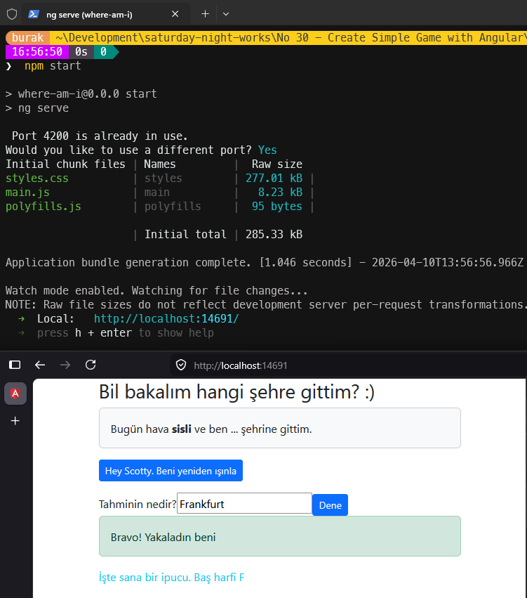

# Güncellemeler

## 10 Nisan 2026

- **Problemler:**
  - Dependabot Alert #60 — `loader-utils` ReDoS (GHSA-76p3-8jx3-jpfq) — Angular build araçları aracılığıyla tetikleniyordu
  - Dependabot Alert #65 — `minimatch` ReDoS (GHSA-f8q6-p94x-37v3) — webpack ve bağımlıları aracılığıyla tetikleniyordu
  - Dependabot Alert #70 — `request` SSRF (GHSA-p8p7-x288-28g6) — protractor/webdriver-manager aracılığıyla tetikleniyordu
  - Dependabot Alert #88 — `tough-cookie` prototype pollution (GHSA-72xf-g2v4-qvf3) — request paketi zinciri aracılığıyla tetikleniyordu
  - Angular Stored XSS Vulnerability via SVG Animation, SVG URL and MathML Attributes
  - Angular has XSS Vulnerability via Unsanitized SVG Script Attributes
  - Angular is Vulnerable to XSRF Token Leakage via Protocol-Relative URLs in Angular HTTP Client

Yok artık dedirten türden açıklar var tabii.

- **Çözüm:** Angular 11 → Angular 21 tam yükseltmesi. Bağımlılık zincirindeki tüm güvenlik açıkları kapandı. `npm audit` 0 zafiyet döndürüyor.
- **Yapay Zeka Asistanı:** Claude Sonnet 4.6

---

### Paket Güncellemeleri

| **Paket** | **Eski** | **Yeni** | **Açıklama** |
| --- | --- | --- | --- |
| `@angular/*` | `~11.0.5` | `~21.2.0` | XSS, XSRF ve diğer Angular güvenlik açıklarını kapattı |
| `@angular/cli` | `~11.0.7` | `~21.2.0` | Tüm build araç zinciri güvenlik açıklarını kapattı (#60, #65, #70, #88) |
| `@angular-devkit/build-angular` | `~0.1100.7` | kaldırıldı | `@angular/build` ile değiştirildi |
| `@angular/build` | — | `~21.2.0` | esbuild tabanlı yeni build sistemi |
| `bootstrap` | `^4.3.1` | `^5.3.3` | Bootstrap 4 → 5; bilinen güvenlik yamaları dahil |
| `rxjs` | `~6.6.0` | `~7.8.0` | Güncel kararlı sürüm |
| `zone.js` | `~0.11.3` | `~0.16.0` | Angular 21 uyumlu sürüm |
| `tslib` | `^2.0.0` | `^2.8.1` | Güncel yama sürümü |
| `typescript` | `~4.0.5` | `~5.9.0` | TypeScript 5 strict mod desteği |
| `protractor` | `~5.4.0` | **kaldırıldı** | Kullanımdan kalktı; Alert #70 (#request SSRF) zincirinin kaynağıydı |
| `tslint` | `~5.11.0` | **kaldırıldı** | Kullanımdan kalktı; ESLint flat config ile değiştirildi |
| `codelyzer` | `~4.5.0` | **kaldırıldı** | tslint ile birlikte kaldırıldı |
| `@angular-eslint/*` | — | `~21.3.0` | tslint yerine Angular resmi ESLint entegrasyonu |
| `typescript-eslint` | — | `~8.0.0` | ESLint TypeScript desteği |
| `@types/jasmine` | `~2.8.8` | `~6.0.0` | Güncel Jasmine tip tanımları |
| `jasmine-core` | `~2.99.1` | `~6.1.0` | Güncel Jasmine çekirdeği |
| `karma` | `^6.3.14` | `~6.4.0` | Güncel Karma test runner |
| `karma-coverage` | `~2.0.1` | `~2.2.0` | karma-coverage-istanbul-reporter'ın yerini aldı |
| `core-js` | `^2.5.4` | **kaldırıldı** | Angular 21 + ES2022 hedefi ile artık gerekli değil |

### Kod Değişiklikleri

**`src/main.ts`**

- NgModule tabanlı `platformBrowserDynamic().bootstrapModule(AppModule)` → `bootstrapApplication(AppComponent)` standalone mimariye geçildi.

**`src/app/app.component.ts`**

- `standalone: true` ve `imports: [FormsModule]` eklendi — NgModule bağımlılığı kaldırıldı
- `var` → `const` değişken bildirimleri güncellendi
- TypeScript strict mod uyumlu tip çıkarımı ile property'ler tanımlandı

**`src/app/app.component.html`**

- `*ngIf` direktifi → Angular 17+ yeni kontrol akışı `@if/@else` bloklarına dönüştürüldü
- `(input)="playersGuess=$event.target.value"` → `[(ngModel)]="playersGuess"` iki yönlü veri bağlama ile değiştirildi (FormsModule ile)

**`src/app/app.component.spec.ts`**

- `async()` (eski form) → `async/await` → `TestBed.configureTestingModule({imports:[AppComponent]})` standalone test mimarisine güncellendi
- Anlamlı test senaryoları eklendi: tahmin doğru/yanlış kontrolü, `fullThrottle()` state sıfırlama

**`angular.json`**

- `@angular-devkit/build-angular:browser` → `@angular/build:application` (esbuild tabanlı)
- `@angular-devkit/build-angular:karma` → `@angular/build:karma`
- Eski `extractCss`, `namedChunks`, `vendorChunk`, `es5BrowserSupport` seçenekleri kaldırıldı
- Bütçe limitleri güncellendi (500kB uyarı / 1MB hata)

**`tsconfig.json`**

- `target: "es5"` → `"ES2022"`, `module: "ES2022"`, `moduleResolution: "bundler"` güncellendi
- `strict: true` ve diğer TypeScript katı mod seçenekleri etkinleştirildi

**`tsconfig.app.json`** / **`tsconfig.spec.json`** (proje kökünde)

- `src/` altından proje köküne taşındı — Angular 21 standart konumu

**`eslint.config.mjs`**

- ESLint 9 flat config formatı — eski `tslint.json` yerine geçti

**`.npmrc`** (yeni)

- `os=win32` — global `~/.npmrc`'deki `os=linux` ayarı Windows'ta rollup native modülünü atlamasına neden oluyordu

---

## Çalışma Zamanı

```bash
npm start
```



- [x] Windows 11 testleri
- [ ] Ubuntu testleri
