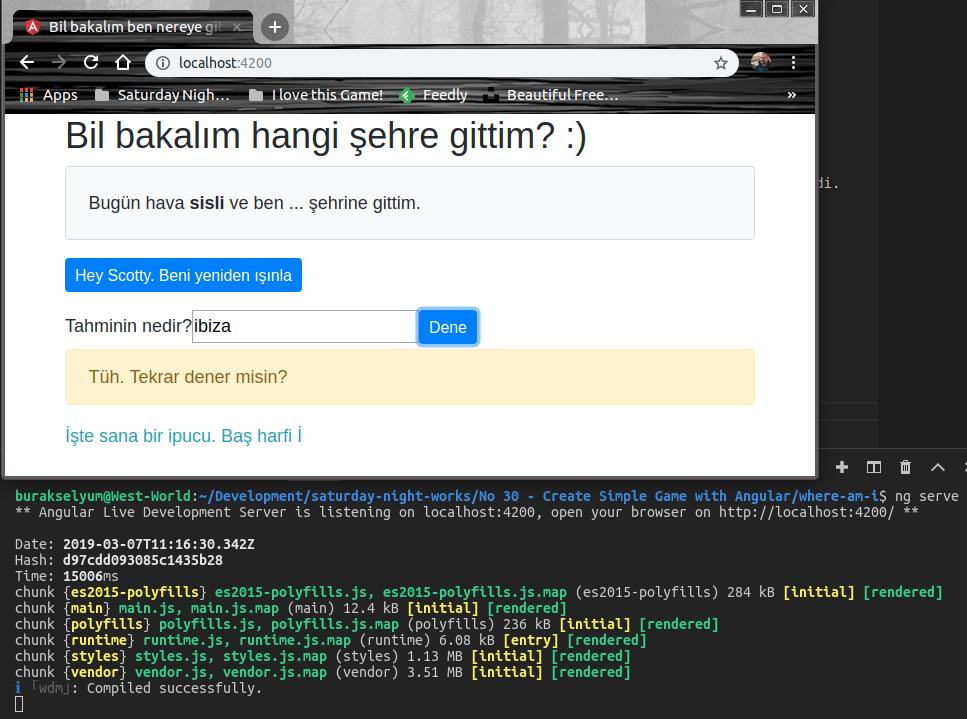
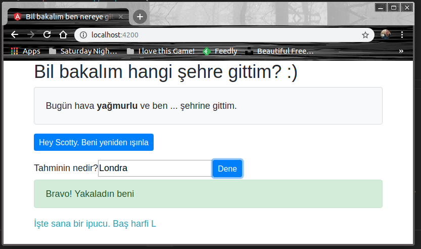

# Angular'ı Biraz Daha İyi Tanımak için Basit Bir Tahmin Oyunu Yazmak

Angular tarafını yavaş yavaş tanımaya başlıyorum. Ancak bilgilerimi pekiştirmek için farklı tuturoial'ları çalışmaya devam etmem gerekiyor. Bu kez temelleri basit şekilde anlamak adına çok basit bir şehir tahmin oyunu yazmaya karar verdim. Uygulama rastsal bir hava durumuna göre kullanıcısına bir soru soracak.

"Merhaba Burak. Bugün hava oldukça "güneşli" ve ben kendimi bir yere ışınladım. Neresi olduğunu tahmin edebilir misin?"

"güneşli" yazan kısım rastgele gelecek bir kelime. Yağmurlu olabilir, soğuk olabilir vb...Buna göre uygun şehirlerden rastgele birisine gidecek bilgisayar. Biz de bunu tahmin etmeye çalışacağız.

>Örnek sonbaharını yaşana WestWorld _(Ubuntu 18.04, 64bit)_ üzerinde geliştirilmektedir.

## Ön Gereksinimler ve Kurulumlar

Sistemde angular CLI yüklü olursa iyi olur. Sonrasında boilerplate etkisi ile uygulamayı oluşturabiliriz. Arayüzün şık görünmesini kolaylaştırmak için _(ben ne kadar şıklaştırabilirsem artık :D )_ bootstrap'i de yüklüyoruz.

```
sudo npm install -g @angular/cli
ng new where-am-i --inlineTemplate
cd where-am-i
npm install bootstrap --save
```

## Yapılan Değişiklikler

- Bootstrap'i kullanabilmek için proje klasöründeki angular.json dosyasındaki styles elementinde ilave yapıldı.
- src/app klasöründeki app.component.html dosyası değiştirildi.
- src/app klasöründeki app.component.ts typescript dosyasındaki bileşen sınıfı değiştirildi.

## Çalışma Zamanı

Uygulamayı çalıştırmak için terminalden aşağıdaki komutu vermek yeterlidir.

```
ng serve
```

Uygulamanın çalışma zamanına ait örnek ekran görüntüleri.

Bir tahmin yaptık ve sonucu bulamadıysak şuna benzer bir sonuçla karşılaşırız.



Ama sonucu bilirsek de şöyle bir ekranla karşılaşırız.



## Neler Öğrendim

- Component bileşeni ile HTML arayüzünü sınıf özellikleri üzerinden nasıl konuşturabileceğimi
- Bootstrap temel elementlerini Angular bileşenlerinden nasıl kullanabileceğimi
- ng serve komutu ile uygulamayı çalıştırdıktan sonra, bileşen ve arayüzde yapılan değişikliklerin save işlemi sonrası uygulamayı tekrardan çalıştırmaya gerek kalmadan çalışma zamanın yansıtıldığını