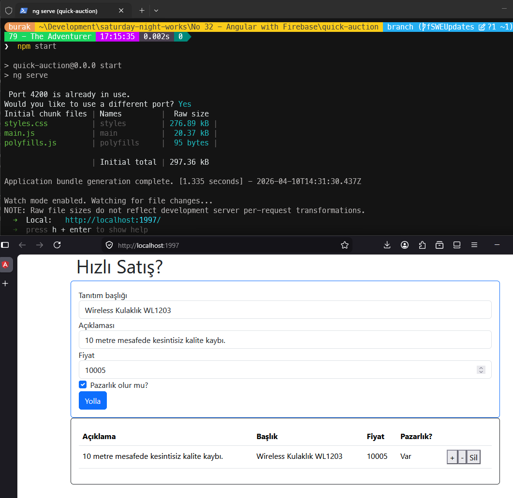

# Güncellemeler

## 10 Nisan 2026

- **Problemler:**
  - Angular Stored XSS Vulnerability via SVG Animation, SVG URL and MathML Attributes
  - Angular is Vulnerable to XSRF Token Leakage via Protocol-Relative URLs in Angular HTTP Client
  - Angular i18n vulnerable to Cross-Site Scripting
  - Firebase JavaScript SDK allows attackers to manipulate the "_authTokenSyncURL" to point to their own server

- **Çözüm:** Angular 11 → 20, Firebase 8 → 11 ve `@angular/fire` 6 → 20 sürümlerine yükseltme yapıldı. `@angular/fire@20.0.1` yalnızca `@angular/core ^20.0.0` ve `firebase ^11.8.0` ile uyumlu olduğundan Angular 21 yerine Angular 20 kullanıldı. Uygulama NgModule mimarisinden Standalone Component mimarisine ve Firebase compat API'sinden modüler API'ye geçirildi.
- **Yapay Zeka Asistanı:** Claude Sonnet 4.6

### Paket Güncellemeleri

| **Paket** | **Eski Sürüm** | **Yeni Sürüm** |
| --- | --- | --- |
| `@angular/*` | 11.0.5 | ~20.3.0 |
| `@angular/fire` | ^6.0.0 | ~20.0.1 |
| `firebase` | ^8.0.0 | ^11.8.0 |
| `bootstrap` | ^4.5.3 | ^5.3.3 |
| `rxjs` | ~6.6.0 | ~7.8.0 |
| `zone.js` | ~0.10.2 | ~0.15.0 |
| `tslib` | ^2.0.0 | ^2.8.1 |
| `@angular/build` (yeni) | — | ~20.3.0 |
| `@angular/cli` | ~11.0.5 | ~20.3.0 |
| `@angular/compiler-cli` | ~11.0.5 | ~20.3.0 |
| `typescript` | ~4.0.2 | ~5.8.0 |
| `@angular-eslint/*` (yeni) | — | ~20.7.0 |

**Kaldırılan paketler:** `@angular-devkit/build-angular`, `codelyzer`, `core-js`, `protractor`, `tslint`

### Kod Değişiklikleri

- **Standalone Mimari:** `AppModule` kaldırıldı, tüm bileşenler `standalone: true` olarak güncellendi
- **Firebase Modüler API:** `AngularFireModule`/`AngularFirestoreModule` → `provideFirebaseApp()` + `provideFirestore()` (`src/main.ts`)
- **Firebase Servis:** `AngularFirestore` → `Firestore` + `addDoc`, `collectionData`, `deleteDoc`, `setDoc` fonksiyonları (`products.service.ts`)
- **Şablon Syntax:** `*ngFor` → `@for` kontrol akışı; `product.payload.doc.data().title` → `product.title` (düz veri yapısı)
- **`tsconfig.json`:** `ES2022`, `moduleResolution: bundler`, `strict: true` olarak güncellendi
- **Yeni dosyalar:** `tsconfig.app.json`, `tsconfig.spec.json` (kök dizinde), `.npmrc` (`os=win32`), `eslint.config.mjs` (ESLint 9 flat config)
- **Kaldırılan dosyalar:** `app.module.ts`, `e2e/`, `tslint.json`, `src/karma.conf.js`, `src/polyfills.ts`, `src/test.ts`, `src/browserslist`, eski `src/tsconfig.*.json` dosyaları

### Çalışma Zamanı

```bash
npm start
```



- [x] Windows 11 testleri
- [ ] Ubuntu testleri
