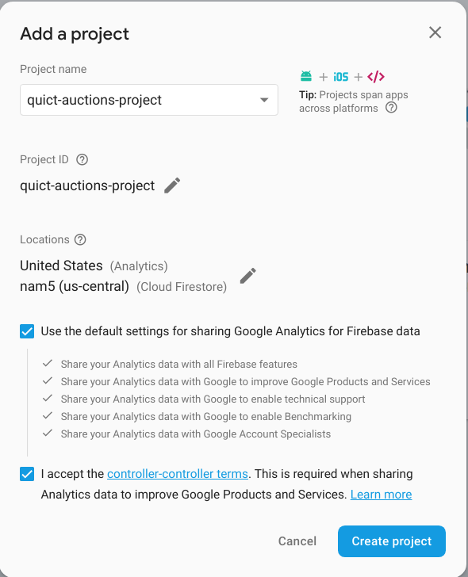
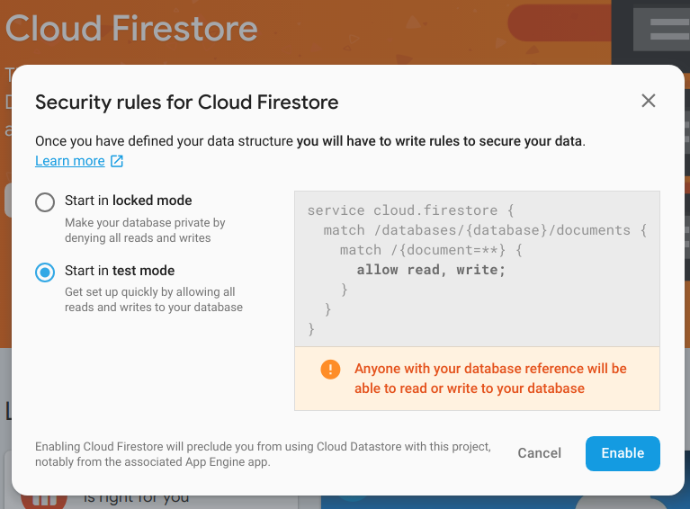
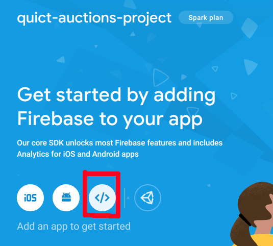
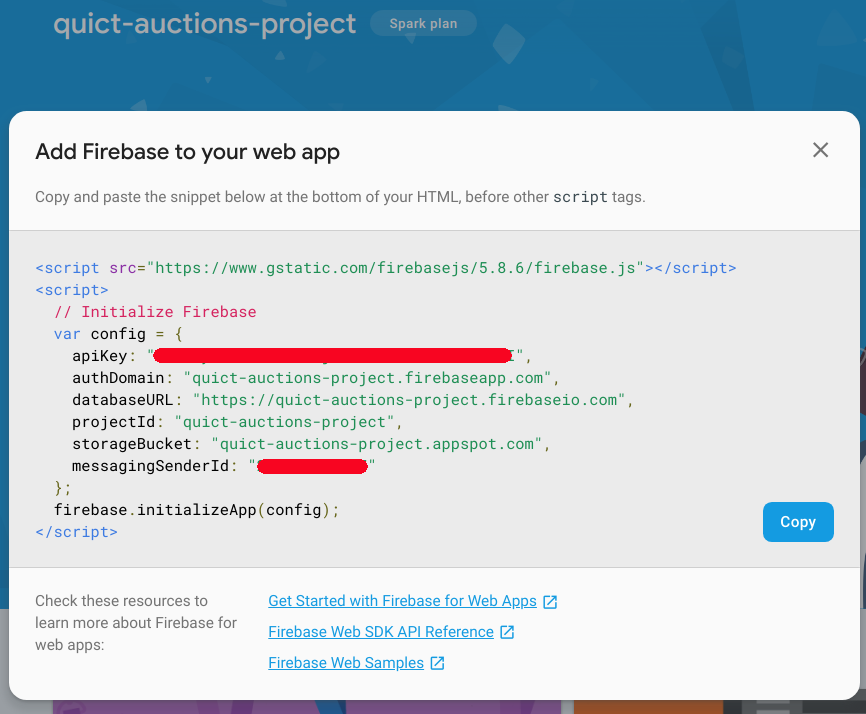

# Firebase Firestore ile Angular Kullanımı

Angular tarafına yavaş yavaş alışmaya başladım. Yine de fazladan idmandan ve tekrardan zarar gelmez. Bu sefer temel CRUD _(Create Read Update Delete)_ operasyonlarını Firebase Firestore üzerinden icra ederken Angular'da koşmaya çalışacağım. Amaçlarımdan birisi de servis tarafında Form kontrolü kullanabilmek. Örneği her zaman olduğu gibi WestWorld _(Ubuntu 18.04, 64bit)_ üzerinde yazacağım _(Mustafar sistemine geçmeden önce oradaki son örneklerim diyebilirim)_

## İlk Hazırlıklar

Sistemimizde Angular CLI yüklü olmalı. Değilse ilk terminal komutu ile işlemlere başlamalıyız.

```
sudo npm install -g @angular/cli
ng new quick-auction
npm i --save bootstrap firebase @angular/fire
cd speed-sell
ng g c products
ng g c product-list
ng g s shared/products
```

ng new ile quick-action isimli yeni bir Angular projesi oluşturmaktayız. Sorulan sorularda Routing seçeneğine No dedim ve Style olarak CSS'i seçili bıraktım. Nitekim bootstrap kullanmaya çalışacağım. npm i ile başlayan komutlarda stil için bootstrap, Google'ın Firebase tarafı ile konuşabilmek içinde firebase ve @angular/fire paketlerini ekledik. ng g ile başlayan komutlarda iki bileşene _(component)_ ve her iki bileşen için ortaklaşa kullanacağımız bir servis oluşturuyoruz. Bu servis temel olarak Firebase ile olan iletişim görevlerini üstlenecek. _(Malum CRUD adımlarını Firestorm'a yansıtacağız)_

## Firebase Tarafı _(Cloud Firestore)_

Firebase tarafında yeni bir proje açıp içerisinde test amaçlı bir Firestore veritabanı yaratmalıyız. [Bu adresten](https://console.firebase.google.com/) Firebase Console'a gidelim ve örnek bir proje açalım.



Sonrasında Database menüsünden veya kocaman turuncu kutucuk içerisindeki Cloud Firestorm bölümünde hareket ederek yeni bir veri tabanı oluşturalım. Aşağıdaki ekran görüntüsünde olduğu gibi veri tabanını Test modunda açabiliriz.



Şimdi Angular uygulamamız ile Firebase tarafını tanıştırmalıyız. Project Overview kısmından hareket ederek 



kırmızı kutucuktaki düğmeye basalım. Karşımıza gelen ekrandaki config içeriğini uygulamamızın environment.ts dosyası içerisine almamız gerekiyor.




## Yapılan Değişiklikler

- Bootstrap kullanabilmek için angular.json dosyasındaki style elementi değiştirildi
- app.module.ts, app.component.html
- products.service.ts
- products.component.cs, products.component.html
- environment.ts

## Çalışma Zamanı

>throw new NotImplementedException("");

## Neler Öğrendim

- Bir component üzerindeki element değerlerinin formControlName niteliği yardımıyla servis tarafındaki FormControl nesneleri ile bağlanabileceğini
- Firebase üzerinde bir Cloud Firestore veri tabanının nasıl oluşturulabileceğini
- Uygulamanın Firebase tarafı ile haberleşebilmesi için gerekli konfigurasyon ayarlarının nereye konulması gerektiğini ve nasıl çağırılabildiğini

