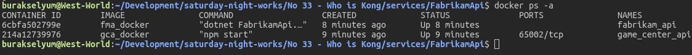
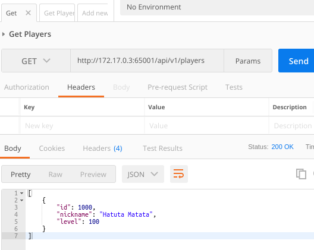
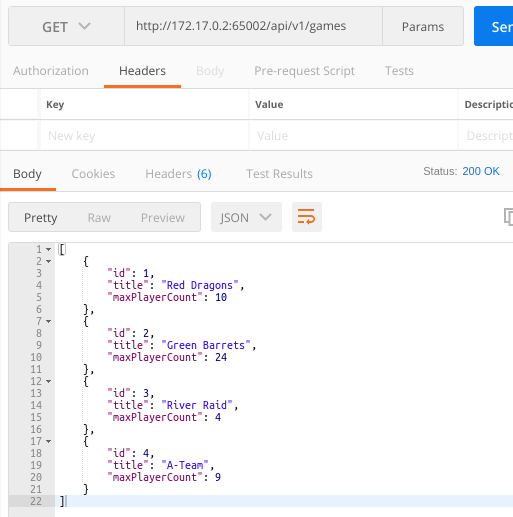
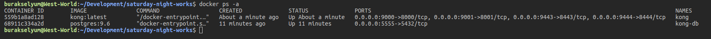
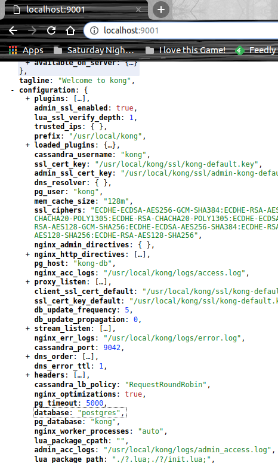
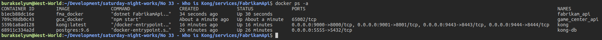
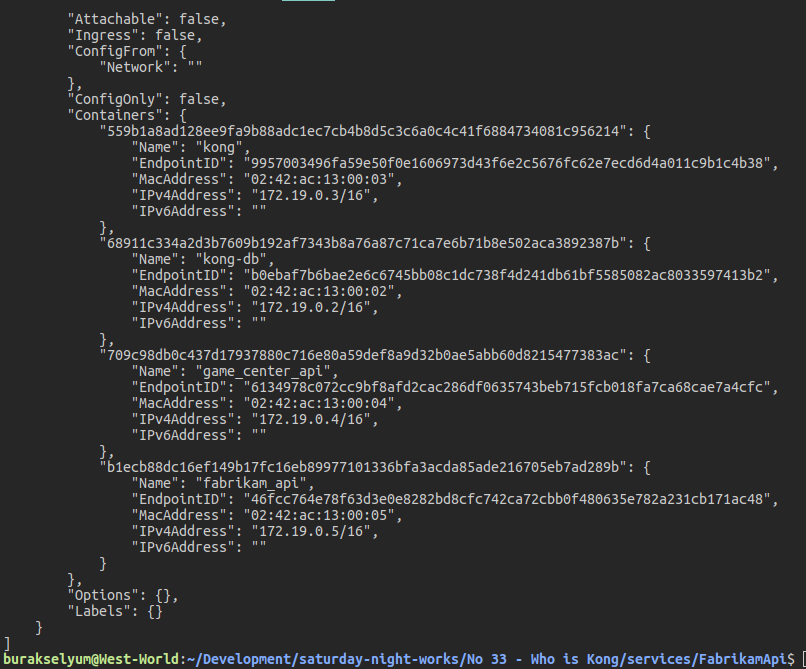
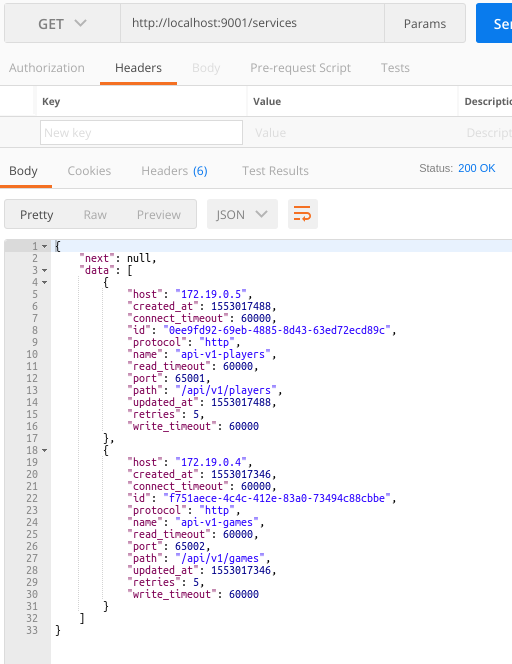
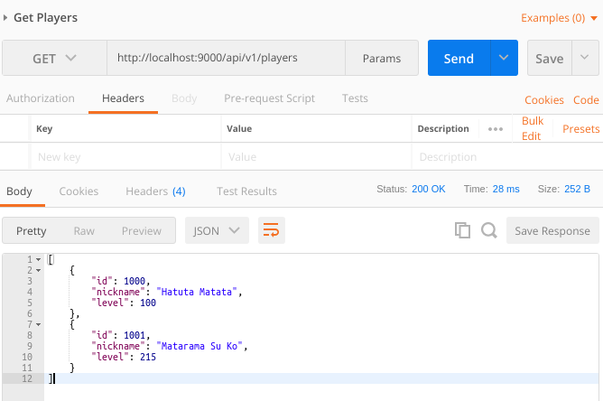

# Kimdir Bu Kong?

Hali hazırda çalışmakta olduğum firmada, microservice'lerin orkestrasyonu için KONG isimli bir araç kullanılıyor. Kabaca bir API Gateway rolünü üstlenen KONG microservice'lere gelen request'lerle ilgili olarak Load Balancing, Authentication, Rate Limiting, Caching, Logging gibi cross-cutting olarak tabir edebileceğimiz yapıları hazır olarak sunuyor(muş) Web, Mobil ve IoT gibi uygulamalar geliştirirken backend servisleri çoğunlukla microservis formunda yaşamaktalar. Bunların orkestrasyonunda görev alan KONG, Lua dili ile geliştirilmiş performansı ile ön plana çıkan NGINX üzerinde koşan açık kaynaklı bir proje olmasıyla da dikkat çekiyor.

Benim amacım ilk etapta KONG'u WestWorld _(Ubuntu 18.04, 64bit)_ üzerine kurmak ve en az bir servis geliştirip ona gelen talepleri KONG üzerinden geçirmeye çalışmak. Normal şartlarda KONG'u sisteme tüm gereksinimleri ile kurabiliriz ancak denemeler için docker imajlarını kullanmak da yeterli olacaktır ki ben bu yolu tercih ediyorum.

## Kobay REST servisleri

Çalışmada en azından bir Web API servisinin olması lazım. Bir tane .net core bir tane de node.js tabanlı servis geliştirmeye karar verdim. WestWorld'de uyguladığım terminal komutları şöyle.

```
mkdir services
cd services
dotnet new webapi -o FabrikamApi
touch Dockerfile
touch .dockerignore
mkdir GameCenterApi
cd GameCenterApi
npm init
sudo npm i --save express body-parser
touch index.js
touch Dockerfile
```

 FabrikamApi servisindeki hazır kod dosyalarında bir kaç değişiklik yapıp, GameCenterApi klasöründeki index.js'i sıfırdan geliştirmem gerekti. Servislerin normal kullanım örneklerine ait Postman dosyalarını [burada - postman_samples.json isimli dosya](assets/postman_samples.json) bulabilirsiniz. Development noktasında servislerin çalıştığını kontrol etmemiz gerekiyor. .Net Core tabanlı servisi çalıştırmak için 

```
dotnet run
```

terminal komutunu verip http://localhost:65001/api/v1/players üzerinden hareket edebiliriz. GameCenterApi isimli Node.js tabanlı servisi çalıştırmak içinse package.json içerisine aldığımız start kod adlı script'i işlettirebiliriz.

```
npm run start
```

Sonrasında http://localhost:65002/api/v1/games adresi üzerinden bu servisi de deneyimleyebiliriz.

>localhost bilgisi ilerleyen kısımlarda görüleceği gibi Docker'a geçildikten değişmektedir.

## Servislerin Dockerize Edilmesi

Dikkat edilmesi gereken noktalardan birisi de, her iki örneğin Dockerize edilebilecek şekilde Dockerfile dosyaları ile donatılmış olmalarıdır. İlaveten .Net Core uygulamasında .dockerignore dosyası vardır. Bunu build context'ini ufalamak için kullanıyoruz. Docker imajları KONG tarafından kullanılacaktır. FabrikamApi için Dockerize işlemleri aşağıdaki terminal komutlarıyla yapılabilir.

```
docker build -t fma_docker .
```

GameCenterApi isimli Node.js uygulaması içinse aşağıdaki gibi.

```
docker build -t gca_docker .
```

Dockerize işlemleri tamamlandıktan sonra container'ları çalıştırıp kontrol etmemizde yarar var. İlk iki komutla ayağa kaldırıp son komutla listede olup olmadıklarına bakıyoruz.

```
docker run -d --name=game_center_api gca_docker
docker run -d --name=fabrikam_api fma_docker
docker ps -a
```

WestWord'de durum aşağıdaki gibi.



>Docker imajları çalışmaya başladıktan sonra servislere hangi IP adresi üzerinden gitmemiz gerektiğine bakmak için 'docker inspect game_center_api' ve 'docker inspect fabrikam_api' komutlarından yararlanabiliriz. Bize uzun bir Json içeriği dönecektir ancak son kısımda IPAddress bilgisini görebiliriz. WestWorld için docker tabanlı adresler http://172.17.0.3:65001/api/v1/players ve http://172.17.0.2:65002/api/v1/games şeklinde oluştu. Sizin sisteminizde bu IP adresleri farklı olabilir.





## Kong Kurulumları ve Docker Servislerinin Dahil Edilmesi

Tüm işlemleri Docker Container'lar üzerinde yapacağız. Bu nedenle kendimize yeni bir ağ oluşturarak işe başlamakta yarar var. Aşağıdaki terminal komutları ile devam edelim.

```
docker network create sphere-net

docker run -d --name kong-db --network=sphere-net -p 5555:5432 -e "POSTGRES_USER=kong" -e "POSTGRES_DB=kong" postgres:9.6

docker run --rm --network=sphere-net -e "KONG_DATABAE=postgres" -e "KONG_PG_HOST=kong-db" kong:latest kong migrations bootstrap

docker run -d --name kong --network=sphere-net -e "KONG_LOG_LEVEL=debug" -e "KONG_DATABASE=postgres" -e "KONG_PG_HOST=kong-db" -e "KONG_PROXY_ACCESS_LOG=/dev/stdout" -e "KONG_ADMIN_ACCESS_LOG=/dev/stdout" -e "KONG_PROXY_ERROR_LOG=/dev/stderr" -e "KONG_ADMIN_ERROR_LOG=/dev/stderr" -e "KONG_ADMIN_LISTEN=0.0.0.0:8001, 0.0.0.0:8444 ssl" -p 9000:8000 -p 9443:8443 -p 9001:8001 -p 9444:8444 kong:latest
```

- İlk komutla sphere-net isimli bir docker network'ü oluşturuyoruz. 
- İkinci uzun komutla Postgres veri tabanı için bir Container başlatıyoruz. sphere-net ağında çalışacak olan veri tabanını KONG kullanacak. KONG, veri tabanı olarak Postgres veya Cassandra sistemlerini destekliyor. Eğer yerel makinede Postgres imajı yoksa _(ki örneği denediğim dönemde WestWorld'de yoktu)_ pull işlemi biraz zaman alabilir.
- Üçüncü komutla Postgres veri tabanının KONG için hazırlanması söz konusu.
- Dördüncü ve uzuuuuuun bir parametre listesine sahip komutla da KONG Container'ını çalıştırıyoruz _(üşenmedim, kopyalamadan yazdım. Siz de öyle yapın)_

Bu adımdalardan sonra kong ve postgres ile ilgili Container'ların çalıştığını teyit etmeliyiz.



Hatta http://localhost:9001 adresine bir HTTP GET talebi attığımızda konfigurasyon ayarlarınıda görebiliriz. 9001 portu _(Normal kurulumda 8001 de olabilir)_ yönetsel işlemlerin bulunduğu servis katmanıdır. Service ekleme, silme, görüntüleme ve güncelleme gibi işlemler 9001 portundan ulaşılan servisçe yapılır. _(Route yönetimi içinde aynı şey söz konusudur)_



Komutlar biter mi? Şimdi servislere ait Container'ları sphere-net üzerinde çalışacak şekilde ayağa kaldırmalıyız.

```
docker run -d --name=game_center_api --network=sphere-net gca_docker
docker run -d --name=fabrikam_api --network=sphere-net fma_docker
docker ps -a
```



>KONG için bir Docker Network oluşturduk. Bu ağa dahil olan ne kadar Container varsa IP adresleri farklılık gösterecektir. sphere-net'e dahil olan Container'ların host edildiği IP adreslerini öğrenmek için terminalden 'docker inspect sphere-net' komutunu kullanabiliriz.



## Çalışma Zamanı _(Bir başka deyişle KONG üzerinde servislerin ayarlanması)_

KONG, veri tabanı olarak kullanılan Postgres ve geliştirdiğimiz iki REST Servisine ait Docker Container'ları ayakta. WestWorld'deki güncel duruma göre 

- http://172.19.0.4:65002/api/v1/games adresinde Node.js tabanlı servisimiz yaşıyor.
- http://172.19.0.5:65001/api/v1/players adresinde ise .Net Core Web API servisimiz bulunuyor.

Amacımız şu anda localhost:9000 adresli KONG servisine gelecek olan games ve players odaklı talepleri aslı servislere iletmek. Yani KONG ilk etapta bir Proxy servis şeklinde davranış gösterecek. Bunun için öncelikle servislerimizi KONG'a eklemeliyiz. KONG'a eklenen servisler http://localhost:9001/services adresinden izlenebilir ve hatta yönetilebilirler. Şimdi bu adrese aşağıdaki içeriğe sahip POST komutunu gönderelim _(Postman ile yapabiliriz yada curl komutu ile terminalden icra edebiliriz)_

```
URL : http://localhost:9001/services
Method : HTTP Post
Content-Type : application/json
Body :
{
    "name":"api-v1-games",
    "url":"http://172.19.0.4:65002/api/v1/games"
}
```


Bu işlemi FabrikamAPI içinde yaptıktan sonra http://localhost:9001/services adresine gidersek servis bilgilerini görebiliriz.



Servisleri eklemek yeterli değil. Route tanımlamaları da gerekiyor _(KONG tarafındaki entrypoint tanımlamaları için gerekli bir aksiyon olarak düşünebiliriz)_ KONG services'e aşağıdaki içeriğe sahip talepleri göndererek gerekli route tanımlamaları yapılabilir.

```
URL: http://localhost:9001/services/api-v1-players/routes
Method : HTTP Post
Content-Type : application/json
Body :
{
    "hosts":["api.ct.id"],
    "paths":["/api/v1/players"]
}
```

```
URL: http://localhost:9001/services/api-v1-games/routes
Method : HTTP Post
Content-Type : application/json
Body :
{
    "hosts":["api.ct.id"],
    "paths":["/api/v1/games"]
}
```

Oluşan route bilgilerini http://localhost:9001/routes adresinden görebiliriz. Her iki servis için gerekli route tanımlamaları başarılı bir şekilde yapıldıktan sonra KONG üzerinden GameCenterAPI ve FabrikamAPI servislerine erişebiliyor olmamız gerekir.



## Yararlandığım Diğer Docker Komutları

Çalışan Container'ları stop komutu sonrası durduramayınca,

```
sudo killall docker-containerd-shim
```

Container'larımı görmek içinse,

```
docker ps -a
```

Container'ları sık sık remove etmem gerektiği için,

```
docker rm {ContainerID}
```

Container'ın tüm bilgilerini görmek için _(özellikle IP adresini)_

```
docker inspect {container adı}
docker inspect {ağ adı}
```

## Neler Öğrendim

- KONG'un temel olarak ne işe yaradığını
- .Net Core ve Node.js tabanlı servis uygulamaları için Dockerfile dosyalarının nasıl hazırlanacağını
- KONG a bir servis ve route bilgilerinin nasıl eklenebileceğini
- Bolca Docker terminal komutunu
- Docker Container içine açılan uygulamaların asıl IP adreslerini nasıl görebileceğimi