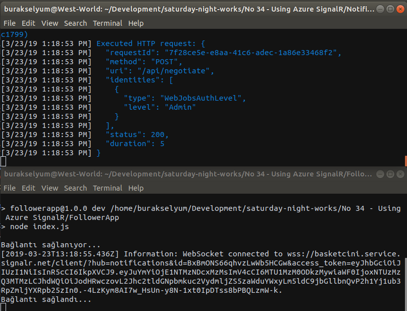
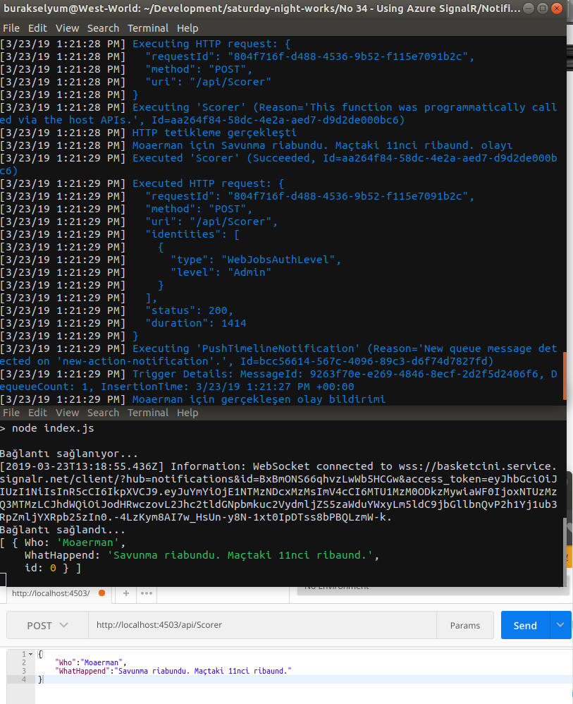
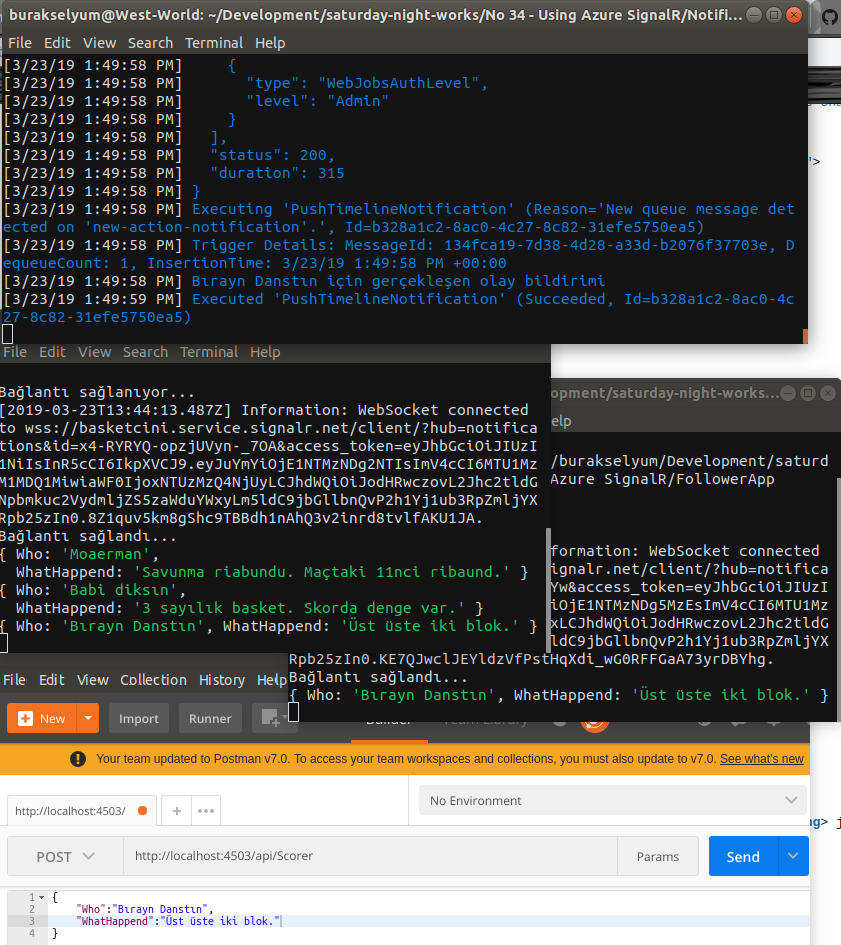

# Azure SignalR Servisini Kullanmak

Amacım Azure platformunda sunulan SignalR hizmetini kullanarak abonelere bildirimlerde bulunabilmek. Normal SignalR senaryosundan farklı olarak, istemciler ve tetikleyici arasındaki eş zamanlı iletişimi _(Real Time Communications)_ Azure platformundaki bir SignalR servisi ile gerçekleştirmeye çalışacağım. Senaryomuzda bildirimleri gören en az bir istemci _(ki n tane olması daha anlamlı)_, local ortamda çalışan ve bildirim yayan bir Azure Function uygulaması ve Azure platformunda konuşlandırılan bir SignalR servisi olacak. Azure üzerinde koşan SignalR servisi Serverless modda çalışacak şekilde ayarlanacak. 

SignalR servisi tüm Azure fonskiyonları ile kullanılabilir. Örneğin Azure Cosmos DB'deki değişiklikleri SignalR servisi ile istemcilere bildirebiliriz, benzer şeyi kuyruk mesajlarını veya HTTP taleplerini işleyen Azure Fonksiyonları için de sağlayabiliriz. Kısacası Azure fonksiyonlarından yapılan tetiklemeler sonrasında SignalR servislerinden yararlanarak bağlı olan aboneleri bilgilendirebiliriz.

## Ön Gereksinimler

Azure platformunda SignalR servisini oluşturmadan önce WestWorld _(Ubuntu 18.04, 64bit)_ tarafında Azure Function geliştirebilmek için gerekli kurulumları yapmam gerekiyor. İlk olarak Azure Functions Core Tools'un yüklenmesi lazım. Aşağıdaki terminal komutları ile bunu gerçekleştirdim. Önce Microsoft ürün anahtarını WestWorld ortamına kaydettirdim, sonrasında bir güncelleme yapıp devamında azure-functions-core-tools paketini yüklettim.

```
curl https://packages.microsoft.com/keys/microsoft.asc | gpg --dearmor > microsoft.gpg
sudo mv microsoft.gpg /etc/apt/trusted.gpg.d/microsoft.gpg

sudo apt-get update

sudo apt-get install azure-functions-core-tools
```

Kurulumdan sonra terminalden Azure Function projeleri oluşturmaya başlayabiliriz. Lakin bu işin Visual Studio Code tarafında daha kolay bir yolu var. Azure Functions isimli extension aracını kullanmak.


Visual Studio Code'a gelen yeni araçla kolayca Azure Function projeleri oluşturabiliriz. 

## Azure SignalR Servisinin Hazırlanması

Ama öncesinde Azure'da bir SignalR servisi oluşturmam gerekti. [Azure Portal](https://portal.azure.com) adresinden SignalR Service öğesini aratarak işe başladım.


Free Tier planında, learning-rg Resource Group altında, basketcini.service.signalr.net isimli bir SignalR servisi oluşturdum. SignalR servisinin oluşması biraz zaman aldı. Servis etkinleştikten sonra ise özelliklerine giderek Serverless modda çalışacak şekilde ayarladım.


Oluşan SignalR servisi ile local makinede çalışacak ve tetikleyici görevini üstlenecek Azure Functions'ın haberleşebilmesi için, Key değerlerine de ihtiyacım var. Bu değerleri Azure Function uygulamasının local.settings.json dosyasında kullanmak gerekecek.


## Azure Functions Projesinin Oluşturulması

Yüklenen Azure Functions aracından 'Create New Project' seçimini yaptım. Proje için bir klasör belirledim _(Ben NotifierApp isimli klasörü kullandım)_ Dil olarak C#'ı tercih ettim. Sonrasında 'Create Function' seçeneği ile projeye Scorer isimli bir fonksiyon ekledim. Bu ekleme işlemi sırasında sorulan sorulara aşağıdaki cevapları vererek ilerledim. HTTP metodları ile tetiklenen bir fonksiyon söz konusu. 

```
Fonksiyon Adı   :       Scorer
Klasör          :       NotifierApp
Tipi            :       Http Trigger
Namespace       :       Basketcini.Function
Erişim Yetkisi  :       Anonymous
```

>Örnekte Table Storage değerlendirilmiştir. Bunun için öncelikle Azure Portal üzerinde learningsignalrstorage isimli bir Storage Account oluşturdum ve 'Access Keys' kısmında verilen Connection Strings bilgisini kullandım. Yani bildirimlerin depolanacağı Storage alanını Azure'a devrettim.

### Azure Functions Projesinde Yapılanlar

Kod tarafında kullanılan bazı tipler için ek paketlerin yüklenmesi gerekiyor.

```
dotnet add package Microsoft.Azure.WebJobs.Extensions.EventGrid 
dotnet add package Microsoft.Azure.WebJobs.Extensions.SignalRService 
dotnet add package Microsoft.Azure.WebJobs.Extensions.Storage
```

- local.settings.json dosyasına Azure SignalR servisine ait Connection String bilgisi ve CORS tanımı _(Senaryoya göre isimsiz tüm istemciler Azure Function Api'sini kullanabilecek)_ eklendi
- Skor durumunu ve anlık olarak meydana gelen olay bilgisini tutan sınıflar eklendi _(Timeline ve Action)_
- Scorer isimli Function sınıfına 3 metod eklendi. Birisi tetikleyici olarak yeni bir olay gerçekleştirmek için, birisi istemcinin kendisini SignalR Hub'ına bağlaması için _(negotiation aşaması)_, birisi de servisin istemciye olay bildirimlerini basması için _(push message aşaması)_

## İstemci Uygulama Tarafı

İstemci tarafı Node.js tabanlı basit bir Console uygulaması. Aslında web tabanlı bir arayüzü takip etmem gerekiyordu ancak amacım kısa yoldan SignalR servisinden akan verileri görmek olduğundan Node.js kullanmayı tercih ettim. SignalR tarafı ile rahat konuşabilmek içinde @aspnet/signalr isimli npm paketini kullandım.

```
mkdir FollowerApp
cd FollowerApp
npm init
touch index.js
npm install @aspnet/signalr
```

- İstemci tarafında index.js ve package.json dosyalarında değişiklik var.

## Çalışma Zamanı _(NotifierApp Uygulaması)_

Öncelikle senaryodan bahsetmem lazım. WestWorld üzerinde NotifierApp isimli Azure Function uygulaması ayağa kaldırılır. Bu, Azure SignalR servisi ile haberleşen programdır. Postman ile oynanan basketbol maçındaki anlık olaya ait bilgiler gönderilir. Bu bilgiler SignalR servisi tarafından karşılanır. Gelen bilgiler Table Storage üstüne ve kuyruğa yazılır. Yine WestWorld üzerinde çalışan bir başka uygulama _(Etkili bir görsellik için bir web sayfası yada konuyu anlamak için bir console uygulaması olabilir)_ local ortamda çalışan Azure Function servisine bağlanır ve 'actionHappend' olaylarını dinlemeye başlar. Postman üzerinden yeni bir basketbol olayı gönderildikçe bu bilgilerin tamamının yer aldığı kuyruk içeriği abone olan istemcilere otomatik olarak basılır. Sonuçta canlı bir maç oynanırken gerçekleşen anlık olayların, bu haber kanalını dinleyen istemcilerine eş zamanlı olarak basılması sağlanır _(en azından senaryonun bu şekilde çalışmasını bekliyorum)_

Yazılan Azure Function uygulamasını çalıştırmak için terminalden aşağıdaki komutu vermek yeterlidir. Tabii bu komutu Azure Function projesinin olduğu klasörde çalıştırmalıyız ;)

```
func host start
```


Function local ortamda çalışır durumda ve Azure SignalR ile haberleşmesini bekliyorum. Bunun üzerine Postman'i kullanarak api/Scorer adresine bir HTTP Post talebi gönderdim.

```
Url     :   http://localhost:4503/api/Scorer
Method  :   HTTP Post
Body    :   {
	"Who":"Mitsiç",
	"WhatHappend":"3 sayılık basket. Skor 33-21 Anadolu Efes önde"
}
```


Bir şeyleri doğru yazmış olmalıyım ki loglarda istediğim hareketliliği gördüm. Hatta Azure Storage tarafında bir tablonun oluşturulduğunu ve gönderdiğim bilginin içerisine yazıldığını da fark ettim. _(Tekrar eden bilgileri nasıl normalize etmek gerekir bunun yolunu bulmam lazım)_


## Çalışma Zamanı _(İstemci/Abone olan taraf)_

Senaryonun işlerliğini görmek için her iki uygulamayı da birlikte çalıştırmak lazım elbette. FollowerApp için terminalden aşağıdaki komutu vermek yeterli.

```
npm run dev
```

İlk ekran görüntüsü istemci ile Azure SignalR servisinin, Azure Function uygulaması aracılığıyla el sıkışmasını gösteriyor.



Alt ekran görüntüsünde dikkat edileceği üzere Negotiation başarıyla sağlandıktan sonra bir id ve token bilgisinin üretildiği görülür. Buradaki çıktı, Azure Function uygulamasındaki negotiate sonrası döndürdüğümüz connection bilgisine aittir. Dikkat çekici noktalardan birisi de Web Socket adresidir.

İkinci ekran görüntüsünde http://localhost:4503/api/Scorer adresine HTTP Post talebi ile örnek bir olay bilgisi gönderilmekte. Bu talep sonrası uygulamalardaki log hareketliliklerine dikkat edelim. Oluşan içerik bağlı olan istemciye gönderilmiştir.



Üçüncü çalışma zamanı görüntüsünde ekrana ikinci bir istemci dahil etmekteyim. Bu durumda push edilen bilgiler bağlı olan tüm abonelere gönderilir.



>Eğer bu senaryoda yaptığımız gibi bir maçın canlı anlatımını online durumdaki tüm abonelere göndermek istiyorsak, sonradan dahil olanların maçın başından itibaren kaçırdıkları olayları da görmesini isteyebiliriz. Burada Table Storage veya benzeri bir depoda maç bazlı tutulacak verileri, istemci ilk bağlandığında ona nasıl yollayabiliriz _(veya yollayabilir miyiz?)_ merak ediyorum. İşte size güzel bir TODO ;)

## Neler Öğrendim

- Azure tarafında bir SignalR Servisinin nasıl oluşturulacağını
- Development ortamında bir Azure Function projesinin nasıl inşa edilebileceğini
- SignalR üzerinden Hub dinleyecek istemcilerde @aspnet/signalr npm paketinin nasıl kullanılabileceğini
- Azure Storage oluşturmadan Function projesindeki Table Storage'ın kullanılamayacağını
- SignalR servisini kullanan Azure Function projesinin herhangibir istemci tarafından kullanılabilmesi için CORS tarafında '*' kullanılması gerektiğini
- Azure Function tarafında abonelerin SignalR ile el sıkıştığı fonksiyon adının 'negotiate' olması gerektiğini _(Farklı bir isim kullanınca istemci tarafında HTTP 404 NotFound hatası aldım)_
- Benzer şekilde SignalR Hubname olarak 'notifications' kullanılması gerektiğini _(Farklı bir isimlendirme kullanınca oluşan bilgilerin SignalR servisi tarafından yorumlandığına ama abonelere akmadığına şahit oldum)_