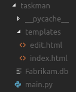
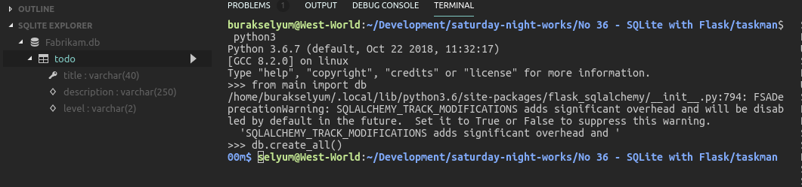
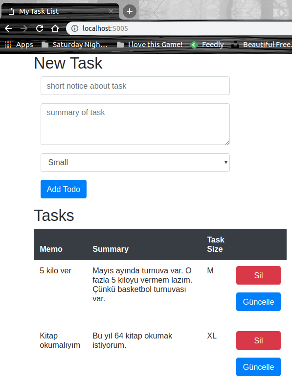
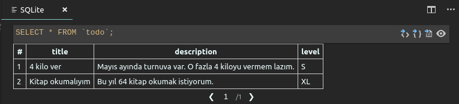
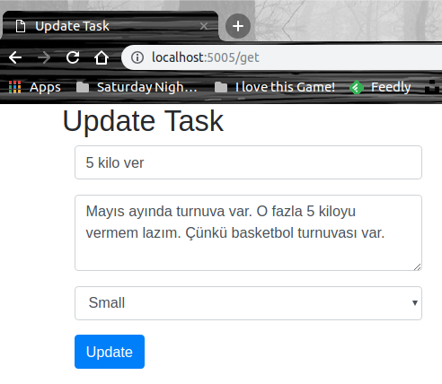
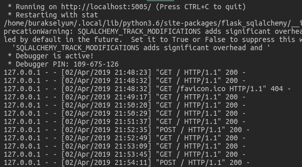

# Flask Üzerinden SQLite ile Konuşan Bir Python Uygulaması

Amacım bir parça Python kodu yazarak bilgilerimi tazelemekti. SQLite veri tabanını kullanan, CRUD operasyonlarını Flask üzerinden HTTP Post çağrıları ile gerçekleştiren _(Flask aynı zamanda web yönlendirmeleri de yapar)_ basit bir Web sayfası tasarlamaya karar verdim. Python ile veri tabanı arasındaki geçişleri daha anlaşılır kılmak için SQLAlchemy, Flask ile SQLAlchemy arasındaki geçişleri basitleştirmek içinse flask-sqlalchemy modüllerini kullanmak istedim.

## Gereksinimler ve Hazırlıklar

İşe aşağıdaki terminal komutları ile başladım.

```
mkdir taskman
cd taskman
touch main.py
mkdir templates
touch templates/index.html
touch templates/edit.html
```

Aşağıdaki şekilde görülen basit proje iskeleti oluştu. Django tarafı kadar kalabalık değil ama python antrenmanı yapmak için yeterli bir çalışma alanı tesis ettim. 



Ana kod yüklenicimiz main.py. İki web sayfamız var. index.html ve edit.html. index sayfasında yeni görev ekleme, var olan görevleri görüntüleme ve silme fonksiyonelliklerini sunacağız. edit.html sayfasında ise, index.html'den seçilen bir göreve ait bilgileri güncelleyebileceğiz. templates klasörü Flask tarafından otomatik olarak takip edilecek. _(Koddaki yorum satırlarını okuyunuz)_ 

Sırada uygulama için gerekli python modüllerinin yüklenmesi var.

>WestWorld _(Ubuntu 18.04, 64bit)_ python ve pip ortamlarına sahip. Siz platformunuza göre gerekli yüklemeleri yapabilirsiniz. Burada detay verebilirdim ama gıcık olduğum için sizin araştırmanızı istemekteyim.

```
pip3 install --user flask sqlalchemy flask-sqlalchemy
```

## Veri tabanının oluşturulması

Veri tabanını oluşturmak için main.py içeriğini tamamladıktan sonra terminalden python3 programını kullanarak aşağıdaki ifadeleri çalıştırmak yeterli olacaktır.

```
from main import db
db.create_all()
exit()
```

Sorun olmazsa Fabrikam.db isimli SQLite veritabanı oluşur. Visual Studio Code SQLite Explorer'dan _(bu bir extension olarak yüklenir)_ veri tabanı içeriğini görebiliriz.



## Çalışma Zamanı

Uygulamayı aşağıdaki terminal komutu ile çalıştırıp http://localhost:5005 adresi üzerinden test edebiliriz.

```
python3 main.py
```

Örnek bir kaç veri girişi yapıldıktan sonraki durum aşağıda görüldüğü gibidiri.



ki bu işlemlere göre SQLite tarafındaki todo tablosunun içeriği de dolar.



Verileri güncellemek için edit.html sayfasını kullanabiliriz. Yaptığımız değişiklikleri kaydettikten sonra da tekrar ana sayfaya yönlendiriliriz.



Bu arada çalışma zamanında meydana gelen hareketlilikleri terminal pencersinden de görebiliriz.



## Neler Öğrendim

- Flask ile HTTP taleplerinin nasıl karşılanacağını
- templates klasöründeki HTML içeriklerinin otomatik render edilebileceğini
- form'dan gelen değerlerin python kod tarafında nasıl yakalandığını
- HTML içerisinde python kodlarında tanımlı değişkenlere nasıl erişilebileceğini
- redirect ve render_template kullanımlarını 
- Basit query çağrıları ile veri sorgulamayı
- Uygulamayı belli bir port üzerinden nasıl sunabileceğimi
- Bootstrap stillerini CDN üzerinden kullanmayı