# Hasura GraphQL Engine ile geliştirilmiş bir API Servisini Vue.js ile Kullanmak

API'ler için türlendirilmiş _(typed)_ sorgulama dillerinden birisi olarak öne çıkan GraphQL'e bir süredir uğramıyordum. Daha doğrusu GraphQL sorgusu çalıştırılabilecek şekilde API servis hazırlıklarını yapmaya üşeniyordum. Bu nedenle işi kolaylaştıran ve Heroku üzerinden sunulan Hasura GraphQL Engine hizmetine bakmaya karar verdim. Hasura, veriyi PostgreSQL kullanarak saklıyor ve ayrıca API'yi bir Docker Container içerisinden sunuyor. Amacım Hasura tarafında hazırlayacağım iki kobay veri setini, Vue.js tabanlı bir istemcisinden tüketmek. 

## Hasura GraphQL Engine Tarafının Geliştirilmesi

Pek tabii Heroku üzerinde bir hesabımızın olması gerekiyor. Sonrasında [şu](https://elements.heroku.com/) adrese gidip elements kısmından Hasura GraphQL Engine'i seçmek yeterli. 

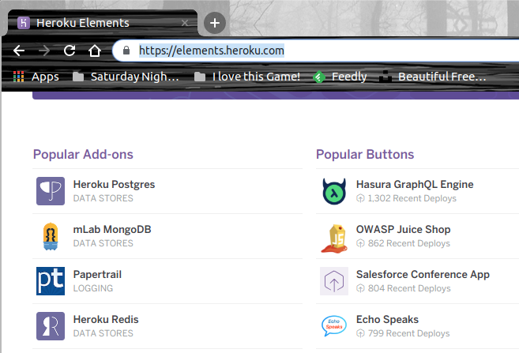

Gelinen yerden _Deploy to Heroku_ diyerek projeyi oluşturabiliriz.

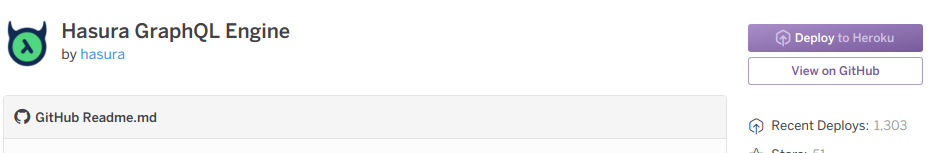

Ben aşağıdaki bilgileri kullanarak bir proje oluşturdum.

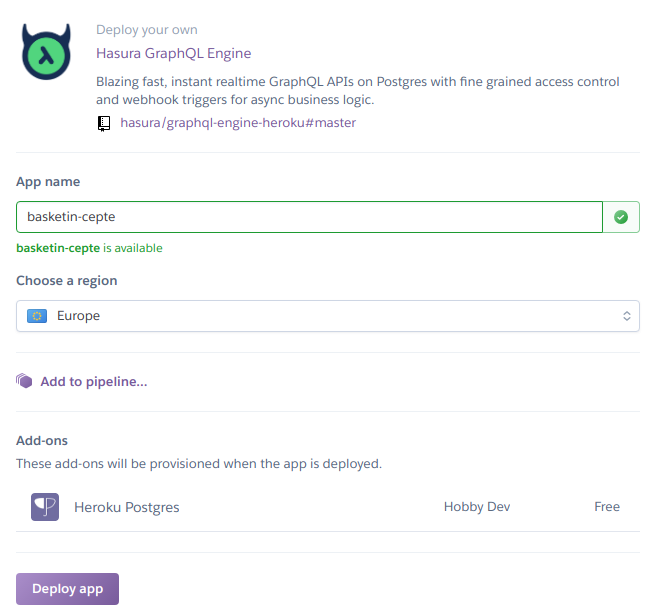

Deploy başarılı bir şekilde tamamlandıktan sonra 

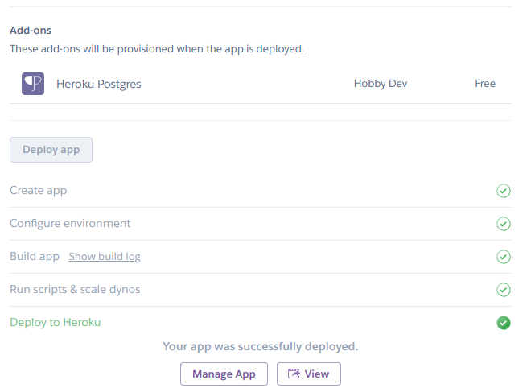

_View_ seçeneği ile yönetim paneline geçebiliriz.

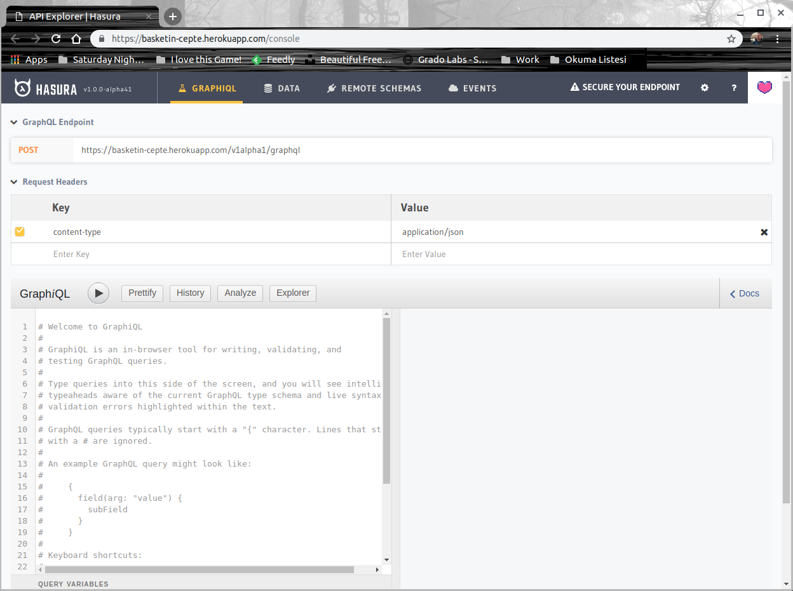 

Dikkat edileceği üzere GrapQL sorgularını çalıştırabileceğimiz hazır bir arayüz bulunuyor. Ancak öncesinde örnek veri setleri hazırlamalıyız. Bunun için Data sekmesinden yararlanabiliriz.


Arabirimin kullanımı oldukça kolay. Ben aşağıdaki özelliklere sahip tabloları oluşturdum.

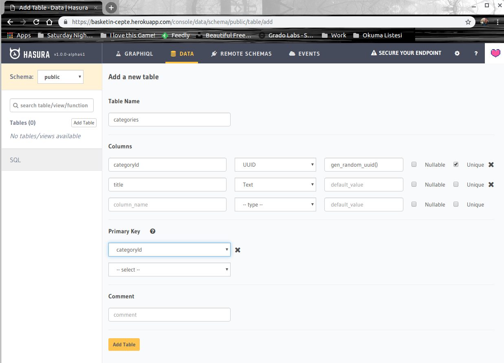

categories isimli tablomuzda unique tipte, get_random_uuid() fonksiyonu ile eklenen satır için rastgele üretilen categoryId ve text tipinde title isimli alanlar bulunuyor. categoryId, aynı zamanda primary key tipinden bir alan.

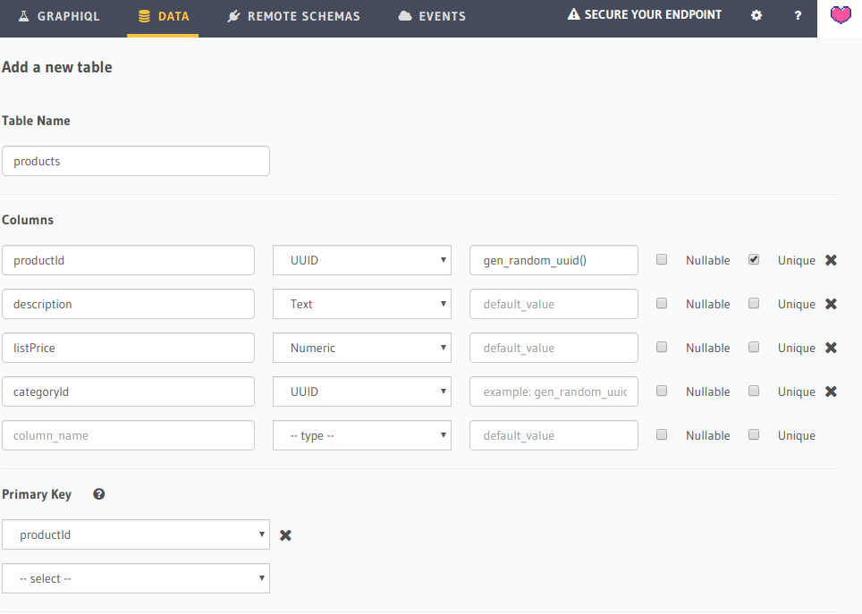

products tablosunda da UUID tipinde productId, text tipinde description, number tipinde listPrice ve yine UUID tipinde categoryId isimli alanlar mevcut. categoryId alanını, ürünleri kategoriye bağlamak için _(foreign key relations)_ kullanıyoruz. Ama bu alanı foreign key yapmak için _Modify_ pencersine girmeliyiz.

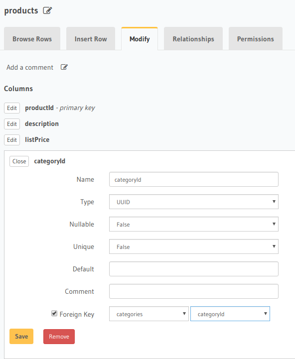

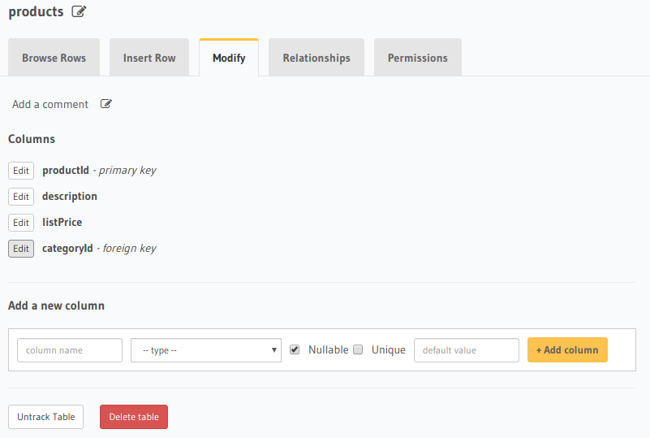

İlişkinin geçerlilik kazanaması içinde, categories tablosunun _Relationships_ penceresine gidip önerilen bağlantıyı eklemek iyi olabilir.

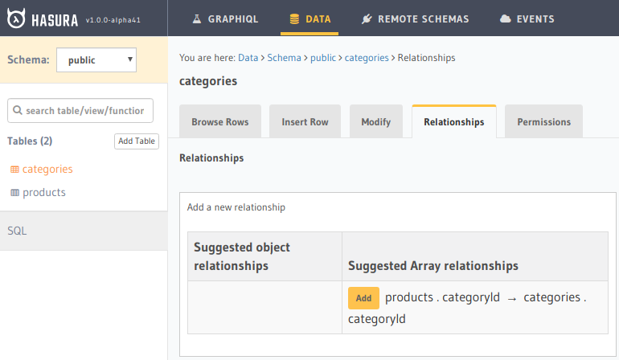

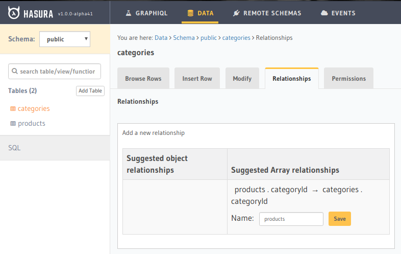

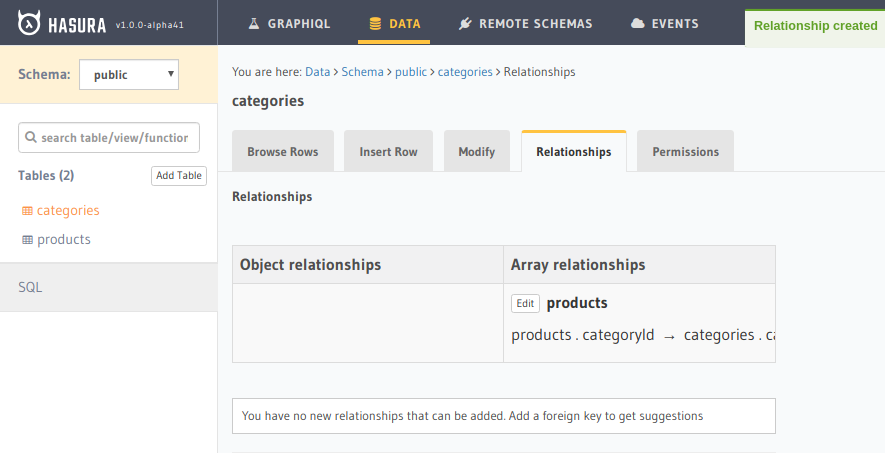

>Bu durumda categories üzerinden products'a gidebiliyor olacağız. Ters ilişkiyi de kurabiliriz ve bir ürünle birlikte bağlı olduğu kategorinin bilgisini de yansıtabiliriz. Bunu deneyin.

Hasura'nın Postgresql tarafındaki örnek tablolarımız hazır. İstersek _Insert Row_ pencersinden tablolara örnek veri girişleri yapabilir ve GraphiQL pencresinden sorgular çalıştırabiliriz. Ben yaptığım denemelerle alakalı bir kaç örnek ekran görüntüsü paylaşayım.

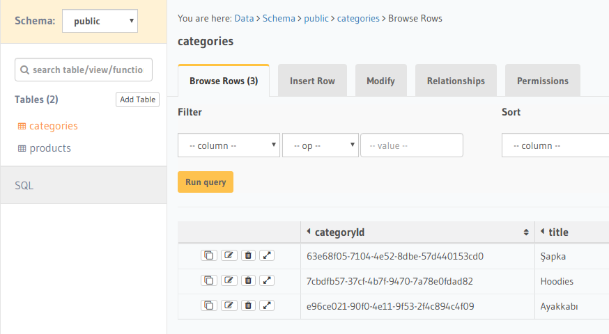

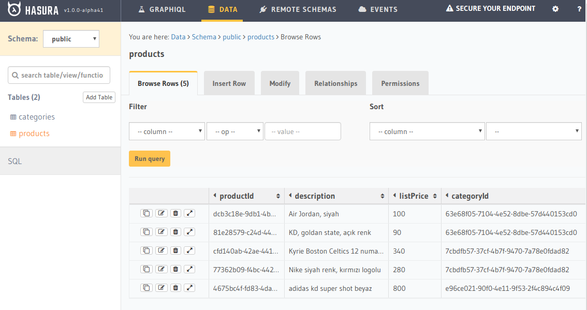

### Örnek Sorgular

Kategoriler

```
query{
  categories{
    title
  }
}
```

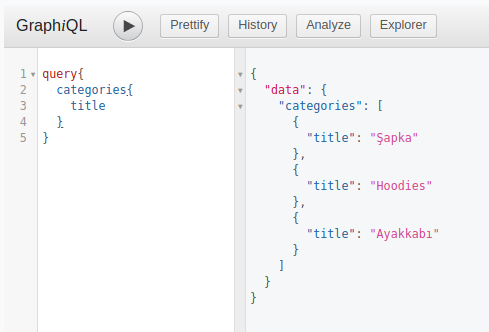

Kategorilere bağlı ürünler

```
query{
  categories{
    title
    products{
      description
      listPrice
    }
  }
}
```

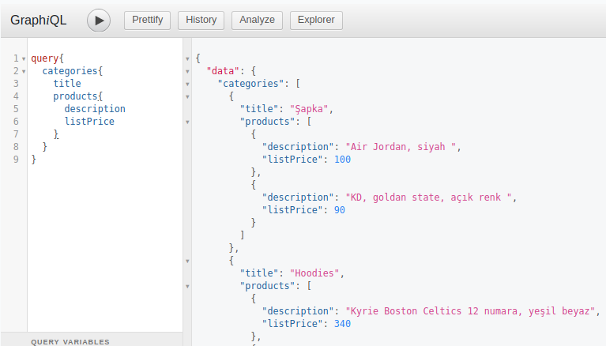

Ürünler tamamın ve bağlı olduğu kategori bilgileri

```
query{
  products{
    description
    listPrice
    category{
      title
    }
  }
}
```

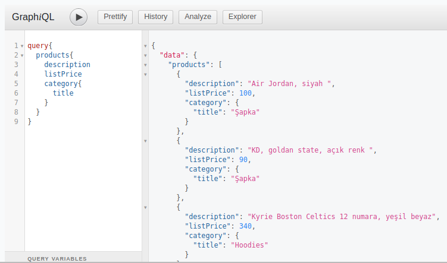

Veri girişi de yapabiliriz. Bunun için mutation kullanıldığını daha önceden öğrenmiştim. Örneğin yeni bir kategoriyi aşağıdaki gibi ekleyebiliriz.

```
mutation {
  insert_categories(objects: [{
    title: "Çorap",
  }]) {
    returning {
      categoryId
    }
  }
```
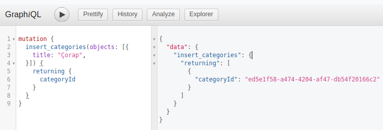

Hasura, GraphQL API’si arkasında PostgreSQL veri tabanını kullanırken SQLden aşina olduğumuz bir çok sorgulama metodunu da hazır olarak sunar. Örneğin fiyatı 300 birimin üstünde olan ürünleri aşağıdaki sorgu ile çekebiliriz.

```
{
  products(where: {listPrice: {_gt: 300}}) {
    description
    listPrice
    category {
      title
    }
  }
}
```

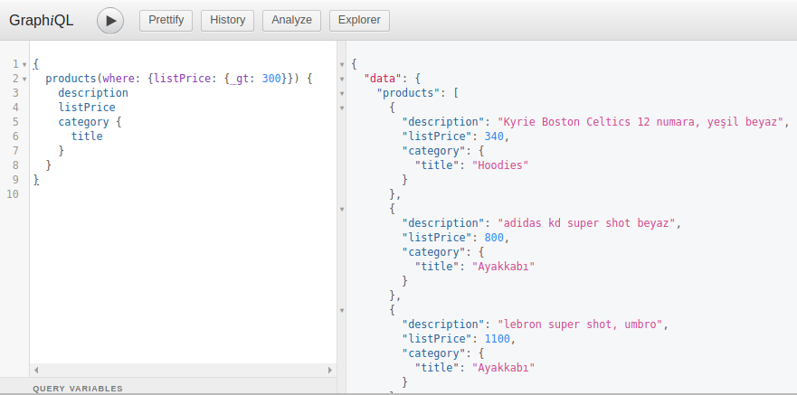

Where metodu sorgu şemasına otomatik olarak eklenmiştir. _gt tahmin edileceği üzere greater than anlamındadır. Yukarıdaki sorguya fiyata göre tersten sıralamada koyabiliriz. Sadece where koşulu arkasından order_by çağrısı yapmamız yeterli olacaktır.

```
{
  products(where: {listPrice: {_gt: 300}}, order_by: {listPrice: desc}) {
    description
    listPrice
    category {
      title
    }
  }
}
```

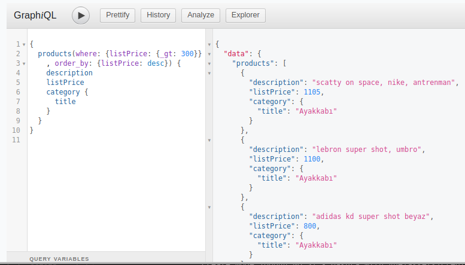

Çok büyük veri setleri düşünüldüğünde önyüzler için sayfalamada önemlidir. Bunun için limit ve offset değerlerini kullanabiliriz. 5nci üründen itibaren 5 ürünün getirilmesi için aşağıdaki sorgu kullanılabilir.

```
{
  products(limit: 5, offset: 5) {
    description
    listPrice
    category {
      title
    }
  }
}
```

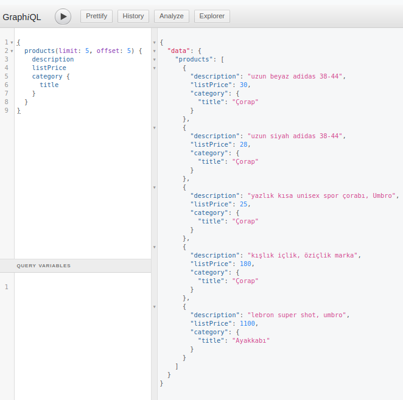

Hasura Query Engine’in sorgu seçenekleri ile ilgili olarak [buradaki dokümanı](https://docs.hasura.io/1.0/graphql/manual/queries/index.html) takip edebiliriz.

## İstemci _(Vue)_ Tarafı

İstemci tarafını basit bir Vue uygulaması olarak geliştirmeye karar vermiştim. Aşağıdaki terminal komutunu kullanıp varsayılan ayarları ile projeyi oluşturdum. Ayrıca GraphQL tarafı ile konuşabilmek için gerekli npm paketlerini de yükledim. Apollo, GraphQL servisimiz ile kolay bir şekilde iletişim kurmamızı sağlayacak.

>Görsel taraf için bootstrap kullanmayı tercih ettim.

```
sudo vue create nba-client
sudo npm install vue-apollo apollo-client apollo-cache-inmemory apollo-link-http graphql-tag graphql bootstrap --save
```

## Yapılanlar

- components klasörüne tek ürün için kullanılabilecek Product isimli bileşen eklendi
- main.js içeriği Hasura'yı ve GraphQL'i kullanabilir hale getirildi
- ürünlerin listesini gösterebilmek için components klasörüne ProductList bileşeni eklendi
- yeni bir ürün ekleyebilmek için ProductAdd isimli bileşen eklendi
- app.vue içeriği eklenen bileşenleri kullanacak şekilde düzenlendi

## TODO

><span style="color:red">Bu servisi JWT Authentication bünyesine almak lazım. İşte size güzel bir araştırma konusu. Başlangıç noktası olarak [Auto0'ın şu dokümanına bakılabilir](https://auth0.com/docs/quickstart/spa/vuejs).</span>

## Çalışma Zamanı

Uygulamayı çalıştırmak için

```
npm run serve
```

terminal komutunu kullanabiliriz. Sonrasında http://localhost:8080 adresine gitmemiz yeterli.

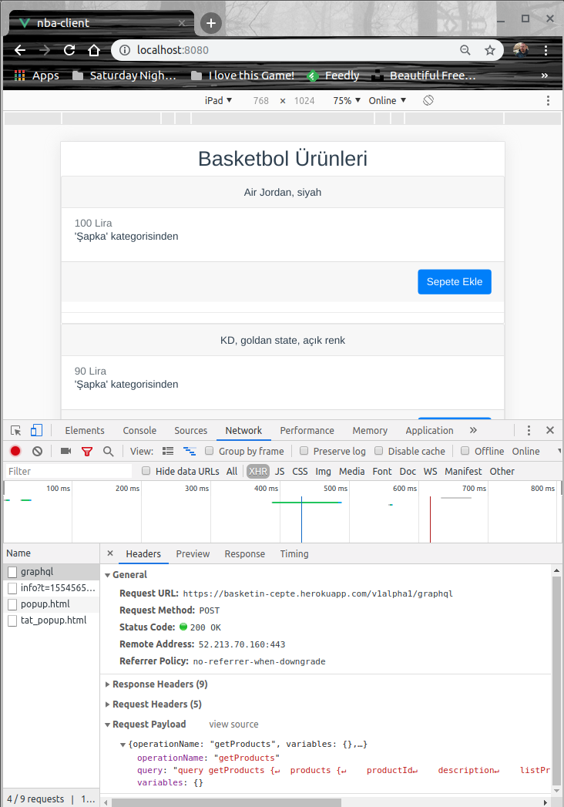

Yeni ürün ekleme bileşeni konulduktan sonrasına ait örnek bir ekran görüntüsü.

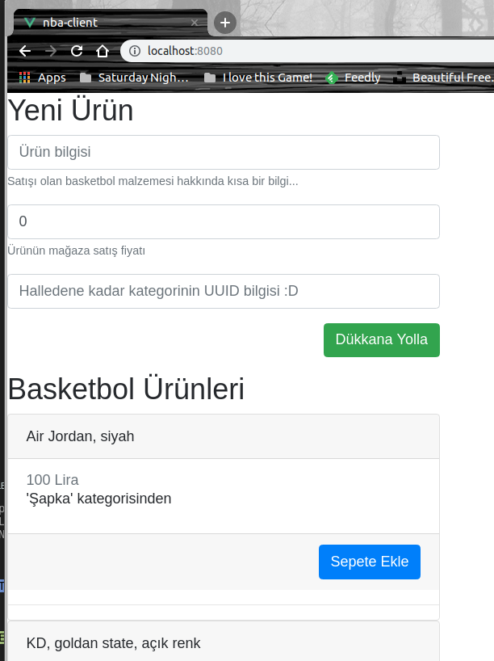

Hatta yeni bir forma eklediğimizde gönderilen Graphql Mutation sorgusundan dönen değeri de görebiliriz.

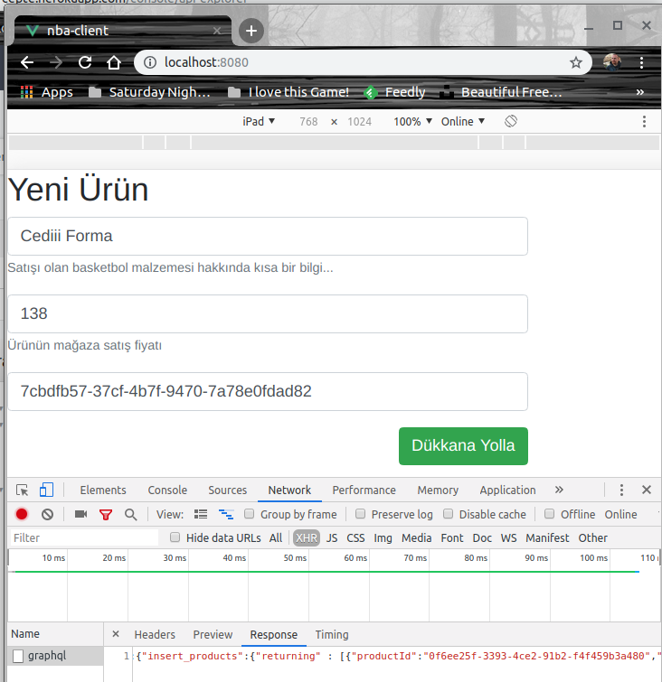

>throw new ToBeContinuedException("Yeni ürün ekleme sayfasında kategori seçiminde combobox kullanımı yapılmalı");

## Neler Öğrendim

- Heroku'da Docker Container içerisinde çalışan ve PostgreSQL verileri GraphQL ile sorgulanabilir olarak sunan Hasura isimli bir motor olduğunu
- Hasura arabirimden ilişkili tabloları nasıl oluşturabileceğimi
- Bir kaç basit GraphQL sorgusunu
- Vue tarafında GraphQL sorgularının nasıl gönderilebileceği
- Component içinde Component kullanımlarını
- Temel component tasarlama adımlarını

>throw new ToBeContinuedException();