# Kimdir Bu Travis?

Continuous Integration kaliteli ve sorunsuz kod çıkartmanın önemli safhalarından birisi. DevOps kültürü için değerli olan, Continuous Deployment/Delivery ile bir anılan CI'ın uygulanmasında en temel noktalar kodun sürekli test edilebilir olması ve ne kadarının kontrol altına alındığının bilinmesi. Başarılı bir Build için bu kriterlerin metrik olarak gerekli değerlerin üzerine çıkması şart. Ancak bu metriklere uyan bir Build, dağıtıma gönderilebilir bir aday sürüm haline gelebilir. 

CI/CD hattını tesis ederken kullanılabilecek bir çok yardımcı ürün bulunuyor. Güncel olarak çalışmakta olduğum şirkette Microsoft'un VSTS'i kullanılmakta. Bunun muadili olabilecek Jenkins'de diğer bir alternatif olarak karşımıza çıkıyor. Benim öğrenmek istediğim ise Travis. Travis, Jenkins gibi kurulum ve bilgi maliyeti fazla olmayan, github ile kolayca entegre olan, geliştirici dostu, ücretsiz, kurulum gerektirmeyen bir CI ürünü olarak karşımıza çıkıyor. Amacım onu deneyimlemek.

## İhtiyaçlar _(Yapılacaklar)_

- Öncelikle test edilebilir örnek bir uygulamaya ihtiyacımız var. Travis'in desteklediği dil ve platform oldukça geniş. _(Ben .Net Core tabanlı bir kütüphaneyi ele almak istiyorum)_ 
- Uygulamayı github üzerindeki bir proje ile ilişkilendirmek gerekiyor. Nitekim Travis, code base olarak GitHub üzerinde ilişkilendirilmiş projeyi ele almakta.
- Travis'in Github entegrasyonu sayesinde code base üzerinde yapılan her Push sonrası otomatik olarak CI süreci başlayacak. Bu süreçte uygulamanın ihtiyaç duyduğu ortam paketleri yüklenip, build işlemi gerçekleştirilirken, aynı zamanda testler de koşulacak. _(CI süreci tamamen bulutta işleyecek)_
- Uygulama için belki de en kritik ihtiyaç travis.yml dosyası ve içeriği. Docker çalışma dinamiklerine benzer şekilde Travis ortamı için gerekli bilgileri içeren bir dosya.

## Travis Tarafının Hazırlanması

Öncelikle [Travis](https://travis-ci.com) sitesine gidip Github hesabımız ile kayıt olmamız gerekiyor. Sonrasında Acivate düğmesine basarak ilerliyoruz.

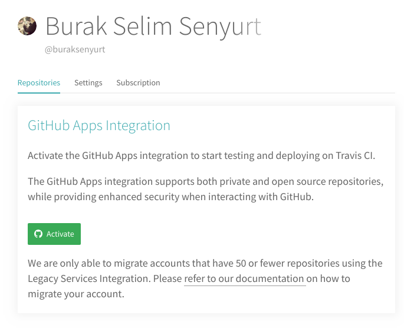

İzleyen adımda CI sürecine dahil etmek istediğimiz Github projesini seçiyoruz. Ben örnek için hello-travis isimli bir repo oluşturdum.

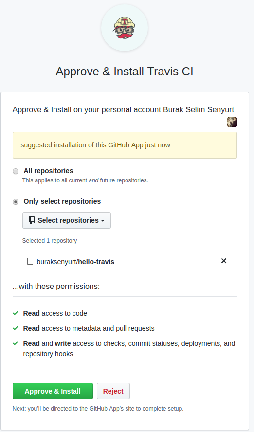

Artık Travis ile Github projemiz birbirlerine bağlanmış durumdalar.

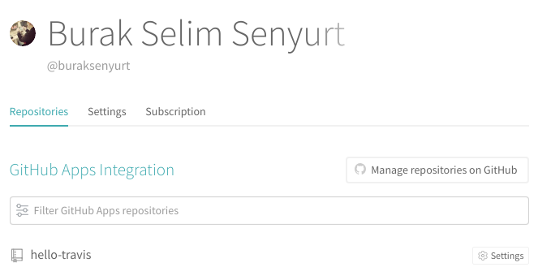

## Projenin Geliştirilmesi

Örnek olarak .Net Core tabanlı bir sınıf kütüphanesi geliştirmeye karar verdim. İlk olarak Github projesini Westworld'e klonladım.

```
git clone https://github.com/buraksenyurt/hello-travis.git
```

Ardından aşağıdaki adımları izleyerek bir .Net Core Solution'u oluşturdum.

```
dotnet new sln
mkdir MathService
cd MathService
dotnet new classlib
mv Class1.cs Common.cs
cd ..
dotnet sln add ./MathService/MathService.csproj
mkdir MathService.Tests
cd MathService.Tests
dotnet new xunit
dotnet add reference ../MathService/MathService.csproj
mv UnitTest1.cs CommonTest.cs
cd ..
dotnet sln add ./MathService.Tests/MathService.Tests.csproj
touch .travis.yml
```

Öncelikle klonlanan klasörde bir Solution oluşturuyoruz. İsim vermediğimiz için hello-travis isimli bir solution dosyası oluşur. Ardından MathService isimli bir sınıf kütüphanesi oluşturuyor ve Class1.cs dosyasını Common.cs olarak değiştiriyoruz. Projeyi, solution'a ekledikten sonra bu kez MathService.Tests isimli xUnit tipinden bir test projesi oluşturuyoruz. Bu projeye, MathService kütüphanesini referans edip son olarak test projesini de solution'a bildiriyoruz. 

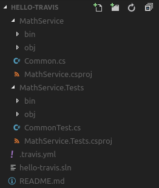

## .travis.yml

Pek tabii Travis entegrasyonu için en kritik nokta bu dosya içeriği.

```
language: csharp
solution: hello-travis.sln
mono: none
dotnet: 2.1.502
 
script:
  - dotnet build
  - dotnet test MathService.Tests/MathService.Tests.csproj
```

Dosya içerisinde Travis'in çalışma zamanı ortamı için bir takım bilgiler var. Bu bilgilere göre .Net Core 2.1.502 runtime üzerinden csharp dilinin kullanıldığı bir Solution söz konusu. Buna uygun bir makineyi Travis kendisi hazırlayacak. script bloğunda yer alan ifadeler ise, her push işlemi sonrası Travis tarafından icra edilecek olan işleri içeriyor. Önce bir build işlemi sonrasında da test'in çalıştırılması.

>Örnekte kullanılan .Net çözümünün [orjinal github adresi burasıdır](https://github.com/buraksenyurt/hello-travis) 

## Çalışma Zamanı

Öncelikle hatalı çalışan test bulunduran bir geliştirme yaptım. Local'de test sonuçları şöyleydi.

```
dotnet test
```

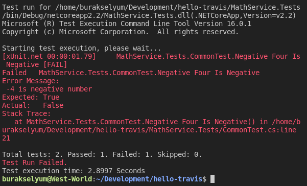

Hal böyleyken kodları commit'leyip github sunucusuna push'ladım.

```
git add .
git commit -m "fonksiyonal eklendir ve test kodları yazıldı"
git status
git push
```

Travis'e gittiğimde otomatik bir Build işleminin başladığını fark ettim. 

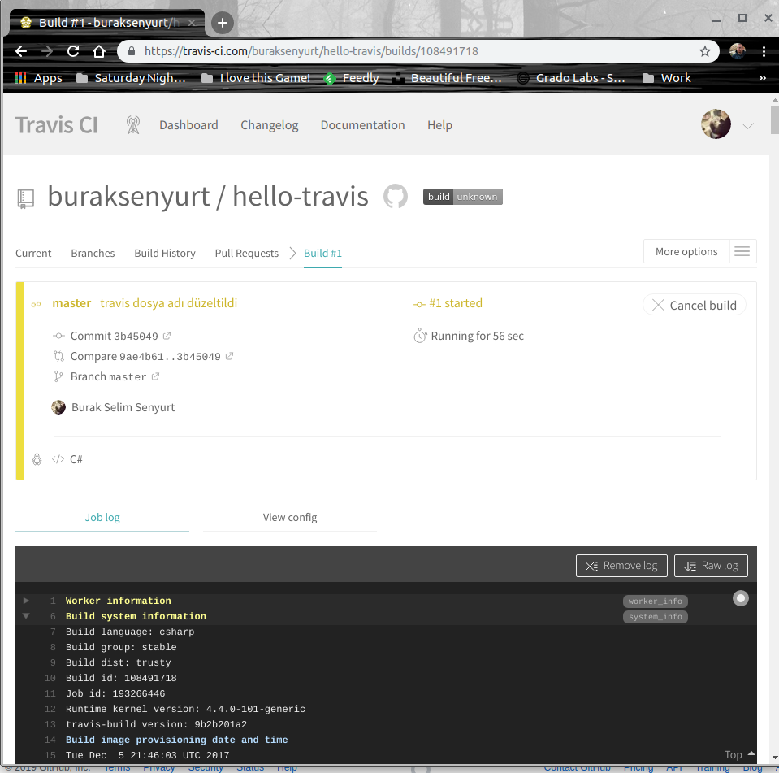

Bir süre sonra Fail eden test nedeniyle Build işlemi de hatalı olarak sonlandı. _(Bu zaten istediğimiz ve beklediğimiz durum)_

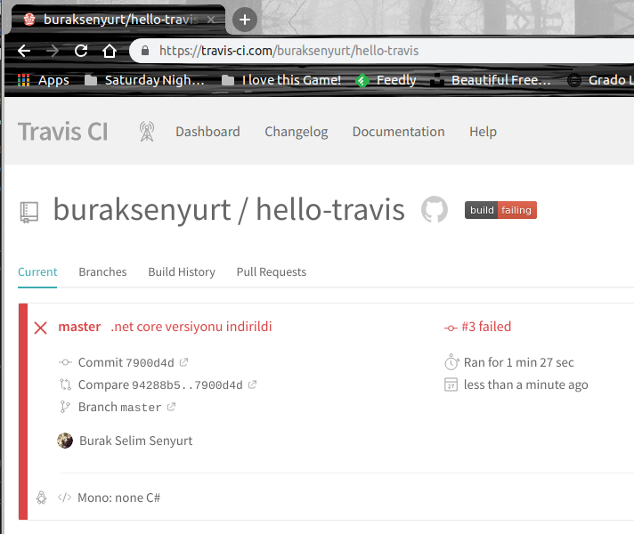

Log raporu sonuçları da aşağıdaki gibi oluştu.

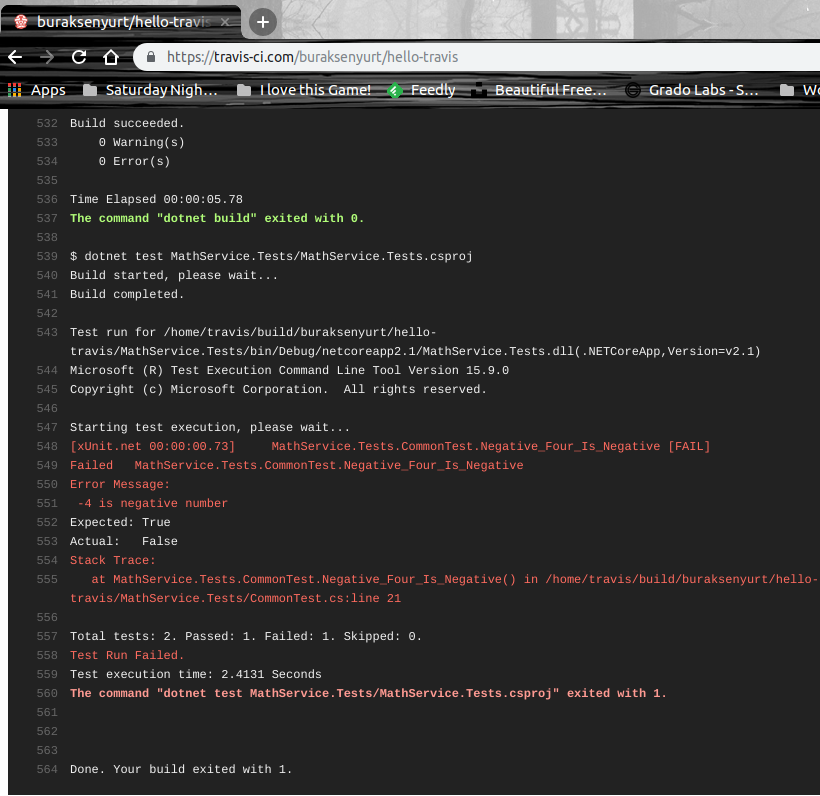

Sonrasında hata alan testi de düzelttim, önce Westworld üzerinde _dotnet test_ terminal komutu ile testlerin başarılı olup olmadığını kontrol ettim. Ardından kodu commit edip github'a push'ladım. Travis kısa süre içinde yeniden bir build işlemi başlattı. Bu sefer beklediğim gibi testler başarılı olduğundan build sonucu Passed olarak işaretlendi.

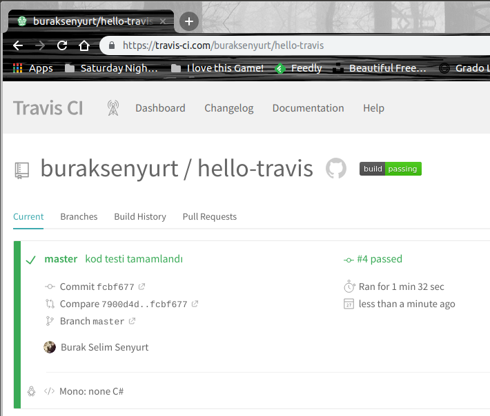,

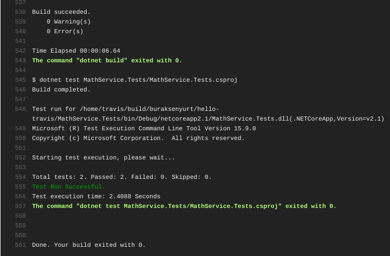

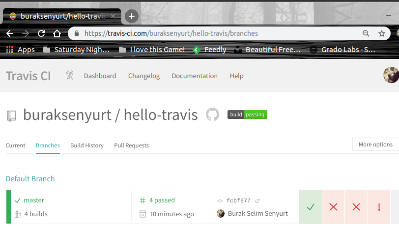

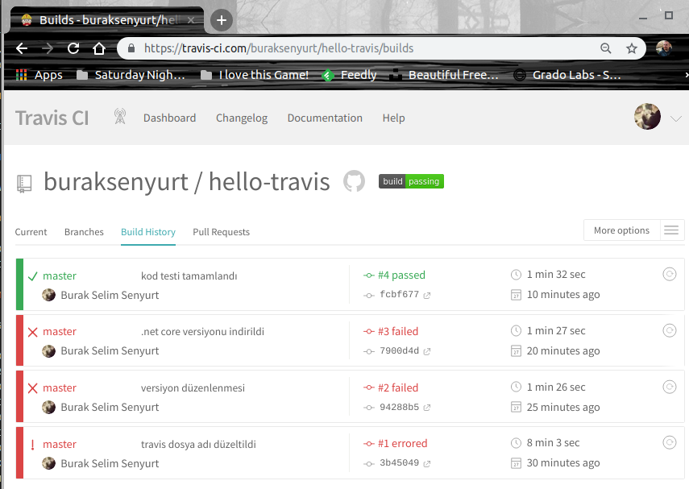

## Neler Öğrendim

- Travis'in CI sürecindeki yerini
- Travis ile bir Github reposunu nasıl bağlayabileceğini
- .travis.yml dosyasının içeriğinin nasıl olması gerektiğini
- .Net Core tarafında xUnit test ortamının nasıl oluşturulabileceğini
- git push sonrası işletilen Build sürecinin izlenmesini