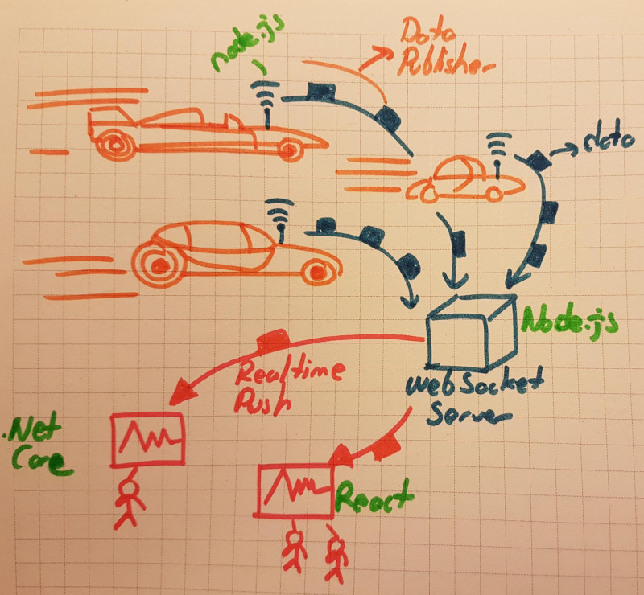

# Socket.IO ve React.js Kullanımı

Bir süre önce eski bir meslektaşım OBD2 portlarından nasıl bilgi okuyabileceğimizi sormuştu. Bu konuyu araştırırken kendimi çok farklı bir yerde buldum. OBD2 portu ile bir arabadan veri almak mümkün. Peki bir yarış sırasındaki tüm araçların hız, motor sıcaklığı, anlık devir vb bilgilerini aktarabildiğimizi düşünsek. Bir şekilde veriyi bir yerlere bastığımızı varsayarsak _(anten, radyo sinyali vb düzenekler ile)_, onun yarışı mobil cihazlarındaki uygulamadan takip edenlere anında gönderimi için nasıl bir yol izleyebiliriz? İşte araştırma sırasında geldiğim nokta buydu. Donanımsal gereksinimleri bir kenara bırakırsak bunun minik bir POC çalışmasını denemek istedim. 

En ideal senaryolardan birisi WebSocket kullanımıydı. Bunun üzerine Socket.IO kütüphanesini kullanarak bir demo üzerinde çalışmaya karar verdim. Çeşitli tipte istemciler, WebSocket haberleşmesi ile veri yayınlayacaklar. Haberleşme ağı üzerinde olan bir sunucu uygulama da verileri, abone olan istemcilere gönderecek. Veri yayıncısı ve broadcast yönetimini üstlenecek sunucu için Node.js, görsel arayüzle yarış araçlarının gönderilen bilgilerine bakacak istemci tarafı içinse bir React uygulaması geliştirmeye karar verdim.



>Tabii gerçek hayat senaryosunda veri yayını yapan taraflar çeşitli IoT cihazları da olabilirler. Ancak ilke olarak WebSocket tipinde haberleşmeyi kullanacaklarını varsayabiliriz. Buna göre salonda dolaşan robotlar çevrimiçi olduklarında sunucuya bağlanıp bir takım bilgilerini diğerleri ile paylaşabilir ve hatta simultune dans figürlerini sergileyebilirler :P Denemeye değer. 

## Ön Hazırlıklar

Örneği her zaman olduğu gibi WestWorld _(Ubuntu 18.04, 64bit)_ üzerinde geliştirmekteyim. Sistemde node.js, npm ve react projesi oluşturmak için gerekli ekipmanlarım mevcut. Proje iskeletini aşağıdaki terminal komutlarını kullanarak oluşturabiliriz.

```
mkdir Zion
mkdir VehicleDataPublisher
cd Zion
npm init
npm i --save express socket.io
touch server.js
cd ..
cd VehicleDataPublisher
npm init
npm i --save socket.io-client
touch index.js
cd ..
sudo npx create-react-app dashboard
sudo npm i --save react-d3-speedometer save socket.io-client
```

Zion isimli klasörde sunucu uygulama kodlarımız olacak _(Aslında yayıncı ve aboneler arasında bir veri aktarım organı)_ Veri yayını yapan uygulamalar burayı kullanacaklar. Sunucu, kendisini dinleyenlere ilgili verileri yayınlayacak. Bir Web Sockets tabanlı bir iletişim söz konusu. Bu nedenle express ve socket.io paketlerini kullanıyor. VehicleDataPublisher uygulaması sembolik olarak veri yayını yapan program kodlarını içeriyor _(Yani yarış aracımızdan veri gönderen parça)_ Socket sunucusu ile haberleşmesi gerektiğinden socket.io-client paketini kullanıyor. Son olarak dashboard isimli bir react uygulamamız var. Bunu, araçlardan yayınlanan veriyi grafik formatında göstermek için kullanacağız. Bu nedenle react-d3-speedometer _(gerekirse benzerleri)_ paketini içeriyor. Pek tabii bu uygulama soket dinleyicisi olarak sunucu ile konuşmak durumunda. Bu nedenle socket.io-client paketini de referans ediyor.

## Yapılanlar

- Zion projesindeki server.js kodlandı
- VehicleDataPublisher projesindeki index.js kodlandı
- 

>throw new NotCompletedException();

## Çalışma Zamanı

En az 3 terminal penceresi ile ilerlemek lazım. Birisinde sunucu, diğerinde publisher ve sonuncusunda da react tabanlı dinleyici çalıştırılmalı. Aşağıdaki terminal komutu ile sunucu ve veri yayıncılarını çalıştırabiliriz. _(Ayrı terminal pencrelerinde tabii ki)_

```
npm run serve
```

>throw new NotCompletedException();

## Neler Öğrendim

- socket.io ile websocket bazlı iletişim trafiğinin node.js'de nasıl tesis edilebileceğini
- socket.on olay dinleyicilerinin ne amaçla ele alındığını
- broadcasting'in nasıl yapıldığını
- disconnect ve connection namespace'lerinin ayrılmış kelimelerden _(reserved words)_ olduğunu _(bunları doğru yazmassak istemciler bağlanamaz veya çevrim dışı olamazlar)_
- node.js tarafında rastgele sayı üretimini
- belirli periyotlarda sürekli olarak çalışan bir fonksiyonun nasıl yazılacağını
- yayımcıların abonelere olan mesajları gönderdiğimiz fonksiyonun bir callback metodu olduğunu

>throw new TobeContinuedException();