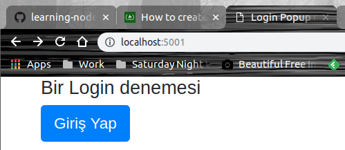
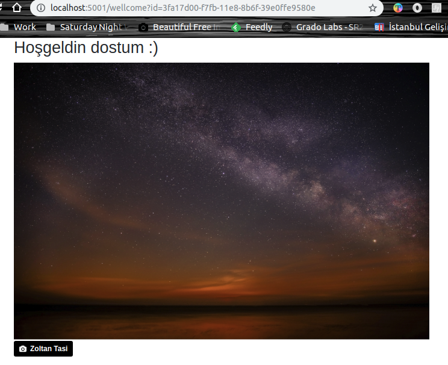

# Login için Bootstrap Modal Popup kullanmak

Bu örnekte bir Login penceresini modal popup olarak açtırmayı hedefledim. Node.js tabanlı bir sunucu kullanmayı tercih ettim. Modal penceresini bootstrap ile tasarlamaya çalıştım. Login işlemini üstlenen fonksiyonu bir servis noktası olarak sundum ve önyüz kodlamasında jQuery'den yararlandım.

## Başlangıç için gerekli kurulumlar

```
npm init
npm install --save-dev express morgan body-parser uuid
bower install jquery bootstrap
```
uuid paketini login olan kullanıcı için benzersiz bir guid üretmek maksadıyla kullandım. express bildiğiniz REST taleplerini karşılamak ve routing işlemleri için. Server hareketliliklerini takip etmek için morgan'dan, JSON parse işlemine ihtiyaç duyduğum noktaları kolaylaştırmak içinse body-parser'a başvurdum.

> Offline'da deneyebileyim diye jquery ve bootstrap için gerekli minimum dağıtım paketlerini public klasörü altına attım.

## Temel çalışma şekli

Kullanıcı / adresine gelirse (yani http://localhost:5001/ 'e) index.html render edilir. Bu sembolik bir sayfa bizim için. 



Burada 'Giriş Yap' düğmesine basılınca Modal Popup kontrolümüz açılır. Aslında kendisini index.html içerisine bir div olarak ekledik. 

>Bunu harici bir sayfaya nasıl alabilirsiniz? Malum başka yerlerden de Login'e göndermek isteyebiliriz. Her sayfaya gidip de modal div gömmesek iyi olur değil mi?


Eğer hatalı kullanıcı bilgisi girersek şöyle bir şeyler olmalı.


Eğer doğru kullanıcı bilgileri girilirse aşağıdaki güzel fotoğrafla karşılaşmamız lazım.



Querystring'e gelen id parametresi login olan kullanıcı için özel üretilmiş bir Guid değeri. Şayet değiştirip aynı sayfayı yüklersek, Guid'in sunuc tarafındaki aktif kullanıcı listesinde yer alması gerekiyor _(aktif kullanıcı listesi dediğime bakmayın. Havalı ismi o. Örnekte ben basit bir array kullandım. Sunucuyu kapatınca uçup gidecek)_ Aksi durumda 403 hatası alacağız. Bunu Wellcome gibi bir sayfaya login olunmadan gelinmesin diye ekledik.

>Sistemi daha güvenli hale getirmeye çalışmak lazım tabii ama ana amaç Bootstrap Model bileşenini bir Login işleminde nasıl ele alabileceğimizi görmekti.

## Çalıştırmak için

Komut satırından

```
npm start
```

ile işe başlayın. Sonra localhost:5001/ adresine gidin ve giriş yapmayı deneyin.